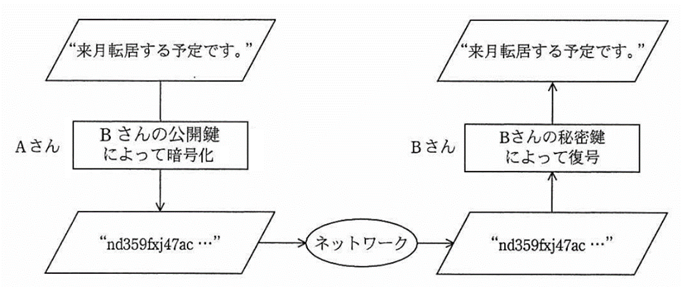
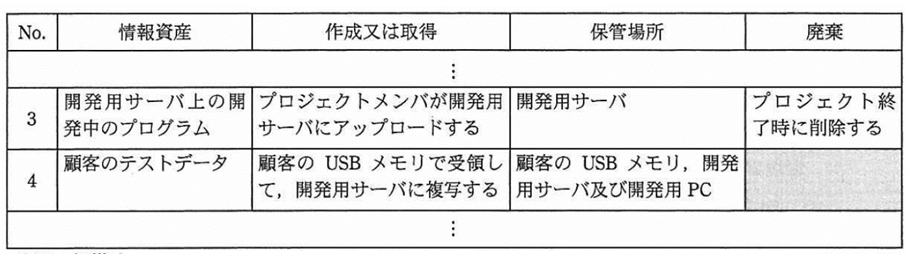
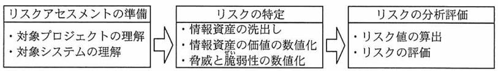
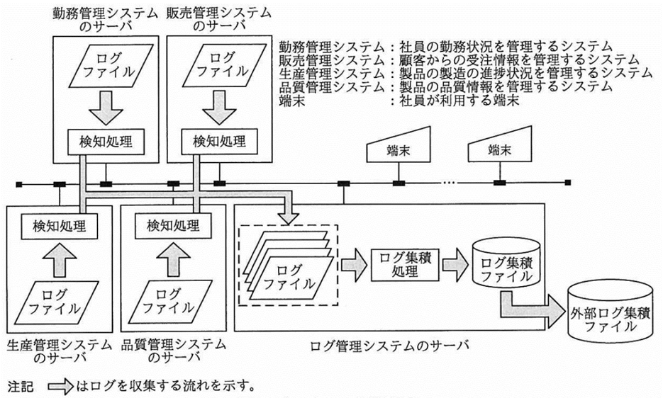
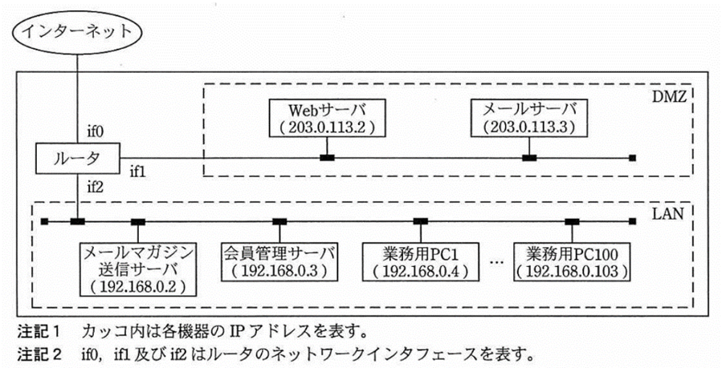
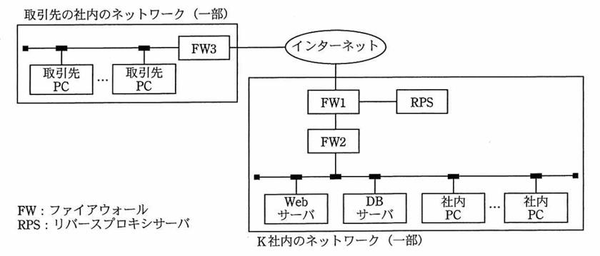

# 第1章　セキュリティ

#### 本章について

　本章は，情報セキュリティマネジメント試験の中核を占めるセクションです．実際に，第１回試験（平成28年春）で出題された127のキーワード・項目のうち69がこのセクションから出題されています．試験対策の最重点と考えてよいでしょう．

　ITパスポート試験の「中分類23：セキュリティ」よりもかなり深くて広い知識が要求されます．学習時間を多めに取ってください．基本情報試験の「中分類11：セキュリティ」と同等の難度ですが「ドライブバイダウンロード攻撃」や「ポートスキャン」など基本情報試験のシラバスには含まれていない項目や未出題の項目が出題されていますので，基本情報合格済の方も注意が必要です．

## 1.1 情報セキュリティ

### 1.1.1　情報セキュリティの目的と考え方

- **情報セキュリティの目的**　情報の機密性，完全性，可用性（**情報セキュリティの三大要素**）を確保，維持することにより，さまざまな脅威から情報システムや情報を保護し，情報システムの信頼性を高めることです．*⇒SG28春9*
- **機密性（Confidentiality）**　アクセス権のある者だけがアクセスできること，またはその度合い．*⇒SGサンプル3,SG28秋5,SG28秋21*
- **完全性（Integrity）**　正確で欠損がなく完全な状態になっていること，またはその度合い．*⇒SG28秋21*
- **可用性（Availability）**　必要な時に必ず利用できること，またはその度合い．*⇒SG28秋5,SG28秋21*
- **責任追跡性（Accountability）**　情報資産が改訂された履歴をたどれること，またはその度合い．説明可能性．
- **真正性（Authenticity）**　利用者，情報資産などが本物であることが確実であること，またはその度合い．*⇒SG28秋5*
- **否認防止性（Non-Repudiation）**　利用者がなんらかの行為を行ってから，後になってその行為を認めないことによる不利益の発生を防止できること，またはその度合いです．例えば，商品の発注や検収などが該当します．「情報システムのセキュリティのためのガイドライン」の3項目以外に列挙されることがある3項目（否認防止性，責任追跡性，真正性）の一つです．これらの目標事項は，**セキュリティ上の関心事（Security Concern）** とも呼ばれます．
- **OECDセキュリティガイドライン（情報システムのセキュリティに関するガイドライン）**　OECD（経済協力開発機構）が1992 年に作成したガイドライン．情報セキュリティを「機密性，完全性，可用性を維持すること」と定義しています．*⇒SG28秋5*

### 1.1.2  情報セキュリティの重要性

- **情報セキュリティの重要性の背景**　社会のネットワーク化に伴い，企業にとって情報セキュリティの水準の高さが企業評価の向上につながること，情報システム関連の事故が事業の存続を脅かすことが少なくありません．これらが，情報セキュリティの重要性の背景です．
- **情報資産**　経営資産のうち，ITに関する資産のことで，ハードウェア，ソフトウェア，データ，ノウハウなどがあります．ハードウェアや印刷済のデータなどを有形資産，ソフトウェア，印刷されていないデータ，ノウハウなどを無形資産といいます．
- **サイバー空間**　情報通信技術を用いて情報がやりとりされる，インターネットその他の仮想的な空間．

### 1.1.3  脅威 脅威の種類

- **脅威の分類**　物理的脅威，技術的脅威，人的脅威に分類されます．
- **物理的脅威**　事故，災害，故障，破壊，盗難，不正侵入などの物理的要因により情報資産が損なわれること．
- **技術的脅威**　不正アクセス，盗聴，なりすまし，改ざん，エラー，クラッキングなどの技術的要因により情報資産が損なわれること．
- **クラッキング**　インターネットなどのネットワークを通じてサーバに不正にアクセスしたり，データの改ざん・破壊を行ったりする行為の総称．*⇒SG28秋22*
- **人的脅威**　誤操作，紛失，破損，盗み見（ショルダハッキング），不正利用，ソーシャルエンジニアリングなどの人的要因により情報資産が損なわれること．
- **ショルダハッキング**　盗み見行為の総称．背中越しの覗き見のみではなく，望遠でキーボード入力の様子を撮影して解析することで利用者IDとパスワードを得るなどの行為を含みます．*⇒SG28春4,SG28春11,SG28秋24*
- **ソーシャルエンジニアリング**　ITを用いない攻撃手法の総称．緊急事態を装って組織内部の人間からパスワードや機密情報を入手したり，ゴミを盗み出して解析したりすることが含まれます．*⇒SG28秋25*
- **妨害行為**　サービスを妨害する行為，**風評**（根拠の乏しい情報や噂），**炎上**（SNSやブログ等に大量の批判的返答を書き込むこと），**SPAM**（迷惑メール）なども含まれます．*⇒SG28春34*
- **誤謬（ごびょう）**　人的な間違い．

### 1.1.4  脅威 マルウェア・不正プログラム

- **マルウェア**　悪意のあるプログラムの総称．*⇒SG28春14*
- **コンピュータウイルス**　感染，潜伏，発病のどれかの特徴をもつマルウェアの総称．
- **マクロウイルス**　ワープロソフトや表計算ソフトのデータファイルに感染するコンピュータウイルス．ファイルを開くことで感染します．ソフトが対応するOSであればOSの違いに関わらず動作する場合があります．　
- **ワーム**　ネットワークを介して自己増殖するプログラム．ネットワークの負荷を上げて被害を与えるため，マルウェアに分類されています．*⇒SG28春14*
- **ボット**　ロボットの略でコンピュータに感染して **踏み台攻撃** をさせるマルウェア．**遠隔操作型ウイルス（RAT:Remote Access Trojan／Remote Administration Tool）** ともいいます．*⇒SG28秋25,SG28秋27*
- **C&C（Command and Control）サーバ**　ボットへの指令サーバ．侵入して乗っ取ったコンピュータに対して，他のコンピュータへの攻撃などの不正な操作をするよう，外部から命令を出したり応答を受け取ったりします．*⇒SG28秋12*
- **ボットネット**　同一のC&Cサーバの配下にある複数のボットが，指令サーバを中心とするネットワークを組んだもの．　
- **トロイの木馬**　見かけ上，正常なプログラムに不正なプログラムをを仕込んだマルウェア．*⇒SG28秋25*
- **スパイウェア**　利用者や管理者の意図に反してインストールされ，利用者の個人情報やアクセス履歴などの情報を収集するマルウェアの総称．*⇒SG28春22,SG28秋27*
- **ランサムウェア**　コンピュータ内のデータを暗号化して，コンピュータ自体を使えない状態にし，環境を復元することを条件に金銭を要求するマルウェア．*⇒SG28春25,SG28秋27*
- **キーロガー**　キーボード入力を監視して記録するソフトウェア．IDやパスワードの不正入手などに悪用されます．*⇒SG28秋27*
- **ルートキット**　攻撃者がコンピュータに不正に侵入する際に利用する悪意のあるソフトウェアをまとめたパッケージ．バックドアツールなどが含まれます．　
- **バックドア**　通常のアクセス経路以外で，攻撃者が不正な行為に利用するために設置する侵入ツール．攻撃者が不正に変更した設定や，作成したユーザアカウントもバックドアになり得ます．*⇒SG28春27*
- **偽セキュリティ対策ソフト型ウイルス**　「ウイルスに感染している」といった嘘の警告メッセージや，偽物の「ウイルス検出画面」を表示させ，ウイルスを駆除するには有償版の製品が必要であるとして，購入サイトに誘導するウイルス．
- **USBメモリ感染型ウイルス**　PCにUSBメモリが接続されたとき，USBメモリに保存されているプログラムを自動的に実行する機能を用いてウイルスを実行し，PCをウイルスに感染させるウイルス．*⇒SG28春25*

### 1.1.5  脆弱性

- **脆弱性**　情報システムの情報セキュリティに関する欠陥で，**セキュリティホール** ともいいます．プログラムの **バグ**（欠陥）も脆弱性の原因になる場合があります．*⇒SG28春14*
- **人為的脆弱性**　企業，組織，個人に対する行動規範の不徹底，未整備に由来する脆弱性の総称．

### 1.1.6  不正のメカニズム

- **不正のトライアングル**　組織内部の不正行為が発生する仕組みであり，**機会**，**動機**，**正当化** の3つの要因が全て揃った時に発生すると言われています．*⇒SG28春9*
- **不正行為の機会**　技術（ITシステム・ネットワーク）や物理的な環境及び組織のルールなど，不正行為の実行を可能，または容易にする要因．
- **不正行為の動機**　プレッシャー（業務量，ノルマ等）や処遇への不満など，内部不正行為に至るきっかけとなる要因．
- **不正行為の正当化**　良心の呵責を乗り越える都合の良い解釈や他人への責任転嫁など，内部者が不正行為を自ら納得させるための自分勝手な理由付けとなる要素．
- **状況的犯罪予防**　都市空間における犯罪予防の理論．監視者の設置などによって外部からのコントロールが可能な「環境」を適切に定めることを主眼として，犯罪機会・動機を低減し，予防する犯罪予防策．直接的に犯罪を防止する対策及び間接的に犯罪を防止及び抑止する対策を含みます．

### 1.1.7  攻撃者の種類

- **攻撃者の種類**　攻撃者は外部の人間とは限らず，**内部関係者** の場合もあるため，慎重な対応が求められます．
- **スクリプトキディ**　技術不足により**クラッカー**（攻撃者）にはなりきれない幼稚な者．攻撃者予備群となりやすいと言われています．*⇒SG28秋24*
- **ボットハーダー**　**ボット**（1,1,4参照）の指令者．
- **愉快犯**　脅威を与えることそのものを楽しむ攻撃者．
- **詐欺犯**　金銭窃取を目的とする攻撃者．
- **故意犯**　自己の行為が犯罪であることを認識している攻撃者．そうでない場合は過失犯となります．
- **ハクティビスト**　情報技術を利用し，宗教的又は政治的な目標を達成するという目的（**ハクティビズム**：1.1.8参照）をもった人や組織の総称．*⇒SG28春1*

### 1.1.8  攻撃の動機

- **攻撃の動機**　攻撃の動機は機密情報の窃取や**金銭奪取**，組織活動の妨害等，多様化しています．
- **ハクティビズム**　抗議活動としての攻撃．自分たちが敵と見なしている企業や他国政府のWebサイトを攻撃してダウンさせたり，Webページを改竄して自分たちの声明を掲載したりすることです．
- **サイバーテロリズム**　サイバー空間において行われるテロ行為のこと．

### 1.1.9  サイバー攻撃手法

- **サイバー攻撃手法**　パスワードクラックなどのパスワード関連の手法，クロスサイトスクリプティングなどのWebアプリケーション関連の手法，中間者攻撃などの第三者を交えた手法，DoS攻撃などのサービス不能化を狙う手法，標的型攻撃，フィッシング，ゼロデイ攻撃 などがあります．
- **パスワードクラック**　パスワードの詐取を目的とする攻撃の総称で，総当り攻撃，辞書攻撃などがあります．
- **総当り攻撃（ブルートフォース）**　与えられた1組の平文と暗号文の鍵候補を総当たりで用いてパスワードの解読を試みる手口．攻撃対象とする利用者IDを一つ定め，文字を組み合わせたパスワードを総当たりに，ログインを試行します．逆に，パスワードを定め，文字を組み合わせた利用者IDを総当たりに，ログインを試行する手口（リバースブルートフォース）もあります．*⇒SG28春25,SG28秋26,SG28秋午後3*
- **辞書攻撃**　辞書にある単語などを組み合わせながら試行してパスワードの解読を試みる手口．*⇒SG28秋26,SG28秋午後3*
- **パスワードリスト攻撃**　悪意のある者が，何らかの方法で事前に入手したIDとパスワードのリストを流用し，自動的に連続入力するプログラムなどを用いてそれらIDとパスワードを入力することで，ウェブサイトにログインを試みる手口．*⇒SG28春26，SG28秋26*
- **レインボー攻撃**　パスワードのハッシュ化におけるハッシュ値のテーブルを効率的に管理する仕掛け（**レインボーテーブル**）を狙う攻撃手法．想定され得るパスワードとそのハッシュ値との対のリストを用いて，入手したハッシュ値からパスワードを効率的に解析する手口です．*⇒SG28秋26*
- **クロスサイトスクリプティング**　訪問者の入力データをそのまま画面に表示する脆弱性があるWebサイトを悪用する攻撃．Webサイトに対して，悪意のあるスクリプトを埋め込んだ入力データを送り，訪問者のブラウザで実行させることで，不正なサイトを表示させたり，情報の搾取を行います．*⇒SG28秋22*
- **クロスサイトリクエストフォージェリ**　電子掲示板などへの投稿に悪意のあるスクリプトを埋め込み，これを掲示板の利用者に実行させることで，利用者の権限を悪用すること．*⇒SG28春21*
- **HTTPレスポンス分割攻撃**　Webアプリケーションの脆弱性を悪用し，Webサーバに不正なリクエストを送ってWebサーバからのレスポンスを二つに分割させることによって，利用者のブラウザのキャッシュを偽造する手法．HTTPレスポンスによるキャッシュ偽造ともいい，一人あるいは複数のユーザに悪意のWebページを閲覧させる攻撃です．*⇒SG28春22*
- **タブナビング**　Webブラウザのタブ表示機能を利用し，Webブラウザの非活性なタブの中身を，利用者が気づかないうちに偽ログインページに書き換えて，正しいページと勘違いさせる手法．*⇒SG28春22*
- **ドライブバイダウンロード**　Webサイトを閲覧したとき，利用者が気付かないうちに，利用者の意図にかかわらず，利用者のPCに不正プログラムが転送される手法．*⇒SG28春25,SG28秋午後3*
- **SQLインジェクション**　Webアプリケーションに悪意のある入力データを与えることにより，データベースの問合せや操作を行う命令文を組み立て，データを改ざんしたり不正に情報取得したりする攻撃．認証回避による不正ログインや，ログインした利用者に許可されている全ての操作を不正に行われたり，ストアドプロシージャ等を利用したOSコマンドの実行によるシステムの乗っ取りや，他への攻撃の踏み台としての悪用なども含みます．*⇒SG28春13,SG28春21*
- **バッファオーバフロー攻撃**　確保されているメモリ空間の下限又は上限を超えてデータの書込みと読出しを行うことによって，プログラムを異常終了させたりデータエリアに挿入された不正なコードを実行させたりする攻撃．*⇒SG28春21,SG28秋22*
- **ディレクトリトラバーサル**　Webサイトの管理者が意図していない相対パスでサーバ内のファイルを指定することによって，本来は許されないファイルを不正に閲覧すること．サーバ上にある非公開情報や設定情報を不法入手しようとする攻撃です．*⇒SG28秋22*
- **中間者攻撃（Man-in-the-middle）**　攻撃者がクライアントとサーバとの通信の間に割り込み，クライアントと攻撃者との間の通信を攻撃者とサーバとの間の通信として中継することによって正規の相互認証が行われているようにしてセキュリティを破る攻撃手法．*⇒SG28秋16*
- **第三者中継**　攻撃者が自らの痕跡を残さないために，不正アクセスや迷惑メール配信などの中継点（踏み台）として他者のサーバを悪用すること．
- **IPスプーフィング**　IPアドレスを詐称すること．偽の送信元IPアドレスを用いることで，IPアドレスを認証や権限確認に用いているシステムを悪用すること．後述のDDoS攻撃にも用いられます．
- **キャッシュポイズニング**　PCが参照するDNSサーバに誤ったドメイン管理情報を注入して，偽装されたWebサーバにPCの利用者を誘導すること．**DNSキャッシュポイズニング** ともいいます．
- **セッションハイジャック**　セッションIDによってセッションが管理されている場合に，ログイン中の利用者のセッションIDを不正に取得し，その利用者に成りすましてアクセスすること．
- **リプレイ攻撃**　以前に送信された正規のメッセージまたはその一部を記録し，コピーを送信することによって認証システムに悪影響を与える攻撃．不正ログインやサービス不能化が目的です．
- **DoS（Denial of Service＝サービスの妨害）攻撃**　システムを過負荷状態にすることで，サービス運用妨害につながる攻撃．攻撃元が単一で防ぎやすいDoS攻撃と，**BOT**（遠隔操作マルウェア）などの利用により，攻撃元を不特定多数化する **DDoS（Distributed DoS＝拡散DoS）攻撃** があります．これらの攻撃の一種に伝送制御キャラクタのSYNを用いる **SYN Flood攻撃**，メールを大量に送りつける **電子メール爆弾（メールボム）** などがあります．*⇒SG28春19,SG28春21,SG28秋午後3*
- **標的型攻撃**　組織や集団が攻撃者であり，一定の意図や目的の下に特定のコンピュータに対して行う攻撃のこと．
- **APT（Advanced Persistent Threats）**　対応が難しい標的型攻撃で，攻撃者は特定の目的をもち，標的となる組織の防御策に応じて複数の手法を組み合わせて，気付かれないよう執拗に攻撃を繰り返します．*⇒SG28春19*
- **水飲み場型攻撃**　狙った組織が閲覧しそうなWebサイトを改ざんし，閲覧者にウイルスを感染させる標的型攻撃．
- **フィッシング**　金融機関などからのように偽造したメールによって，攻撃者が偽造したWebサイトにアクセスさせ，IDやパスワード，暗証番号やクレジットカード番号などを詐取すること．
- **ワンクリック詐欺**　Webブラウザから悪意のあるページを開いた場合や，ページ上の画像をクリックしただけで「入会ありがとうございます」等と画面に表示し，料金を請求する詐欺行為のこと．
- **スミッシング（SMShing）**　SMS（ショートメッセージングサービス）を利用するフィッシング詐欺．
- **ゼロデイ攻撃**　セキュリティパッチが提供される前に攻撃すること．
- **クリックジャッキング攻撃**　WebサイトAのコンテンツ上に透明化した標的サイトBのコンテンツを配置し，WebサイトA上の操作に見せかけて標的サイトB上で操作させること．利用者に意図せずに個人情報を公開させたり，セキュリティ設定を解除させることなどが目的です．*⇒SG28春22*
- **ウォードライビング**　不正にアクセスする目的で，建物の外部に漏れた無線LANの電波を傍受して，セキュリテイの設定が脆弱な無線LANのアクセスポイントを見つけ出す行為．*⇒SG28春25*
- **ポートスキャン**　攻撃者が **ポート番号**（5.3.1参照）を順に用いてアクセスを試行すること．システムへの侵入を企む攻撃者が，事前調査の段階で，攻撃できそうなサービスがあるかどうかを調査する為に行います．*⇒SG28春29*
- **rootkit**　攻撃者がコンピュータに不正侵入した後に利用するためのソフトウェアをまとめたパッケージのこと．一般的には，ログ改ざんツールやバックドアツール，改ざんされたシステムコマンド群などが含まれます．*⇒SG28秋14*

### 1.1.10 情報セキュリティ技術（暗号技術）

- **鍵**　暗号化アルゴリズムに与えるパラメータ．**暗号方式** はアルゴリズムと鍵によって決められます．暗号化に用いる鍵を暗号鍵といいます．
- **平文**　暗号化される前の状態．
- **復号**　暗号化されたデータをアルゴリズムと鍵によって元の平文に戻すこと．復号に用いる鍵を**復号鍵**といいます．また復号することなく平文を得ることを**解読**といいます．
- **CRYPTREC暗号リスト**　総務省と経済産業省が暗号技術に関する有識者で構成した**CRYPTREC活動**を通して策定した，電子政府における調達のために参照すべき暗号のリスト．「電子政府推奨暗号リスト」「推奨候補暗号リスト」及び「運用監視暗号リスト」で構成されています．
- **共通鍵暗号方式**　暗号化と復号に同じ鍵（**共通鍵**）を用いる暗号化アルゴリズムの総称．暗号化や復号が短時間で可能ですが，通信相手ごとに異なる鍵を用いないと，悪意のある第三者による盗聴と解読の危険性があります．よって，鍵の配布の手間がかかり，鍵の数が多くなることから管理が煩雑になるのが欠点です．また，不特定多数との暗号化通信には使えません．*⇒SG28春28*
- **共通鍵暗号方式の鍵の数**　共通鍵暗号方式によって，n人が相互に暗号を使って通信する場合，異なる鍵は全体でｎ×（ｎ－１）÷２個必要になります．
- **公開鍵暗号方式**　暗号化と復号に異なる鍵を用いる暗号化アルゴリズムの総称．受信者は専用のプログラムにより1組の鍵を生成し，一つを**秘密鍵**として秘匿し，もう一つを**公開鍵**として必要な相手に配布します．公開鍵で暗号化した暗号文は秘密鍵でしか復号できないので，鍵の配布が簡単で，管理の手間がかからず，不特定多数との暗号化通信も可能です．しかし，鍵が長大な文字列になり，暗号化と復号に時間がかかるのが欠点です．*⇒SG28春23,SG28春30*

図1.1.1 公開鍵暗号方式の例（FE27春40改） 　

- **AES（Advanced Encryption Standard）**　代表的な共通鍵暗号方式．それまでの代表的な方式である **DES（Data Encryption Standard）** の有効性の低下に伴い，**NIST（National Institute of Standards and Technology：米国標準技術局）** が公募し規格された方式．*⇒SG28春28*
- **RSA（Rivest，Shamir，Adleman）**　代表的な公開鍵暗号方式．素因数分解の計算の困難さを利用しています．
- **S/MIME（Secure MIME）**　暗号化の応用技術．公開鍵暗号方式のRSAを利用して電子メールを暗号化します．送信者のメール本文を受信者の公開鍵で暗号化してから送信し受信者は自分の秘密鍵で復号します．
- **PGP（Pretty Good Privacy）**　公開鍵暗号方式を手軽に利用できるフリーソフト．RSA方式などの公開鍵暗号方式に対応し，1組の鍵を生成する機能，暗号化機能，復号機能などを提供します．
- **ハイブリッド暗号**　共通鍵暗号方式と公開鍵暗号方式のメリット組み合わせた暗号方式．本文の暗号化には共通鍵を用い，共通鍵そのものを公開鍵暗号方式で暗号化送信する手法です．
- **ハッシュ関数**　数値を与えると，既定の方法により一定範囲内の数値に変換する関数．*⇒SG28春16*
- **SHA-256**　256ビットの値を生成するハッシュ関数による暗号化アルゴリズム．
- **鍵管理**　共通鍵と秘密鍵を秘匿し，公開鍵の改ざんを防止すること．そのための各種管理法．
- **ディスク暗号化**　主にノートパソコンやタブレットのディスクを暗号化することで，盗難時の内蔵ディスクの抜き取りによる情報漏えいを防ぐことができます．**ファイル暗号化** よりも手軽でモレが起こらないのがメリットです．
- **危殆化**　安全性が脅かされ得る状態になること．例えば，コンピュータの高速化により暗号の違法解読にかかる時間が短縮化されることをいいます．

### 1.1.11 情報セキュリティ技術（認証技術）

- **ディジタル署名**　文書やソフトウェアの作成者が本人であり，かつ，改ざんされていないことを証明するための手法．例えば，インターネットで公開するソフトウェアにディジタル署名を添付する目的は，ソフトウェアの内容が改ざんされていないことを確認できるようにすることです．*⇒SGサンプル3,SG28春23,SG28秋28,SG28秋午後1*
- **ディジタル署名の手順**　下記の通りです．

|                                                                             |
|:----------------------------------------------------------------------------|
| ① 送信者は，ハッシュ関数を用いて文書から**メッセージダイジェスト（MAC）**を生成する．|
| ② 送信者は，自分の秘密鍵（署名鍵）を使用してMACを暗号化して署名とし，文書に添付して送付する．|
| ③ 受信者も，ハッシュ関数を用いて受信した文書からMACを生成する．|
| ④ 受信者は，送信者の公開鍵（**検証鍵**）を使用して受信した署名を復号してMACを得る．|
| ⑤ 受信者は，③と④を比較し，等しければ認証とする．|

- **MAC（Message Authentication Code：メッセージ認証符号）**　通信データの改ざんを検知するために，通信データから生成する固定長のコードのことです．
- **タイムスタンプ(時刻認証)**　作成者が依頼した電子文書に，タイムスタンプ機関がタイムスタンプを付与すること．この文書がタイムスタンプの時刻以前に存在したことを証明します．*⇒SGサンプル3*
- **チャレンジレスポンス認証**　固定パスワードと，サーバから送られたランダムなデータとをクライアント側で演算し，その結果を認証用データに用いる方式．サーバ側でも固定パスワードとランダムなデータとを演算し，クライアントから返された認証用データと比較して一致すれば認証します．固定パスワードそのものは送信せず，認証用データが毎回異なるワンタイムパスワード（1.1.12参照）となるため，暗号文の盗聴による攻撃（**リプレイ攻撃**）を防止できます．この仕組みを **CHAP（Challenge Handshake Authentication Protocol）** ともいいます．*⇒SG28秋12*

### 1.1.12 情報セキュリティ技術（利用者認証）

- **ログインアカウント**　利用者IDとパスワードからなる利用者確認のための情報．個人認識番号であるPINコードを用いる場合もあります．利用者確認にICカードを用いると，より長大で強度の強いパスワードを設定できます．
- **PINコード**　個人識別番号（Personal Identification Number）．
- **ワンタイムパスワード**　使い捨てのパスワード．パスワードが盗聴されることによる脅威を防ぐことができます．元々は，コンピュータと利用者が共有する乱数表を生成して，利用者が1行ずつ入力する方式でした．現在では，チャレンジレスポンス認証（1.1.11参照）のように，パスワードを用いて毎回異なる認証用データを生成する方法や，一定時間ごとに異なるパスワードを表示するカード（**ハードウェアトークン**）を用いる方式などがあります．*⇒SG28春18*
- **ピクチャパスワード**　タブレット端末へのログイン等に用いる手法．タッチによる入力なのでプログラムによる自動入力を防ぐことができます．*⇒SG28秋26*
- **多要素認証（2要素認証）**　複数の要素を用いる認証方式．所有物による認証，身体特徴による認証（生体認証），知識による認証の３種類から２つ以上を用いることです．*⇒SG28秋午後1*
- **シングルサインオン（SSO）**　ログインを一元化する機能．利用者が複数の業務アプリケーションにアクセスする際，それぞれにログインし直す必要がないようにできます．SSO機能を提供するサーバに障害が発生すると，これを利用するすべての情報システムに利用者がアクセスできなくなるため，可用性への配慮が必要です．なお，リバースプロキシ（1.5.2参照）を使ったSSOの場合，利用者認証においてパスワードの代わりにディジタル証明書を用いることができます．
- **CAPTCHA**　入力フォームへのソフトウェアによる自動入力を排除するための手法．文字をわざと歪ませた画像を表示し，描かれている文字列を入力してもらうことで，人間が入力していることを確認できます．ブログやSNS への広告メッセージや迷惑コメントの大量投稿などを防ぐ効果があります．

図1.1.2 CAPTCHAの例 *⇒IP22春75* 　

- **パスワードリマインダ**　あらかじめ「質問」と「答え」を設定しておくことで，パスワードを忘れた際には「秘密の質問」によって本人確認をする仕組み．第三者が知り得る情報が『質問』に設定されているとセキュリティホールになります．*⇒SG28春18*
- **パスワード管理ツール**　IDとパスワードを保存する仕組み．ツールに，"利用しているサービスの ID・パスワード"と"ツールを起動するためのマスターパスワード"を登録しておきます．そのマスターパスワードだけを覚えておけば，ツールを起動して各サービスのIDとパスワードを呼び出すことができます．
- **AAA（Authentication，Authorization，Accounting）**　認証，認可，アカウンティングの略で，アクセス管理の３大要素のことです．*⇒SG28春9*

### 1.1.13 情報セキュリティ技術（生体認証技術）

- **生体認証技術（バイオメトリクス認証）**　人体の特徴を利用者確認に利用する技術．**指紋認証**，**静脈パターン認証**，目を用いる**虹彩認証**と**網膜認証**，**顔認証** などがあります．また，**声紋認証**（声や話し方による認証），**署名認証**（筆跡や筆圧による認証）のように，人間の振る舞いの特徴を用いる手法も含みます．*⇒SGサンプル2,SG28春18*
- **本人拒否率と他人受入率**　生体認証の精度の指標．本人拒否率とは，本人にもかかわらず認証できないことの度合いです．この度合いを下げることが望ましいのですが，一般に，本人拒否率を下げると，本人ではないのに受入れてしまう度合いが上がります．これが他人受入率です．生体認証では，他人受入率をできるかぎり上げずに，本人拒否率を下げる調整が重要です．

### 1.1.14 情報セキュリティ技術（公開鍵基盤）

- **PKI（Public Key Infrastructure：公開鍵基盤）**　公開鍵暗号方式を用いた技術・製品の総称．*⇒SG28秋29*
- **CA（Certification Authority：認証局）**　公開鍵が被認証者（認証されたい者）のものであることを示す証明書を発行する組織．公的なCAと，民間のCAがあります．*⇒SG28春23,SG28春24,SG28秋29*
- **ディジタル証明書（公開鍵証明書）**　ある個人や企業の公開鍵が真正であることを証明する電子データ．被認証者の依頼によりCAが発行します．*⇒SG28春24,SG28秋28,SG28秋29*
- **ルート証明書**　発行するディジタル証明書の正当性を証明するために，CAが自ら署名して発行するCA自身のディジタル証明書です．
- **サーバ証明書**　サーバ用のディジタル証明書．CAがサーバの正当性を証明するために発行します．
- **クライアント証明書**　クライアント用のディジタル証明書．電子申請・電子入札などを行うクライアントPCがその正当性を証明するために設定します．
- **CRL（Certificate Revocation List：証明書失効リスト）**　CAが管理・配布している失効したディジタル証明書のリストです．*⇒SG28秋29*

## 1.2 情報セキュリティ管理

### 1.2.1 情報セキュリティ管理

- **情報セキュリティ管理の目的**　組織の情報セキュリティ対策を包括的かつ継続的に実施すること．**情報セキュリティポリシに基づく情報の管理** が必要です．
- **情報資産**　情報セキュリティ管理の保護対象．**有形資産**と**無形資産**（**ソフトウェア資産** を含む）に，また，**物理的資産**，**人的資産**（**人**，**保有する資格・技能・経験**），管理的資産に分類できます．
- **リスクマネジメント（JIS Q 31000）**　残留リスク．リスク管理のプロセスが規定されています．*⇒SG28秋9*
- **情報セキュリティ事象**　情報セキュリティにおいて発生したサービス低下要因．**情報セキュリティインシデント** ともいいます．*⇒SGサンプル午後1*

### 1.2.2 リスク分析と評価（情報資産の調査・分類）

- **情報資産の調査**　適切なリスク分析手法を用いて情報資産調査を行います．また，定期的に **情報資産の棚卸** を実施します．
- **情報資産の重要性による分類と管理**　情報資産の発生時や受入れ時，変更時に下記を行います．

|                     |
|:----------------------------------------------------------------------------|
| ① 機密性，完全性，可用性の側面から情報資産の重要性を検討し分類する．|
| ② 情報資産を保護するための判断基準を作成する．|
| ③ 要求される情報セキュリティの水準を定める．|

- **情報資産台帳**　情報資産の入手から廃棄までを管理する台帳．管理番号，情報資産名，作成又は取得理由，媒体，保管・格納場所，利用範囲/利用管理方法，管理体制（管理責任部門名，管理責任者名），登録日，廃棄予定時期/廃棄日/廃棄管理方法，保存期間，重要度（機密度）などを記載します．

図1.2.1 情報資産管理台帳の例（FE26春午後1） 　

### 1.2.3 リスク分析と評価（リスクの種類）

- **リスクの種類**　リスクには，**財産損失**，**責任損失**（賠償責任や罰金などによる損失），**純収益の喪失**，**人的損失** などがあります．
- **オペレーショナルリスク**　日常業務に潜むリスク，あるいは，企業や組織の経営・運営上の不手際によるリスク．
- **サプライチェーンリスク**　供給連鎖に潜むリスク．部門や企業をまたがって発生します．
- **外部サービス利用のリスク**　例えば，SNS（ソーシャルネットワーキングサービス）による情報発信のリスクがあります．*⇒SG28春4*
- **投機リスク**　利益を生む可能性に内在する損失発生の可能性として存在するリスク．
- **モラルハザード**　危険回避のための手段や仕組みを整備することで，逆に人間の注意が散漫となり，リスク回避の意識が薄れ**ペリル**（危険をもたらす，あらゆる原因）の発生確率が高まる状態のことです．

### 1.2.4 リスク分析と評価（情報セキュリティリスクアセスメント）

- **リスク基準**　リスク分析と評価では，情報セキュリティリスクアセスメントを実施するための基準として，リスクの基準を検討します．残留リスク対策を明らかにするための**リスク受容基準**が重要です．
- **定量的リスク分析手法**　リスクのコスト要因ごとの**年間予想損失額**の計算によりリスクを数値で表す手法．　
- **定性的リスク分析手法**　定量的リスク分析ができない場合に，相対的なランク付け（**リスクレベル**）や **得点法**（インタビューなどを行い，得られた答えに点数を付けて集計しリスクの大きさを表す手法）などで代替する手法．
- **リスクマトリックス**　事象発生時の影響の大きさと，事象の発生頻度をマトリックス（２軸分析図）にしたもの．例えば，事象発生時の影響が致命的であれば，発生頻度に関わらず重大リスクとして扱い．そうでなければ，発生頻度の応じて取扱い優先度を決める等の検討に用いる．
- **リスク所有者**　リスクオーナ．リスクを運用管理することについて，責任と権限をもつ人やグループ．あるいは，リスク対策として **リスク保有**（10.1.1参照）を選択した場合の保有担当者またはグループのこと．
- **リスク源**　リスクの発生する源のこと．これを除去することが，**リスク回避**（10.1.1参照）や **損失低減**（10.1.1参照）につながります．
- **リスクアセスメントのプロセス**　準備段階の後は下記の流れになります．

|   |   |    |
|:--|:--|:---|
| ① |**リスク特定**| 業務プロセス上の情報の取り扱い，IT管理，物理的管理，人／組織管理などに着目して，リスクを洗い出す．JIS Q 27000（1.2.8参照）では「リスクを発見，認識及び記述するプロセス」とされている．|
| ② |**リスク分析**（10.1.1参照）| 洗い出したリスクがもたらす結果とその影響を予測する．JIS Q 27000（1.2.8参照）では「リスクの特質を理解し，リスクレベルを決定するプロセス」とされている．|
| ③ |**リスク評価**| リスク発生時の影響の大きさと，リスクの発生頻度（発生確率）を検討すること．JIS Q 27000（1.2.8参照）では「リスクが受容可能か否かを決定するために，リスク分析の結果をリスク基準と比較するプロセス」とされている．|

図1.2.2 リスクアセスメントの手順の例（FE26春午後1）*⇒SG28秋8* 　

- **リスク忌避**　リスク回避を徹底するあまり，企業経営や組織運営に悪影響を与えること．
- **リスク選好**　組織に追求する又は保有する意思があるリスクの量及び種類．リスクに対する戦略のことで，ハイリスクハイリターン，ローリスクローリターンなどの選択肢を含みます．
- **ベースラインアプローチ**　リスク分析手法の一つで，ベースライン（自組織の対策基準）を策定し，適用するもの．既存の標準や基準をもとにチェックしていき，情報資産毎にリスクを評価しないこと，情報セキュリティに関する基準やガイドラインを利用し，自組織で実現可能な管理策を採用することが特徴です．チェックリストやアンケートにより，手軽にリスク分析ができること，アンケート形式で進めると，手軽に規定を浸透させられることが長所ですが，既存の基準を参照しているため自組織にマッチせず，過度の対策を実施したり，対策に不足が生じることがあるのが欠点です．手順は下表の通りです．*⇒SG28秋6*

|    |                  |                          |
|:---|:-----------------|:-------------------------|
|　  | テーマ | 内容 |
|①	 | ベースラインの決定 | 基準などを参照して自組織の管理策を決定 |
|②  | ギャップ分析の実施 | 採用した管理策への準拠状況を把握する |

表 1.2.1 ベースラインアプローチの手順（IPAの資料より） 　

### 1.2.5 リスク分析と評価（情報セキュリティリスク対応）

- **リスクコントロール**　リスクによる損失の発生を防止または軽減させる方法のこと．**リスク回避**（10.1.1参照），**リスク分離**，**リスク集約**（**リスク集中**），**リスク保有**（10.1.1参照）があります．
- **リスク分離**　情報資産を分離することで，損失の影響を最小化する考え方．例えば，影響を特定の部門のみに抑えることが該当します．
- **リスク集約（リスク集中）**　損失の発生原因を一まとめにすることで対策を集中化する考え方です．
- **リスクファイナンシング（リスクファイナンス）**　リスクによる損失を補てん・負担するための方法のこと．リスク共有（リスク移転，リスク分散）とリスク保有があります．
- **リスク共有**　発生する損失を他者と共有したり，移転したり，分散する方法のこと．**リスク移転**（10.1.1参照），リスク分散）と同義．
- **リスク転嫁**　PMBOKにおいて，マイナスのリスクに対する戦略として用い，「リスクの影響や責任の一部又は全部を第三者に移す」と説明されています．**リスク移転**（10.1.1参照）と同義．
- **リスクヘッジ**　リスク移転，リスクファイナンス・情報化保険などのリスク対策の総称です．　
- **情報化保険**　コンピュータ総合保険，情報処理業者賠償責任保険などの総称です．
- **残留リスク**　リスク対応の後に残っているリスク．リスク対策を行った結果，残されたリスクであり，通常，経営者の承認を得て受容することになります．*⇒SG28秋9*
- **リスク対応**　「リスクを修正するプロセス」と **JIS Q 27000**（1.2.8参照）に規定されています．*⇒SG28秋8*
- **リスク対応計画**　情報セキュリティリスクへの考え方を計画としてまとめたものです．
- **リスク登録簿**　特定したリスク，リスクの根本原因，対応策案の一覧などを登録し管理するための台帳やシステムです．
- **リスクコミュニケーション**　リスクが損害をもたらした際の被害者への連絡や外部への周知のこと．

### 1.2.6 情報セキュリティ継続

- **情報セキュリティ継続**　**事業継続マネジメント（BCM）** における情報セキュリティの側面のこと．**JIS Q 27002**（1.2.8参照）で規定されています．
- **緊急事態計画**　緊急事態の区分，緊急時対応計画，バックアップ対策，復旧計画を含む計画です．
- **緊急事態の区分**　緊急事態を段階分けし，緊急時の活動レベルを定めたもの．例えば，警戒事態，部分緊急事態，全面緊急事態の３段階に区分します．
- **緊急時対応計画**　**コンティンジェンシープラン** ともいいます．*⇒SG28秋38*
- **復旧計画**　災害復旧，障害復旧を含む事業復旧のための計画．**被害状況の調査手法** などを含めて文書化します．
- **再発防止**　情報セキュリティインシデントの再発を防止するための**原因の切分け**と恒久的な再発防止策を検討します．**業務手順の見直し** も検討の対象とします．

### 1.2.7 情報セキュリティ諸規程（情報セキュリティポリシを含む組織内規程）

- **情報セキュリティポリシ**　組織における情報セキュリティの基本姿勢を明示するものです．**ISMS適合評価制度**（1.2.8参照）においては「情報セキュリティの方針は，事業，組織，所在地，資産および技術の特徴を考慮して策定する」と規定されています．**情報セキュリティ基本方針** と **情報セキュリティ対策基準** から成ります．
- **情報セキュリティ基本方針**　情報セキュリティのための経営陣の方向性および支持を規定する文書．経営者が関係者全員に示す公開可能な文書です．*⇒SG28春6*
- **情報セキュリティ対策基準**　情報セキュリティ基本方針に基づいて，守るべき情報資産を具体的に明示する文書．対応する脅威，判断基準なども明示します．
- **セキュリティ規程に関連する社内規定**　具体的には**雇用契約**，**職務規程**，**機密管理規程**，**文書管理規程**，**情報管理規程**，**プライバシポリシ**（個人情報の取扱いに関する規定），**セキュリティ教育の規程**，**罰則の規程**，**対外説明の規程**，**例外の規程**，**規則更新の規程** など，そして，**規程の承認手続に関する規定** があります．
- **情報セキュリティの教育・訓練**　関係者全員の **情報セキュリティ意識の向上** に必要な教育と訓練を計画的に実施し，**教育資料** を整備します．内容の充実には **成果の評価** が重要です．

### 1.2.8 情報セキュリティマネジメントシステム（ISMS）

- **ISMS（情報セキュリティマネジメントシステム）**　組織体における情報セキュリティ管理の水準を高め，維持し，改善していく仕組み．
- **ISMS適合評価制度**　その組織のISMSが国際規格に適合し，有効に運用されているかを第三者の審査登録機関が評価・認定する制度です．**ISMS認証**，**ISMS認定** ともいいます．
- **JIS Q 27000**　「情報技術 - セキュリティ技術 - 情報セキュリティマネジメントシステム - 用語」の規格で，**ISO/IEC 27000** を基に作成されました．*⇒SG28秋8*
- **ISO/IEC 27001**　**ISMS** を確立，実施，維持及び継続的に改善するための要求事項を規定した国際規格．日本では **JIS Q 27001** として規格化されています．これに基づく **情報セキュリティ方針** は経営者が関係者全員に遵守を求めるものですので，従業員及び関連する外部関係者に通知する必要があります．*⇒SG28春5,SG28春6,SG28秋37*
- **ISO/IEC 27001と内部監査**　組織は，ISMSがあるべき状況にあるか否かに関する情報を提供するために，あらかじめ定めた間隔で内部監査を実施しなければならないと規定されています．また，監査プログラムは，関連するプロセスの重要性及び前回までの監査の結果を考慮に入れなければならないことも明示されています．
- **JIS Q 27002**　ISMSの実施基準として制定されたISO/IEC 17799がISO/IEC 27002に移行し，日本では **JIS Q 27002** として規格化されています．*⇒SG28春8,SG28秋10*
- **特権的アクセス権**　JIS Q 27002で述べられている「利用者の職務上の役割のための最小限の要求事項に基づいて割り当てる」権限．システム管理者の作業に必要な場合などに用いる．
- **ISMS適用範囲**　合理的なマネジメントシステムの構築が可能で，外部とのインタフェースが明確にできる範囲のこと．適用範囲とした事業部や部門に対して，必要な教育・訓練を行い，情報セキュリティ対策の周知度を把握します．
- **ISMSのパフォーマンス評価**　状況を把握し，適正に評価するために**内部監査**，**マネジメントレビュー**，**自己点検**，**指摘事項** などを活用します．
- **マネジメントレビュー**　経営や管理の見直しを行うこと．情報セキュリティポリシに従った組織運営をしているかどうかのチェックを含みます．
- **ISMSのパフォーマンス改善**　マネジメントシステムの不適合を早期に発見し，**是正処置** を行って，**継続的改善** に導きます．必要に応じて **規程の改廃** を行うことも必要です．
- **ISMSの管理策**　**情報セキュリティインシデント管理**，**情報セキュリティの教育及び訓練**，**法的及び契約上の要求事項の順守** などがあります．
- **情報セキュリティガバナンス**　社会的責任にも配慮したコーポレート・ガバナンスと，それを支えるメカニズムである内部統制の仕組みを，情報セキュリティの観点から企業内に構築・運用すること．**ISO/IEC 27014** として規格化されています．

### 1.2.9 情報セキュリティ組織・機関

- **情報セキュリティ機関**　不正アクセスによる被害受付の対応，再発防止のための提言，セキュリティに関する啓発活動などを行う機関です．企業内においては **情報セキュリティ委員会** などの名称で組織化し，事例研究，グループ学習，セミナー等を実施すると共に，セキュリティインシデントの再発防止のための提言，情報セキュリティに関する啓発活動を行います．
- **CSIRT（Computer Security Incident Response Team）**　組織内の情報セキュリティ問題を専門に扱うインシデント対応チーム，**情報セキュリティ関連組織** の総称．インシデント関連情報，脆弱性情報，攻撃予兆情報を常に収集，分析し，対応方針や手順の策定などの活動をしています．*⇒SG28春1,SG28秋4*
- **SOC（Security Operation Center）**　セキュリティ対応センターの総称．企業内またはベンダーに設置され自社または取引先のセキュリティインシデントに対応します．
- **サイバーセキュリティ戦略**　**サイバーセキュリティ基本法**（2.2.1参照）によって，サイバー空間に対する我が国の方針を内外に明確化するために公開された文書．目的達成のための施策の立案及び実施に当たって，五つの基本原則を挙げています．*⇒SG28秋23*

|　  | 基本原則 | 主な内容 |
|:---|:-----------------|:--------------------------------------------------------|
| ① | 情報の自由な流通の確保 | 発信した情報が，その途中で不当に検閲されず，また，不正に改変されずに，意図した受信者へ届く世界が創られ，維持されること |
| ② | 法の支配 | 実空間と同様に，サイバー空間においても法の支配が貫徹されるべきであること |
| ③ | 開放性 | サイバー空間が一部の主体に占有されることがあってはならず，常に参加を求める者に開かれたものでなければならないこと |
| ④ | 自律性 | サイバー空間における秩序維持を国家が全て代替することは不可能，かつ，不適切であること |
| ⑤ | 多様な主体の連携 | 関係者全てが，サイバーセキュリティに係るビジョンを共有し，それぞれの役割や責務を果たし，また努力する必要があること |

表 1.2.2 サイバーセキュリティ戦略の基本原則 　

- **サイバーセキュリティ戦略本部**　サイバーセキュリティ戦略により，国の行政機関におけるサイバーセキュリティ対策の強化を図ることを目的として，内閣に設置された特務機関．
- **内閣サイバーセキュリティセンター（NISC）**　政府が設置した我が国における情報セキュリティ政策の基本戦略の遂行機関です．
- **IPAセキュリティセンター**　独立行政法人情報処理推進機構（IPA）の下部機関で，情報システムの弱点をつくウイルス，不正アクセスなどの攻撃から守り，安心できる情報化社会を実現するのが目的．被害状況の把握，セキュリティ対策に役立つ啓発資料などの情報の発信，暗号技術の調査・評価，システムのセキュリティ評価・認証，セキュリティを高めるための技術開発・調査研究など，幅広い情報セキュリティ対策の活動を行っています．
- **JPCERT/CC**　特定の政府機関や企業からは独立した中立のセキュリティ機関．インターネットを介して発生する侵入やサービス妨害などのコンピュータセキュリティインシデント（以下，インシデント）について，日本国内のサイトに関する報告の受付け，対応の支援，発生状況の把握，手口の分析，再発防止のための対策の検討や助言などを，技術的な立場から行っています．
- **CRYPTREC**　電子政府推奨暗号の安全性を評価・監視し，暗号技術の適切な実装法・運用法を調査・検討するプロジェクトです．
- **コンピュータウイルス届出制度**　通商産業省（現・経済産業省）の **コンピュータウイルス対策基準**（2.2.6参照）に基づき1990年4月にスタートした制度．届出機関はIPAが指定されています．
- **コンピュータ不正アクセス届出制度**　上記の後，不正アクセスの届出が1996年8月に同省の **コンピュータ不正アクセス対策基準**（2.2.6参照）によりスタートしました．これも届出機関はIPAが指定されています．
- **ソフトウェア等の脆弱性関連情報に関する届出制度**　経済産業省告示に基づき，2004年7月より開始．IPAが届出受付・分析，JPCERT/CCが国内の製品開発者などの関連組織との調整を行っています．
- **情報セキュリティ早期警戒パートナーシップ**　2004年7月7日に経済産業省が **情報システム等脆弱性情報取扱基準**（2.2.6参照）を告示し，これに基づく公的な制度として確立．発見された脆弱性の扱いや対策情報の策定，これらの公表に至るまでの関係者の行動基準を「ガイドライン」として示しています．脆弱性取扱業務はIPA，JPCERT/CCが中心に実施しています．
- **JVN（Japan Vulnerability Notes）**　日本で使用されているソフトウェアなどの脆弱性関連情報とその対策情報を提供し，情報セキュリティ対策に資することを目的とする脆弱性対策情報ポータルサイトです．**情報セキュリティ早期警戒パートナーシップ** に基いて，2004年7月よりJPCERT/CCとIPAが共同で運営しています．*⇒SG28秋4*
- **ホワイトハッカー**　コンピュータやネットワークに関する高度や知識や技術を持つ人．狭義ではクラッカーによる攻撃に対処する高度な技術者のことです．

## 1.3 セキュリティ技術評価

### 1.3.1 セキュリティ評価

- **PCI DSS（Payment Card Industry Data Security Standard）**　クレジットカード会社が共同で策定したクレジット業界における国際セキュリティ基準．世界的に統一されたクレジットカード情報保護のためのセキュリティ対策フレームワークになっています．
- **CVSS（Common Vulnerability Scoring System：共通脆弱性評価システム）**　情報システムの脆弱性に対するオープンで汎用的な評価手法であり，ベンダーに依存しない共通の評価方法を提供しています．*⇒SG28秋4*
- **CVE（Common Vulnerabilities and Exposures）**　共通脆弱性識別子．製品に存在する脆弱性に対して採番された識別子です．*⇒SG28秋4*
- **ペネトレーションテスト**　侵入検査．外部からの侵入を試みることで，防御に問題がないかどうかをテストするもの．**脆弱性検査** の一つです．*⇒SGサンプル2,SG28春12*
- **ISO/IEC 15408**　情報システムのセキュリティレベルを評価するための評価基準．情報技術セキュリティの観点から，情報技術に関連した製品およびシステムが適切に設計され，正しく実装されていることを評価します．**コモンクライテリア(CC)** とも呼ばれています．*⇒SG28秋30*

## 1.4 情報セキュリティ対策

### 1.4.1 人的セキュリティ対策

- **組織における内部不正防止ガイドライン**　IPAセキュリティセンタの主導によって，企業やその他の組織において必要な内部不正対策を効果的に実施可能とすることを目的として，組織における内部不正防止ガイドライン検討委員会で作成されたものです．*⇒SG28春7,SG28春10,SG28秋11*
- **情報セキュリティ啓発**　情報セキュリティの教育，訓練，資料配付，メディア活用などが含まれます．
- **利用者アクセスの管理**　アクセスの管理には，**アカウント管理**，**特権的アクセス権**（1.2.8参照）の管理，**パスワード管理**，**ログ管理・監視** などが含まれます．
- **ログ管理**　ログは検索や更新の記録であり，非常に重要かつ大量のデータとなることから，容量管理やバックアップ，改ざんの防止などの管理が必要です．また，集積処理を行い，攻撃や災害による破壊を防止するために外部にログ集積ファイルを置くことが望まれます．

図1.4.1 ログ管理の例（FE27秋午後1） 　

- **アカウント管理**　本来はコンピュータの課金管理．転じて，利用者のID，パスワード，利用権の管理のことです．
- **need-to-know**　情報は知る必要のある人のみに伝え，知る必要のない人には伝えないという原則のことです．
- **退職者対策**　退職者による情報の持ち出しや悪用を防ぐために，退職時に **機密保持契約（NDA：Non-disclosure agreement）** を再確認させると共に，業務情報へのアクセスがログに記録されていることを説明します．*⇒SGサンプル午後1*

### 1.4.2 技術的セキュリティ対策の種類

- **技術的セキュリティ対策**　ソフトウェア，データ，ネットワークなどに技術的対策を実施することで，システム開発，運用業務などに被害が発生することを防ぎます．クラッキング対策，暗号処理，ファイアウォール，コンピュータウイルス対策，OSアップデート，ネットワーク監視，アクセス制御，侵入検知などがあります．
- **クラッキング対策**　悪意のある者による破壊行為への対策の総称です．
- **不正アクセス対策**　**コンピュータ不正アクセス対策基準**（2.2.6参照）に準拠した対策が求められます．
- **マルウェア・不正プログラム対策**　ウイルス対策ソフトの導入，ウイルス定義ファイルの更新などがあります．特に，コンピュータウイルスに対しては **コンピュータウイルス対策基準**（2.2.6参照）に準拠した対策が求められます．また，ファイル交換ソフトや無線LAN等における**情報漏えい防止策**も必要です．
- **コンピュータウイルス対策**　ウイルス対策ソフトウェアを必ずインストールし常に最新状態にアップデートすること，ウイルス対策ソフトウェアが用いるウイルス情報ファイルを必ず最新状態にアップデートすることなどが含まれます．
- **入口対策・内部対策・出口対策**　使用しないTCPポート（5.3.1参照）宛ての通信を禁止することなどの侵入を防止する **入口対策**，システム内部侵入後に侵害範囲を拡大させないための **内部対策**，情報を外部に送出させない **出口対策** をバランス良く実施することが必要です．*⇒SG28春14*
- **多層防御**　セキュリティを強化するために，異なる方法を複数用いて防御する方法．例えば，社内において機密性が高い人事情報へのアクセスを多重防御する場合，サーバーへのアクセスを人事ネットワークセグメントからのものに限定し，ファイルへのアクセス権を人事部に限定し，さらにIDとパスワードで保護する，などがあげられます．
- **秘匿化**　他者に読解できない状態にすること．通信の場合，主に暗号化を指します．
- **アクセス制御**　データベースへのアクセス制御と同様に，ネットワークについてもアクセス制御を行います．外部から持ち込まれた端末を勝手にネットワークに接続したり，共用のインターネット接続回線を許可なく利用することを防ぐことが必要です．*⇒SGサンプル3*
- **脆弱性管理**　OSを最新状態にアップデートすること，**脆弱性修正プログラム（修正パッチ）** の適用などを行い，その実行状況を監視します．
- **侵入防止**　技術的対策としては，**侵入検知システム（IDS）**（1.4.3参照），**侵入防止システム（IPS）**（1.4.3参照）などがあります．
- **ファイアウォール**　インターネットからの不正侵入や，LANからの不正通信を防止する機器またはソフトウェア．ルータまたはゲートウェイに実装する場合と，専用ハードウェア（アプライアンス）を用いる場合があります．*⇒SG28春46*
- **DMZ（非武装地帯）**　ファイアウォールを2段式にするか，1つのファイアウォールに第3のセグメントを設置することで実現する領域．インターネット側から直接アクセスするWebサーバや，メールの中継を担当するメールサーバ（メールゲートウェイサーバ）などを配置します．*⇒SG28春46*

図1.4.2 DMZの構成例（FE26秋午後1） 　

- **検疫ネットワーク**　セキュリティ対策の検査を行い，セキュリティ対策が不十分な端末を社内ネットワークに接続させない仕組み．OSが最新状態にアップデートされているか，ウイルス対策ソフトは正常に動作しており，ウイルス情報ファイルが最新に保たれているか，などを検査します．対処を自動的に行ったり，VLAN（1.5.2参照）を利用して検査に合格したPCを抜き差しすることなく社内ネットワークに接続する仕組みを持つものもあります．*⇒SG28春12*　
- **電子メール・Webのセキュリティ**　後述のSPAM対策，SPF，URLフィルタリング，コンテンツフィルタリング）などがあります．
- **SPAM対策（迷惑メール対策）**　メールサーバにおいて，送信者メールアドレス，タイトルなどによるフィルタリングを行ったり，メールを受信するPCにおいて，ウイルス対策ソフトウェアと同様にパターンマッチングによる排除や分別などを行う対策ツールがあります．
- **SPF（Sender Policy Framework）**　電子メールの送信元アドレスの偽装を防止する技術．メール送信元のなりすましを検知するSPAM対策の一つです．*⇒SG28秋16*
- **URLフィルタリング**　主にWebブラウザからのページ閲覧を制限するための技術．未成年の利用者が不適切なサイトにアクセスしたり，業務用PCからの業務対象外のWebページを利用したり，業務情報を漏えいすることを防止します．
- **コンテンツフィルタリング**　ヘッダではなく内容（コンテンツ）をフィルタリングに利用すること（**パケットフィルタリング**（1.5.2参照）はヘッダのみ）．既知ウイルスを含むデータや，情報漏えいが疑われるデータの排除が可能です．メールの場合，本文内の特定文字列，添付ファイルの拡張子などの指定による制御を行うことができます．
- **携帯端末のセキュリティ**　携帯電話，スマートフォン，タブレット端末などにおけるセキュリティ．PC に比べてだれでも手軽に利用でき，機能の向上により，メールやWeb などのインターネットのサービスをPCと同等に活用できるようになったことから，PCと同等のセキュリティ（マルウェア対策，スパム対策，URLフィルタリングなど）が必要になっています．
- **無線LANセキュリティ**　WPA・WPA2などによる無線LAN の暗号化，SSID，SSIDステルスなどがあります．
- **WPA（Wi-Fi Protected Access）**　初期の無線LAN用暗号化アルゴリズムとして用いられた **WEP（Wired Equivalent Privacy）** を改良して信頼性を上げると共に，ユーザ認証機能やTKIP機能を加えたものです．
- **TKIP（Temporal Key Integrity Protocol）**　暗号鍵を一定時間ごとに自動的に更新するプロトコル，または機能のことです．*⇒SG28秋14*
- **SSID（Service Set IDentifier）**　無線LANアクセスポイントの識別コード．ノード側に設定することで接続するアクセスポイントを指定します．盗聴が可能であり，セキュリティ上の効果はほとんどありません．
- **ESSID（Extended SSID）**　SSIDを複数のアクセスポイントを設置したネットワークにおいても使用できるように拡張したもの．
- **SSIDステルス**　無線LANアクセスポイントから定期的に送信しているBeacon信号を停止するセキュリティ対策です．正規のユーザーはESSIDを無線LANアクセスポイントからの配信以外の手段で入手し，PCなどの無線LANクライアントに設定する必要があります．　
- **電子透かし**　マルチメディアコンテンツに見聞きするだけではわからないデータを埋め込むこと．メッセージを画像データや音声データなどに埋め込み，メッセージの存在を隠す技術であるステガノグラフィの応用で，著作権保護や改ざん防止に用いられます．
- **ディジタルフォレンジックス**　デジタル鑑識・**証拠保全**．不正アクセスや情報漏洩などの技術的・人的セキュリティな事件の発生時に，原因の究明や調査に必要な情報の法的な証拠性を明らかにする手段・技術の総称です．単に **フォレンジック**，**フォレンジックス** とも呼ばれます．*⇒SGサンプル2,SG28春2,SG28春16,SG28春38*
- **クラウドサービスのセキュリティ**　検討要素として，データセンター施設の信頼性・耐障害性，クラウドを形成する技術要素における脆弱性の排除と安定性の確保，クラウド上のデータのセキュリティとプライバシー，クラウドサービスプロバイダーのセキュリティ管理能力，クラウド利用ユーザの利用能力とセキュリティ管理の及ぶ範囲，国境を越えるデータに対する法的利害衝突，外部からの攻撃に対する耐性と対応能力が挙げられます．
- **タイムスタンプ**　ファイルに含まれる時刻情報．作成日時，更新日時などが記録されるので，この文書がタイムスタンプの時刻以前に存在したことを証明する**時刻認証**に用いられます．
- **BIOSパスワード**　コンピュータの起動システムに設定するパスワード．*⇒SG28春20*
- **HDDパスワード**　HDDに設定するパスワード．PCからHDDを抜き取って他のPCに接続しても有効なので，PCの盗難による情報漏えい対策としても有効．*⇒SG28春20*

### 1.4.3. セキュリティ製品・サービス

- **ウイルス対策ソフト**　コンピュータウイルス対策のために全PCにインストールし，常に最新状態にアップデートすることが必要です．ウイルス対策ソフトウェアが用いるウイルス情報ファイルを必ず最新状態にアップデートすることなども求められます．*⇒SGサンプル2*
- **コンピュータウイルス検出手法**　既知のウイルスを検出する手法としては，ウイルス対策ソフトウェアで主流となっているパターンマッチング法があります．未知のウイルスを検出する技術としては，チェックサム／インテグリティチェック法，ヒューリスティック法，ビヘイビア法などがあります．
- **チェックサム／インテグリティチェック法**　あらかじめ検査対象に付加された，ウイルスに感染していないことを保証する情報と，検査対象から算出した情報とを比較する手法．合計値を用いる場合はチェックサム法と呼びます．*⇒SG28秋18*
- **ビヘイビア法**　ウイルスをあえて動作させる手法で，検査対象をメモリ上の仮想環境下で実行して，その挙動を監視します．未知のウイルスにも適応できます．*⇒SG28秋18*
- **DLP（Data Loss Prevention）**　情報漏えい防御の製品群．機密情報を自動的に特定し，機密情報の送信や出力など，社外への持出しに関連する操作を検知しブロックすることができます．*⇒SG28秋15*
- **SIEM（Security Information and Event Management）**　セキュリティ情報およびイベント管理の製品群．サーバやネットワーク機器などのログデータを一括管理，分析して，セキュリティ上の脅威を発見し，通知します．*⇒SG28秋15*
- **WAF（Web Application Firewall）**　クライアントとWebサーバの間において，クライアントがWebサーバに送信するデータを検査して，SQLインジェクションなどの攻撃を遮断する技術．*⇒SG28春13*
- **IDS（Intrusion Detection System：侵入検知システム）**　不正なアクセスを検知し，管理者に通知するシステム．サーバやネットワークを監視し，セキュリティポリシを侵害するような挙動を検知した場合に管理者へ通知します．ネットワーク型とホスト型があります．*⇒SG28春12,SG28秋15,SG28秋16*
- **IPS（Intrusion Prevention System：侵入防止システム）**　不正なアクセスを特定し，アクセスを遮断するシステム．IDS を補完する仕組みですが，誤判断した場合のオーバヘッドが大きいので，侵入であることが明らかな場合にのみ遮断します．
- **UTM（Unified Threat Management：統合脅威管理）**　複数のセキュリティ対策を統合的に管理することです．
- **SSLアクセラレータ**　SSLによる暗号通信において，CPU負荷が高い暗号化・復号の作業を高速に行う専用ハードウェア．
- **MDM（Mobile Device Management）**　モバイル端末と社内システムとの認証，アプリケーションとの同期，外部サービスとの接続等を管理するシステムです．*⇒SG28秋13*

### 1.4.4 物理的セキュリティ対策

- **物理的セキュリティ対策**　外部からの侵入，盗難，水害，落雷，地震，大気汚染，爆発，火災などから情報システムを保護することによって，情報システムの信頼性，可用性を確保するための対策．耐震耐火設備，監視カメラ，施錠管理，入退室管理などを含みます．
- **RASIS（Reliability，Availability，Serviceability，Integrity, Security）**　システムを評価する際の評価項目となる信頼性，可用性，保守性（7.3.3参照），完全性，安全性のこと．信頼性，可用性，保守性でRAS技術とも言います．
- **UPS（Uninterruptible Power Supply）**　無停止電源供給装置．停電時に，内蔵している電池からコンピュータにシャットダウンに必要な電力を供給します．瞬間停電時や自家発電装置起動までの「つなぎ電源」としても利用できますが，バッテリーが経年劣化するため，定期的な保守が必要です．
- **二重化技術**　システムの一部または全部を**冗長構成**にすること．コストが増加しますが，システムの信頼性向上に貢献します．また，負荷分散ができれば，レスポンス（応答）速度の向上などが実現します．
- **ミラーリング**　同一データを複数ディスクに書込む仕掛け．RAID 1ともいい信頼性を向上します．*⇒SG28秋43*
- **クリアデスク・クリアスクリーン**　クリアデスクは机上に書類を放置しないこと，クリアスクリーンは，情報をスクリーンに残したまま離席しないことを指します．*⇒SG28春2*
- **遠隔バックアップ**　外部のサイトにある媒体にバックアップすること．地震や火災などによりシステムとバックアップの両方が被災することを避けられます．
- **USBキー**　ソフトウェアの利用や機能の実行時にUSB メモリに格納されているキー情報を確認すること．キー情報の複写が困難なので，利用者の認証や使用権（ライセンス）の保護に活用されています．
- **WORMメディア**　Write-Once Read-Many（書込みは一度，読込みは自由）の略で，追記式で削除不可な記憶媒体のこと．ログなどの重要情報が消されてしまうのを防ぐ場合などに用います．*⇒SGサンプル午後1*

## 1.5 セキュリティ実装技術

### 1.5.1 セキュアプロトコル

- **セキュアプロトコル**　通信データの盗聴，不正接続を防ぐためのプロトコル．通信プロトコルと同様に提案・普及・活用されています．
- **IPSec**　**IP**（5.3.1参照）においてパケットの暗号化通信を行う規格．IPv4ではオプション扱いですが，IPv6では標準実装されています．*⇒SG28春28*
- **SSL（Secure Socket Layer）**　Webサーバとブラウザ間などで暗号化通信を行うプロトコル．*⇒SG28春13*
- **TLS（Transport Layer Security）**　暗号化に加えて，盗聴や改ざん，なりすましの防止も可能なセキュアプロトコル．OSI基本参照モデルのトランスポート層に該当します．
- **SSH（Secure SHell）**　Telnet（遠隔操作プロトコル）に暗号化機能を付加して安全性を高めたもの．サーバをネットワーク経由で安全に遠隔操作することができます．

### 1.5.2 ネットワークセキュリティ

- **ネットワークセキュリティ対策**　ネットワークに対する不正なアクセス，不正利用，サービスの妨害行為などの脅威に対する対策として，**セキュリティ監視**　を行います．例えば，イントラネットをインターネットに接続した場合などに，悪意のあるインターネット利用者からイントラネット内のシステムに攻撃を受けることがないように実施します．
- **パケットフィルタリング**　一定のルールに従ったパケットのみを通過させる仕組み．ファイアウォールやルータにおいて，送信元と宛先のIPアドレスとポート番号を指定することで実装します．例えば，社内ネットワークとインターネットの接続点にパケットフィルタリング型ファイアウォールを設置して，社内ネットワーク上のPCからインターネット上のWebサーバ（ポート番号80）にアクセスできるようにするとき，フィルタリングで許可するルールの組合せは下表のようになります．

|　 | 送信元 | 宛先 | 送信元ポート番号 | 宛先ポート番号 |
|:--|:-------|:-----|:-----------------|:--------------|
| 発信 | PC | Webサーバ | 1024以上 | 80 |
| 応答 | Webサーバ | PC | 80 | 1024以上 |

表 1.5.1 フィルタリングルールの設定例（FE21秋44） 　

- **MAC アドレス（Media Access Control address）フィルタリング**　主に無線LANアクセスポイントや無線LANルータがもつ機能で，あらかじめ登録したMACアドレス（5.3.1参照）を含む通信フレームのみを受け入れます．これにより，登録した端末以外の接続を制限することができますが，MACアドレスは詐称が可能であるため，他のセキュリティ対策と併用する必要があります．
- **認証サーバ**　利用者を認証するサービスを提供するサーバ．*⇒SG28秋12*
- **VLAN（Virtual LAN）**　仮想LANの略で，レイヤ2スイッチやレイヤ3スイッチの応用技術です．VLANにはスイッチのポートをグループ分けして異なるLANを混在させる機能や，一つのポートを論理的に複数のポートとして扱う機能などが含まれます．
- **リバースプロキシ**　既存のサーバの代理（プロキシ）となるサーバ．そのサーバへの要求を中継するときにパケットを選別できるので，セキュリティを強化できます．また，**シングルサインオン**（1.1.12参照）などにも活用されています．

図1.5.2 リバースプロキシの構成例（FE27春午後1） 　

- **VPN（Virtual Private Network）**　仮想私設網．インターネットなどの公衆回線を経由する通信を暗号化して行うことで，盗聴や改ざんを防ぐ技術．専用線のような相手固定接続を低コストで仮想的に実現します．暗号化に **SSL**（1.5.1参照）を用いるものを **SSL-VPN** といいます．*⇒SG28春13*
- **ハニーポット**　攻撃者の侵入手法やマルウェアの動作などを調査・研究するために設置された，わざと侵入しやすいよう設定されたサーバやネットワーク機器のこと．

### 1.5.3 データベースセキュリティ

- **データベースセキュリティ対策**　データベースに対する不正アクセス，不正利用，破壊などの脅威に対する対策．**データベース暗号化**，利用者認証，**データベースアクセス制御**（4.1.2参照），**データベースバックアップ**（4.4.1参照），**ログの取得**　と管理，アカウント管理，パスワード管理，外部媒体の利用制御，不正アクセス検知などがあります．

### 1.5.4 アプリケーションセキュリティ

- **アプリケーションセキュリティ**　Webシステムのセキュリティ対策．Webアプリケーションに対する攻撃を抑制することであり，その一つとして，プログラミングの段階で対策を施す **セキュアプログラミング** があります．
- **バッファオーバフロー対策**　領域あふれを未然に防ぐべく配慮してソースコードを記述し，入力データの正当性検査を厳しく行うことなどがあります．
- **クロスサイトスクリプティング対策**　入力値の内容チェックをしっかりと行うこと．Webページに出力する全ての要素に対して，サニタイジングを施し，スクリプトとして動作しないようにすること．スタイルシートを任意のWebサイトから取り込めるようにしないことなどがあります．
- **SQLインジェクション対策**　クロスサイトスクリプティング対策と同様に，入力値の内容チェックをしっかりと行い，サニタイジングを施すことで，SQLの一部として動作しないようにします．
- **サニタイジング**　入力データから危険な文字を検出し，置換・除去することにより，入力データを無害化する処理．
