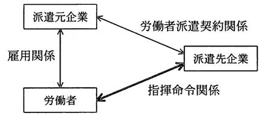

# 第2章　法務

#### 本章について

　本章は，第1章「セキュリティ」の次に出題項目が多いセクションです．実際に，平成28年春の第１回試験では13のキーワード・項目がこの章から出題されています．試験対策としては第1章と合わせて取りこぼしの無いように理解を深めておきましょう．

　ITパスポート試験の「中分類2：法務」よりも広く深い知識が要求されます．特にセキュリティ関連法規やガイドラインの正しい理解が必要です．基本情報試験の「中分類23：法務」と同等の難度ですが「OECDプライバシーガイドライン」や「情報セキュリティ対策ベンチマーク」のように基本情報試験では出題されたことのないテーマが用いられていますので，注意が必要です．

## 2.1　知的財産権

### 2.1.1　知的財産権

- **知的財産権**　産業財産権と著作権を合わせたもの．ソフトウェアなどの知的財産の重要性が増し，開発，流通が盛んになっていく中で，開発者の利益を守り，市場で適正利潤を得られるようにするための法律により守られる権利のことです．
- **産業財産権法**　産業の発展に寄与することを目的として制定されたもので，**特許法**，**実用新案法**，**意匠法**，**商標法** から成ります．それぞれ，発明，考案，意匠，商標の各権利を守ります．*⇒SG28春33,SG28春35*
- **著作権法**　著作者の権利を保護する法律．著作権者から見て，権利侵害であるという場合は，著作権者は差止請求権を行使することができ，損害賠償の請求が可能です．*⇒SG28春33,SG28春35*
- **著作権**　著作者の持つ複数の権利の集合体です．日本では，無方式主義を採用しており，著作物を作成した時点で権利が発生し，その後一定期間保護されます．著作権法ではプログラムやデータベースも保護の対象となります．なお，所定の条件を満たせば著作権者の許諾を得ることなく著作物を利用，改変することができます．
- **コピープロテクト外し**　ソフトウェアのコピープロテクトを外すことは，ビデオや音楽の記録媒体と同様に，著作権法の「技術的保護手段の回避」という条項で（コピーするかどうかとは別に）禁止されています．また，著作権法の改正により，平成24年10月1日から，DVDなどのコピー防止機能を解除して，自分のパソコンに取り込む行為（リッピング）についても違法となり，また，このようなコピー防止機能を解除するプログラムなどを作成や譲渡などした場合が刑罰の対象となりました．

### 2.1.2　不正競争防止法

- **不正競争防止法**　商号や商標などの無断使用，営業秘密の不正取得，不正使用などの行為，利益の保護や侵害への措置に関する法．他の商品の名前や形をまねる，営業機密を盗む，他社を誹謗中傷するなどの利益侵害の行為と，それに関わる損害賠償などの措置を取り決めています．*⇒SG28春33,SG28春35*
- **営業秘密**　不正競争防止法において「営業秘密となる要件」が定められており「秘密として管理されていること」「事業活動に有用な技術上又は経営上の情報であること」「公然と知られていないこと」となっています．また違法性がないことも条件です．*⇒SG28春35*
- **ドメイン名の不正取得**　ドメイン名は比較的簡単な手続きで取得できるため，商号や商標に類似するものは，不正競争防止法によって規制されています．

## 2.2　セキュリティ関連法規

### 2.2.1　サイバーセキュリティ基本法

- **サイバーセキュリティ基本法**　世界的規模で生じているサイバーセキュリティに対する脅威の深刻化に伴い，情報の自由な流通を確保しつつ，サイバーセキュリティの確保を図るために基本理念を定めた法．サイバーセキュリティ戦略本部の設置なども含みます．
- **サイバーセキュリティ**　情報システムやネットワークの安全性及び信頼性の確保のために必要な措置が講じられ，その状態が適切に維持管理されていること．

### 2.2.2　不正アクセス禁止法

- **不正アクセス禁止法**　**刑法**（2.2.4参照）はデータの改ざん，消去などの行為を処罰の対象にしているのに対し，不正アクセス禁止法はネットワークヘの侵入，アクセス制御のための符号提供などを一律に犯罪の対象としています．利用権限をもたない第三者が，他人のID やパスワードを使ってネットワークに接続されたコンピュータを利用可能にする行為およびその助長行為を処罰の対象にしている法です．*⇒SG28秋35*
- **不正アクセス禁止法の処罰の対象となる行為**　Web サイトで使用している他人のID・パスワードを無断で第三者に教えるような **不正アクセス行為** と，**不正アクセス行為を助長する行為** です．ただし，**アクセス制御機能** のないWebサイトに対する侵害行為は含まれません．また，コンピュータウイルスを添付した電子メールをメールサーバに送信する行為，ネットワーク接続されていないスタンドアロンのコンピュータに対する侵害行為などは対象ではありません．
　
### 2.2.3　個人情報保護法

- **個人情報**　氏名や住所，生年月日など，生存している個人を特定できる情報のこと．*⇒SG28春32*
- **個人情報保護法**　個人情報取扱事業者が遵守すべき義務を定めることで，個人の権利や利益を保護するための法律です．*⇒SG28秋31*
- **個人情報取扱事業者**　5,000件以上の個人情報データベース等を事業の用に供している事業者です．
- **個人情報保護に関するガイドライン**　個人情報保護法を補完するガイドライン．事業者等が行う個人情報の適正な取扱いの確保に関する活動を支援する具体的な指針です．例えば，個人情報の **第三者提供** や目的外利用では本人同意が原則であり，個人情報を保有する事業者は安全管理措置が求められます.
- **プライバシーマーク**　**JIS Q 15001** に適合して，個人情報について適切な保護措置を講ずる体制を整備している事業者などを認定して，その旨を示すプライバシーマークを付与し，事業活動に関してプライバシーマークの使用を認める制度です．
- **特定個人情報の適正な取扱いに関するガイドライン**　個人番号（**マイナンバー**）を取り扱う事業者が特定個人情報の適正な取扱いを確保するための具体的な指針を定めたもの．事業者編と、行政機関等・地方公共団体等編があり，事業者編では従業員の個人番号を含む源泉徴収票を，業務委託先の税理士に作成させることなどを認めています．*⇒SG28秋33*
- **マイナンバー法施行令**　行政手続における特定の個人を識別するための番号の利用等に関する法律施行令のこと
- **OECDプライバシーガイドライン**　OECD（Organization for Economic Cooperation and Development：経済協力開発機構）が1980年に策定した **プライバシー保護と個人データの国際流通についてのガイドラインに関する理事会勧告** のこと．日本の個人情報保護法制や関連制度（プライバシーマークなど），OECD加盟国をはじめとする多くの国や地域における法制度やルールに大きな影響を及ぼしています．*⇒SG28春31*

表2.2.1 OECDプライバシーガイドライン～規範となる8つの原則（JIPDEC）

|  |  |  |
|:---|:---|:---|
| 原則1	| 収集制限の原則	| 個人データを収集する際には，法律にのっとり，また公正な手段によって，個人データの主体（本人）に通知または同意を得て収集するべきである．|
| 原則2	| データ内容の原則 | 個人データの内容は，利用の目的に沿ったものであり，かつ正確，完全，最新であるべきである．|
| 原則3	| 目的明確化の原則 | 個人データを収集する目的を明確にし，データを利用する際は収集したときの目的に合致しているべきである．|
| 原則4	| 利用制限の原則	| 個人データの主体（本人）の同意がある場合，もしくは法律の規定がある場合を除いては，収集したデータをその目的以外のために利用してはならない．|
| 原則5	| 安全保護の原則	| 合理的な安全保護の措置によって，紛失や破壊，使用，改ざん，漏えいなどから保護すべきである．|
| 原則6	| 公開の原則	| 個人データの収集を実施する方針などを公開し，データの存在やその利用目的，管理者などを明確に示すべきである．|
| 原則7	| 個人参加の原則	| 個人データの主体が，自分に関するデータの所在やその内容を確認できるとともに，異議を申し立てることを保証すべきである．|
| 原則8	| 責任の原則	| 個人データの管理者は，これらの諸原則を実施する上での責任を有するべきである．

- **プライバシー影響アセスメント（PIA：Privacy Impact Assessment）**　情報の取り扱いに関する分析であり，以下の目的で実施されます

 1. 情報の取扱いが，該当する法律上の要件，規制上の要件，および政策要件に確実に準拠するようにする．
 1. 電子情報システムによって特定可能な形式で情報を収集，維持，普及する際の，リスクと影響を判断する．
 1. 潜在的なプライバシーリスクを軽減するための，情報の取り扱いに関する保護対策と代替プロセスを検証し，評価する．

- **APECプライバシーフレームワーク**　APEC（Asia-Pacific Economic Cooperation：アジア太平洋経済協力）が2004年に採択したプライバシーに関する枠組み．OECDプライバシーガイドラインとほぼ同等の内容に，「被害の防止原則」が加わったものです．
- **オプトイン**　電子メールなどによる情報の提供において，消費者から事前承認を得ること．*⇒SG28秋34*
- **オプトアウト**　電子メールなどによる情報の提供において，消費者が受信を拒否すること．あるいは，消費者が受信を拒否できることを理由に事前承認を得ずに情報を提供することを指す場合もあります．
- **匿名化手法**　あるデータに対して，情報の削除やあいまい化等の加工を行うことで，データを参照した人が個人を識別できない状態にする手法．**サンプリング**，**k-匿名化** などがあります．

### 2.2.4　刑法

- **刑法**　犯罪とそれに対する刑罰の関係を定める法律．コンピュータ犯罪に関する条項が増えていますが，別途，不正アクセス禁止法が制定されたように，刑法では対応しきれない事案もあります．
- **電子計算機使用詐欺**　コンピュータに虚偽情報や不正な命令を与えて，不正なデータを作成し不法な利益を得ることです．*⇒SG28春33,SG28秋32*
- **電子計算機損壊等業務妨害**　コンピュータやデータを破壊したり，虚偽情報や不正な命令を与えて，業務を妨害することです．*⇒SG28春33,SG28秋32*
- **電磁的記録不正作出および供用**　誤った事務処理をさせるようにデータを不正に作成すること，および，これを供用することです．
- **支払用カード電磁的記録不正作出**　誤った事務処理をさせるようにクレジットカードを不正に作成・譲渡・貸出・輸入することです．
- **不正指令電磁的記録に関する罪**　コンピュータウイルスの作成，提供，供用，取得，保管行為を罰する法律．ウイルス作成罪ともいいます．

### 2.2.5　その他のセキュリティ関連法規

- **電子署名および認証業務などに関する法律**　インターネットを活用した電子商取引など，ネットワークを通じた社会経済活動の円滑化を図ることを目的として **電子署名**（**ディジタル署名**（1.1.11参照））および認証業務について規定している法です．
- **認定認証事業者**　電子署名の認証処理が，電子署名法で定める基準に適合しているとして，認定された事業者です．
- **電子証明書**　**CA（Certification Authority：認証局）** が発行する証明書としての電子データ．送信者の公開鍵が，正当な所有者本人のものであることを保証します．
- **プロバイダ責任制限法**　インターネットや携帯電話の掲示板などで誹謗中傷を受けたり，個人情報を掲載されて，個人の権利が侵害された場合，ISP（インターネット・サービス・プロバイダ）に対して，これを削除するよう要請できること，ISPがこれらを削除しても権利者からの損害賠償の責任を免れること，権利を侵害する情報を発信した者の情報を開示する請求ができることを規定する法です．また，侵害の事実に気付かずに放置した場合に、ISPの損害賠償責任が制限されます．*⇒SG28秋31*
- **特定電子メール**　営業活動を目的とするメール．このようなメールを送信する際の禁止事項などを規定した法律が **特定電子メール法** です．取引関係にあるなどの一定の場合を除き，**オプトイン方式**（2.2.3参照）をとることなどを定めています．*⇒SG28春34,SG28秋34*

### 2.2.6　情報セキュリティに関する基準

- **コンピュータ犯罪防止法**　従来の刑法では対象にならなかったコンピュータの電磁的記録などに関する犯罪についても，処罰の対象とできるようにした改正刑法の通称です．
- **コンピュータウイルス対策基準**　コンピュータウイルスに対する予防，発見，駆除，復旧などについて実効性の高い対策をとりまとめたものです．
- **コンピュータ不正アクセス対策基準**　コンピュータ不正アクセスによる被害の予防，発見，再発防止などについて，組織および個人が実行すべき対策をとりまとめたものです．
- **情報システム安全対策指針**　国民生活の安全を確保し，情報社会における秩序を維持することを目的とする国家公安委員会が作成した指針です．
- **ソフトウェア等脆弱性関連情報取扱基準**　経済産業省が制定した基準で，ソフトウエアなどに係る脆弱性関連情報などの取扱いにおいて関係者に推奨する行為を定めることにより，脆弱性関連情報の適切な流通および対策の促進を図り，コンピュータウイルス，コンピュータ不正アクセスなどによって不特定多数の者に対して引き起こされる被害を予防し，高度情報通信ネットワークの安全性の確保に資することを目的とするものです．
- **政府機関の情報セキュリティ対策のための統一基準**　日本の政府機関が情報セキュリティ対策を行うにあたっての対策基準を定めたもの．
- **スマートフォン安全安心強化戦略**　総務省が「利用者視点を踏まえたICTサービスに係る諸問題に関する研究会」の下に「スマートフォン時代における安心・安全な利用環境の在り方に関するワークグループ」を設置し，スマートフォン等を安心・安全に利用できる環境を整備すべく策定したもの．
- **ソーシャルメディアガイドライン**　ソーシャルメディア、**SNS**（9.2.1参照）を利用する際に，企業・団体としての活用方針や，従業員・職員に求められる取り組み姿勢をまとめた指針です．**SNS利用ポリシ** ともいいます．
- **情報セキュリティ対策ベンチマーク**　IPAセキュリティセンターが提供している，組織の情報セキュリティ対策自己診断テスト．望まれる水準や他社の対策状況と自社の対策状況を比較することができます．情報システムの運用管理状況などの情報セキュリティ対策状況と企業情報を入力し，組織の情報セキュリティへの取組状況を自己診断します．*⇒SG28春12*

## 2.3　労働関連・取引関連法規

### 2.3.1　労働関連の法規（労働基準法）

- **労働基準法**　労働者の主な労働条件についての最低限守るべき基準を定めた法．会社と労働者は対等な立場で労働契約を結ぶべきであるという原則に立ち，就業規則，労働条件を文書などで明示することや，労働契約における最低賃金，残業賃金，労働時間などの計算についての最低基準を定めています．*⇒SG28秋11*

### 2.3.2　労働関連の法規（労働者派遣法）

- **労働者派遣法**　労働者派遣事業の適正な運営と，派遣労働者の就業に関する条件整備を図り，派遣労働者の雇用を安定させるための法律です．
- **労働者派遣契約**　派遣元企業が自社で雇用契約を結んだ労働者を，労働者派遣契約を結んだ派遣先企業に行かせて，派遣先の指揮命令を受けながら労働に従事させる形態です．**請負契約**（2.3.3参照）とは異なり，出先（派遣先）に指揮命令関係が移りますが，雇用関係は変わりません．*⇒SG28秋36*

図2.3.1 労働者派遣と各種の関係（*⇒FE22秋80*） 　

### 2.3.3　企業間の取引にかかわる契約

- **請負契約**　ある仕事を完成することを請負業者が発注者に対して約束し，その仕事の成果に対して発注者が請負業者に報酬を支払う契約．つまり，成果物の完成責任における契約です．*⇒SG28春36,SG28秋36*
- **請負業者と労働者の関係**　業務に従事するのは請負業者が自社で雇用する労働者です．労働者の管理を行うのは請負業者であり，指揮命令権も請負業者にあります．この関係が守られないと偽装請負となります．
- **委任契約**　請負契約に似た業務受託ですが，成果物の完成責任がありません．
- **準委任契約**　善管注意義務を負って作業を受託する契約です．*⇒SG28秋36*
- **守秘契約（NDA：Non-Disclosure Agreement）**　自社以外の事業者に業務を委託する際に，自社の秘密情報を開示する場合，その秘密情報を守るために締結する契約．
- **ソフトウェア使用許諾契約**　ソフトウェアの知的財産権の所有者が，第三者に当該ソフトウェアの利用許諾を与える場合に条件を取り決める契約．知的財産権利用許諾契約の一つ．**ソフトウェアライセンス契約** ともいいます．
- **ボリュームライセンス契約**　一つのソフトウェア製品に複数の利用権（ライセンス）をまとめて，割引価格で提供する販売契約です．
- **コピーレフト（Copyleft）**　著作者が著作物の自由な利用，再配布，改変を許諾すること．
- **ソフトウェア開発契約**　委託に基づいて，ソフトウェアの開発を受託するソフトウェア契約です．
- **ソフトウェア開発委託モデル契約**　経済産業省や社団法人情報サービス産業協会（JISA）が公開している開発委託契約のひな型．
- **情報システム・モデル取引・契約書**　経済産業省による情報システムの契約プロセス，契約書（企画，開発，運用・保守の基本契約書）のひな型．

## 2.4　その他の法律・ガイドライン・技術者倫理

### 2.4.1　その他の法律・ガイドライン・技術者倫理

- **IT基本法**　ITを活用し，急激かつ大幅な社会経済構造の変化に適確に対応し，ネットワーク社会の形成に関する施策を迅速かつ重点的に推進していくことを目指して，基本法として制定された法です．
- **e-文書法**　各種法令によって保存が義務付けられている文書について，電子化された文書ファイルでの保存が可能であるとする法律．
- **電磁的記録**　電子的方式，磁気的方式などにより，人の知覚によっては認識することができない方式でつくられた記録．紙文書をスキャンした画像ファイルや情報システムが扱う電子帳簿などのことです．
- **電子帳簿保存法**　コンピュータを使用して作成した国税関係帳簿書類の保存方法などの特例に関する法．電磁的記録，COM（Computer Output Microfilm：電子計算機出力マイクロフィルム）による保存を可能としたものです．
- **コンプライアンス**　企業が法律，規則などのルールに従って活動すること．遵法．企業にはコンプライアンスの義務と責任があり，コンプライアンスに違反した場合には法的制裁やリスクが出現します．コンプライアンスの強化により，企業存続の危機につながりかねない，経営者や従業員による不法行為の発生を抑制することができます．
- **情報倫理・技術者倫理**　情報の不適切な利用から利用者を保護する法令，マナーに関する情報倫理，高度な専門技術者に期待される技術者倫理が重要です．**法令，規格** に加えて適切な **情報倫理規程** を制定し，状況に応じて最適な内容に更新することも必要です．

## 2.5　標準化関連

### 2.5.1　標準・規格と標準化団体

- **JIS（Japanese Industrial Standards：日本工業規格）**　工業標準化法に基づきJISC（日本工業標準調査会）の答申を受けて，主務大臣が制定する工業標準です．
- **IS（International Standards：国際規格）**　ISOなどで制定された世界標準の総称です．
- **ISO（International Organization for Standardization：国際標準化機構）**　各国の代表的標準化機関からなり，電気および電子技術分野を除く工業製品の国際標準の策定を目的としています．
- **IEC（International Electrotechnical Commission：国際電気標準会議）**　主に電気，電子，通信技術の国際標準や規格を作成する機構．ISOの電気・電子部門を担当し，ISO/IECの名前で規格を策定しています．
- **IEEE（Institute of Electrical and Electronics Engineers：電気電子学会）**　電気・電子技術に関する非営利の団体であり，学会活動，書籍の発行，IEEE で始まる規格の標準化を行っています．
- **デファクトスタンダード**　事実上の標準として広く用いられている規格，基準，製品などのことです．
- **デジュレスタンダード**　社会的な標準化団体によって定められた標準規格のこと．デファクトスタンダードの対語です．
- **QRコード**　２次元バーコードの代表例．**JIS X 0510** 及び **ISO/IEC 18004** として規格化されています．*⇒SG28秋20*
- **ISO 9000ファミリー**　品質マネジメントシステムおよび品質保証のための国際標準規格群．商品やサービスの品質だけでなく，顧客満足や業務改善といった組織の管理までを含む「企業の質」についての基準を定めています．認証は審査登録機から得られますが，半永久的なものではなく，取得後も一定期間内に再審査を受ける必要があります．品質マネジメントシステムに関する要求事項を規定した **ISO 9001** などがあります．*⇒SG28秋30*
- **ISO 14000ファミリー**　環境マネジメントシステムの国際標準規格群．環境マネジメントシステムの要求事項をまとめた **ISO 14001**、環境マネジメントシステムの実施の一般指針を規定した **ISO 14004** などがあります．*⇒SG28秋30*
- **ISO/IEC 27000ファミリー**　情報セキュリティマネジメントシステムのための国際標準規格群．情報セキュリティマネジメントシステムの要求事項をまとめた **ISO/IEC 27001**，その導入，実施，維持及び改善に関するベストプラクティスをまとめた **ISO/IEC 27002**（旧：**ISO/IEC 17799**），リスクマネジメントの規格である **ISO/IEC 27005** などがあります．*⇒SG28秋30*
