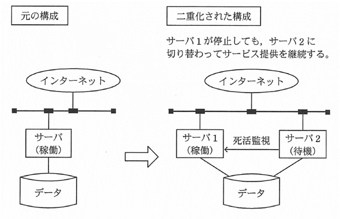
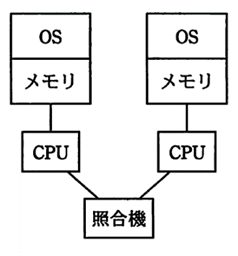
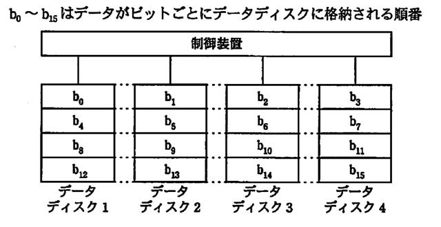
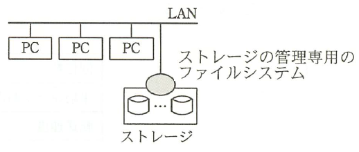
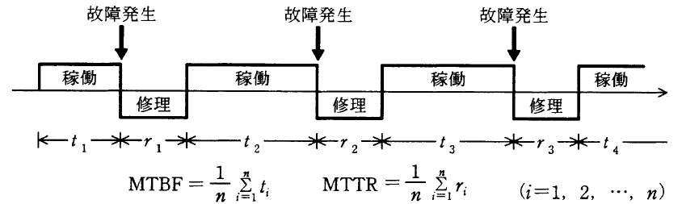

# 第3章　システム構成要素

#### 本章について

　本章は，セキュリティの基盤となるシステムを構成する要素を扱っており，単独ではなく，セキュリティ関連問題に含まれて出題される項目群です．特に，午後問題ではシステム構成に関する説明文を読み解く必要があり，構成方法のメリットとデメリット，評価指標の利用法などの知識が問われます．

　ITパスポート試験の「中分類16：システム構成要素」，基本情報試験の「中分類4：システム構成要素」とほぼ同等の範囲と難度ですが，より実践的な理解が問われますので，あいまいな項目がないかチェックしておきましょう．

## 3.1　システムの構成

### 3.1.1　システムの処理形態・利用形態

- **集中処理**　中央のコンピュータ（主にメインフレームや大型サーバ）で処理を集中して行い，リクエスト入力や結果表示を専用端末装置やPCで行う処理形態．銀行オンラインシステムや鉄道座席予約システムなどで用いています．集中処理システムは中央装置への保守要員の集中化ができますので，管理のしやすさ，セキュリティの高さがメリットです．このことにより，コスト性能比を高くすることができます．しかし，負荷が中央装置に集中するため，繁忙時には処理待ちが発生しやすく，また，中央装置が停止すると，システム全体が停止してしまいます．加えて，システム規模の拡大や縮小が難しいという問題もあります．
- **分散処理**　システムを構成するコンピュータで処理を分担する処理形態．日常業務処理システムなどで用います．分散処理システムは，**対話型処理** に向いており，規模の変更が柔軟に行えます．また，**機能配分** を適切に行うことで部分稼働が可能なので，システムの一部で障害が発生しても，その内容によっては，残りの部分でサービス継続が可能です．しかし，保守要員を張り付けることができないため，各組織に対して管理責任を負わせる必要があります．このため，管理レベルが低下しやすく，セキュリティも低くなりやすいのがデメリットです．加えて，各組織の要員の訓練や教育も必要なため，コストは大きくなりがちです．
- **バッチ処理**　処理対象データを蓄積しておき，必要なタイミングで一括処理する形態．月次帳票発行システムなどに用います．コンピュータの処理効率を最大化できるのがメリットです．
- **リアルタイム処理**　処理対象データが発生したらすぐに処理する形態．機械制御システムなどに用います．

### 3.1.2　システム構成

- **冗長構成**　システムの一部または全部を，二重化または多重化すること．コストが増加しますが，システムの信頼性向上に貢献します．また，**負荷分散** を適切に行うことで，応答速度の向上などが実現します．

図3.1.1 冗長構成の例（*⇒FE24春43*） 　

- **デュアルシステム**　完全二重化システム．OS，メモリ，CPUなどを二重化して同一の処理を実行し，処理結果を照合機で確認することで，異常の発生を即時に知ることができます，異常時は片側を切り離すことでシステムを止めることなく業務継続が可能です．単一構成の2倍以上のコストが
かかりますので，無停止性が必要な基幹システム等に用います．

図3.1.2 デュアルシステムの構成例（*⇒AP23特14*） 　

- **デュプレックスシステム**　2系列のコンピュータシステムをもち，異常発生時に切り替える方式です．正常時は一方を **主系（現用系）** としてオンラインシステムで用い，もう一方を **従系（待機系）** としてバッチ処理や開発作業などに用いるのが一般的です．デュアルシステムよりも信頼性は低く，異常時の切替えに時間がかかりますが低コストにできます．
- **クラスタ（クラスタリング）**　複数のコンピュータを組み合わせて一つの信頼性の高いシステムを構築する方式．システムの一部で障害が発生しても，他のコンピュータに処理を肩代わりさせることによって，システム全体の停止を防止できます．*⇒SG28春13*
- **ロードバランシング**　負荷分散．多重化している装置や機能の負荷を平準化します．*⇒SG28春13*
- **クライアントサーバシステム**　サービスを提供する側（**サーバ**）と提供される側（**クライアント**）によって構成されるシステム．柔軟で安価なシステムを構築できます．*⇒SG28秋45*
- **シンクライアント**　PCと同等の処理能力を持ちますがハードディスクなどの周辺記憶装置をもたない安価な端末装置．アプリケーションはネットワーク経由で実行するので，管理コストが低く，セキュリティが高いのが特徴です．
- **Webシステム**　WebサーバとWebクライアント（主に **Webブラウザ**）によるシステム構成．クライアント側は基本的にWeb ブラウザのみで利用できるため，運用コストが低く，機種やOS への依存が少ないのがメリットです．
- **ピアツーピア**　1対1接続．2台のコンピュータが対等な接続を行って資源を共有する方式です．
- **クラウドコンピューティング**　コンピュータの資源をネットワークを介して提供することによって，利用者がスケーラビリティ（拡張性）やアベイラビリティ（可用性）の高いサービスを容易に受けられる構成です．これを用いるサービスを **クラウドサービス** といいます。
- **パブリッククラウド** インターネットを介して不特定多数に利用されることを前提に構築・提供されるクラウドサービス。*⇒SG28秋午後3*
- **プライベートクラウド** 特定の組織が利用することを前提に構築･提供されるクラウドサービス。
- **コミュニティクラウド** パブリッククラウドとプライベートクラウドの中間的な存在であり、同じ目的を持つ特定ユーザ群によって形成されるコミュニティに閉じて共同利用されるクラウドサービス。
- **バーチャルプライベートクラウド** パブリッククラウド上で仮想的にプライベートクラウドを構成するもの。
- **オンデマンド**　利用者からの要望に即応したサービスを提供すること．
- **ホスティング**　プロバイダ（サービス業者）が所有するコンピュータ，外部記憶装置，通信回線などの性能・容量を区分して，複数の利用者へ間貸しするサービスです．
- **SaaS（Software as a Service）**　インターネット経由で，アプリケーションソフトウェアの機能を必要なときに必要な分だけ利用者に提供するサービス．管理コストとソフトウェアコストを効率化できます．
- **PaaS（Platform as a Service）**　OS やミドルウェアなどのプラットホームの機能を必要なときに必要な分だけ利用者に提供するサービスです．オンデマンドでデータセンタを利用できるサービスなどがあります．
- **IaaS（Infrastructure as a Service）**　ハードウェアやネットワークなどの基盤の設置や保守などを必要なときに必要な分だけ利用者に提供するサービス．オンデマンドでホスティングを行うサービスなどがあります．
- **DaaS（Desktop as a Service）**　ユーザのシステム利用環境（デスクトップ）の設置や保守などを必要なときに必要な分だけ利用者に提供するサービス．シンクライアントの導入・運用サービスなどがあります．

### 3.1.3　ストレージの構成

- **RAID（Redundant Arrays of Inexpensive Disks）**　複数の磁気ディスク装置をまとめて一つの装置として扱い，信頼性や速度を向上させる技術です．下記の種類があり，主に，RAID 0，1，5，6が用いられます．

表3.1.1 RAIDの種類

| 種類 | 概略 |
|:----|:----|
| **RAID 0** | **ストライピング**（データの分散書込み）．速度向上のみ |
| **RAID 1** | **ミラーリング**（同一データの複数ディスク書込み）．信頼性向上のみ |
| RAID 2 | 各装置にハミングコード（訂正用情報）を記録する．信頼性がRAID 1よりも向上 |
| RAID 3 | １装置をパリティ（訂正用情報）専用にし，データをビット単位でストライピング．速度，信頼性，共にRAID 2よりも向上 |
| RAID 4 | １装置をパリティ専用にし，データをブロック単位でストライピング．速度がRAID 3より向上．信頼性はRAID 3と同等 |
| **RAID 5** | **パリティ付きストライピング**．パリティとデータを共にストライピング．速度，信頼性，共にRAID 4より向上．1台の故障であれば処理継続可能 |
| **RAID 6** | 二つのパリティとデータを共にストライピング．速度はRAID 5と同等．信頼性がRAID 5より向上．2台までの故障であれば処理継続可能 |

図3.1.3 ストライピングの例（*⇒FE21秋12*） 　

- **NAS（Network Attached Storage）**　ネットワーク接続ストレージ．ネットワークに直結するディスク装置であり，ファイルサーバとして機能します．ストレージの管理用のファイルシステムはNAS側にあるので，PC側のOSに依存しないのが特徴です．

図3.1.4 NASの例（*⇒FE22秋15*） 　

- **SAN（Storage Area Network）**　ストレージ専用ネットワーク．磁気ディスク装置や磁気テープ装置などのストレージを，通常のLANとは別の高速な専用ネットワークで構成する方式です．サーバやLANを介さずに，データのバックアップが可能です．

### 3.1.4　信頼性設計

- **フォールトトレラント**　システム障害の影響を最小限に抑える考え方の総称．
- **フェールセーフ**　システムに障害が発生したときでも，常に安全側にシステムを制御すること．安全に停止する場合と，安全な状態に固定する場合があります．
- **フールプルーフ**　利用者の誤操作によって致命的な問題が発生しないようにする工夫のことです．ヒューマンエラー回避技術．
- **UPS（Uninterruptible Power Supply）**　無停止電源供給装置．停電時に，内蔵している電池からコンピュータにシャットダウンに必要な電力を供給します．瞬間停電時や自家発電装置起動までの「つなぎ電源」としても利用できますが，バッテリーが経年劣化するため，定期的な保守が必要です．　

## 3.2　システムの評価指標

### 3.2.1　システムの性能特性と評価

- **システムの性能指標**　レスポンスタイム，スループットなどがあり，システムの性格に合わせて使い分けます．
- **レスポンスタイム（応答時間）**　入力完了から出力開始までの所要時間．主に対話型システムの評価指標として用います．*⇒SG28春43*
- **ターンアラウンドタイム**　入力（準備）の開始から出力の完了までの所要時間．主にバッチ処理の評価指標に用います。*⇒SG28春43*
- **スループット**　単位時間当たりの仕事量．単位は評価対象によって異なります．

### 3.2.2　システムの信頼性特性と評価

- **信頼性指標と信頼性計算**　信頼性指標としてMTBFとMTTRがあり，この２値から稼働率を計算できます．
- **MTBF（Mean Time Between Failure）**　**平均故障間隔**．稼動時間の合計を稼動回数で割って得られます．*⇒SG28春41*
- **MTTR（Mean Time To Repair）**　**平均修理時間**．修理時間の合計を修理回数で割って得られます．MTBFとの関係を図と数式にすると下図のとおりです．

図3.2.1 MTBFとMTTR（*⇒FE20秋34*） 　

- **稼働率**　平運用時間を故障時間を含む全時間で割ったもので0以上1以下の値．**MTBF÷（MTBF＋MTTR）** でも得られます．

### 3.2.3　システムの経済性の評価

- **初期コスト（イニシャルコスト）**　システム導入時の費用．ハードウェア，ソフトウェアの購入費や開発費，利用者の教育費などの一過性の費用のことです．
- **運用コスト（ランニングコスト）**　システムを運用する限り継続的にかかる費用．電気料金，紙などの媒体費，運営スタッフの人件費などが含まれます．

