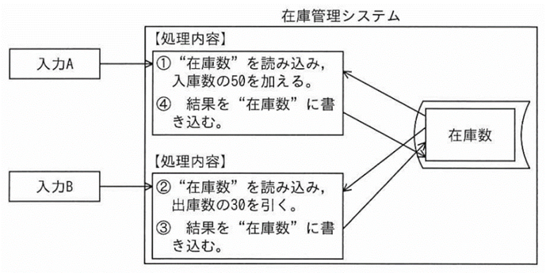

# 第4章　データベース

#### 本章について

　本章で扱うデータベースの項目群については，主にセキュリティ問題を解く上で必要な関連知識となっています．第１回試験ではデータベースを主なテーマとする問題は１問のみでした（正解はデータウェアハウス）．セキュリティを主なテーマとする問題ではSQLインジェクション関連が午前に２問あり，午後問題では，ロールベースアクセス制御（RBAC）の考え方が出題されましたので，重点的に理解しておくと良いでしょう．

　ITパスポート試験の「中分類21：データベース」とほぼ同等の範囲と難度ですが「データベース応用」が追加されています．また，基本情報試験の「中分類31：データベース」とは異なりSQLの文法は出題されない様子です．ITパスポート合格レベルのデータベース関連知識があれば，RBACのようなトピックの概略を理解しておけば十分でしょう．

## 4.1　データベース方式

### 4.1.1　データベース

- **データベースの種類と特徴**　データを１対ｎの親子関係による階層構造（階層モデル）で扱う階層型データベース，データをｎ対ｍの自由度の高い階層構造（ネットワークモデル）で扱う網型データベース．オブジェクト指向におけるクラスとオブジェクトをそのまま扱うオブジェクト指向データベース，関係データベースなどがあります．
- **関係データベース（RDB：Relational Database）** データを2次元の表どうしの関連による構造（リレーショナルモデル）で扱うデータベース方式です．

### 4.1.2　データベース管理システム

- **DBMS（DataBase Management System）**　データベース管理システム．対象とするデータモデルにそって，データを構造的に蓄積し，それらの一貫性を保ち，効率的に取り出すための機能を備えるシステムです．
- **データベース定義機能**　データベースの仕様を定義する機能．実際に論理構造を作成・変更・削除する機能を含みます．
- **データベース操作機能**　データベースへのアクセスを提供する機能．データの検索，更新，削除などを行います．
- **データベース制御機能**　データベースの運用を支援する機能．データの一貫性を保つための保全機能や，データ機密保護の機能を含みます．
- **データベースアクセス制御**　利用者や利用者グループごとに，データベースのどの要素にどういう操作が可能かを設定し．違反行為を防止・警告すること．
- **ロール**　多数のデータベースアクセス権限を，システム上の役割として定義し効率的に管理する仕組み．業務上必要な操作権限の組合せを付与したもので，利用者IDにロールを設定することによって，利用者の操作権限が決まります．
- **ロールベースアクセス制御（RBAC：Role-based Access Control）**　データベースアクセス制御をロールによって行うこと．柔軟で効率の良いアクセス制御が可能で，上位権限設定の濫用を防ぐことができます．

## 4.2　データベース設計

### 4.2.1　データ分析

- **データ分析**　対象業務にとって必要なデータは何か，各データがどのような意味と関連をもっているかなどを検討することです．
- **データ重複の排除**　異音同義語，同音異義語の発生を抑えるためにデータ項目の標準化を行います．
- **データディクショナリ**　データの属性，意味内容，格納場所など，データを管理するための情報（メタデータ）を収集，管理するデータ辞書です．*⇒SG28春44*

## 4.3　データ操作

### 4.3.1　データ操作

- **データベース言語（SQL：Structured Query Language）**　データベースの定義や操作などを行うための標準化された言語．

## 4.4　トランザクション処理

### 4.4.1　トランザクション処理

- **トランザクション**　データベースやファイルの更新を含む一連の処理のこと．銀行の口座間振込処理のように，一つ一つの更新や参照ではなく，全体で一つの業務処理として管理すべき場合に用いる考え方です．
- **排他制御**　データの整合性を保つために，複数のトランザクションや更新プログラムが同時にデータベースのデータを更新することが起こらないようにする仕組みです．

図4.4.1 排他制御が必要な例（*⇒IP24秋80*）

- **障害回復**　DBMSには障害に備えたバックアップを取得し，世代管理を行う機能が含まれています．
- **バックアップの方式**　障害に備えたバックアップの方式は複数あり，バックアップに用いるリソース（時間や媒体数など）と，リストア（再格納）の作業量や所要時間によって検討します．これらは相反するものになります．

| 種類             | 概略                                                                                                                                                                                                                                                                       |
|------------------|----------------------------------------------------------------------------------------------------------------------------------------------------------------------------------------------------------------------------------------------------------------------------|
| **フルバックアップ** | 全データをバックアップする．バックアップ時間がかかるが，修復はフルバックアップのリストアのみで済む．差分バックアップや増分バックアップを行う場合にも必要 *⇒SG28秋40*                                                                                                                   |
| **差分バックアップ** | 前回のフルバックアップ以降に追加・変更されたデータのみバックアップする．バックアップ時間を短縮できるが，繰返し行うと時間が増えていく．修復には，先にフルバックアップをリストアし，それから最新の差分バックアップを上書きする必要がある *⇒SG28秋40*                                     |
| **増分バックアップ** | 前回のなんらかのバックアップ以降に追加・変更されたデータのみバックアップする．バックアップ時間を大幅に短縮できる．修復には，まず，フルバックアップをリストアし，次に最新の差分バックアップがあれば上書きし，それから最新までの全ての増分バックアップを上書きする必要がある |

表4.4.1 バックアップの種類

- **世代管理**　バックアップ結果を時系列に複数保持することです．人の過失によるファイル破壊などからの復旧の可能性を高めます．

## 4.5　データベース応用

### 4.5.1　データベースの応用

- **データウェアハウス(DWH)**　大規模蓄積用に特化したデータベース．組織の様々な活動を介して得られた大量のデータを整理・統合して蓄積しておき，意思決定支援などに用いられます．*⇒SG28春44*
- **データマート**　DWHを直接検索することは非効率なので，目的に適合する情報をDWH から抽出した結果のデータベースです．
- **データマイニング**　DWHやデータマートを分析して法則や規則を導き出すこと．複数の要素の相関関係などを対象にします．
- **ビッグデータ**　大量または長大なデータのこと．一般的にデータベースへの格納や管理が難しいデータのことを指します．データマイニングに有効な情報が含まれている場合が多く，ツールなどを活用してデータベース化することが望まれます．
- **データマッピング**　データの付け合わせ．データベースとXMLファイルのような形式の異なる媒体との間での，データの関係性を明示することです．*⇒SG28春44*
