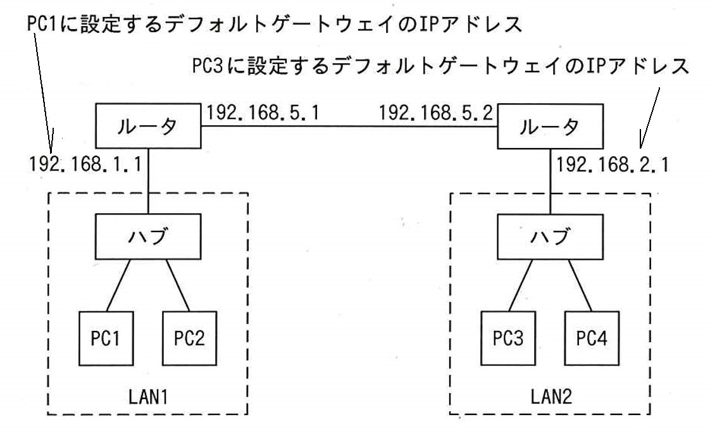
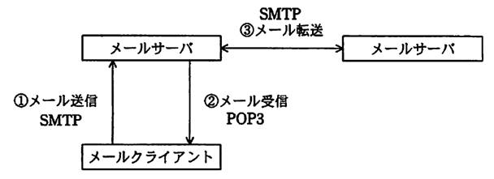
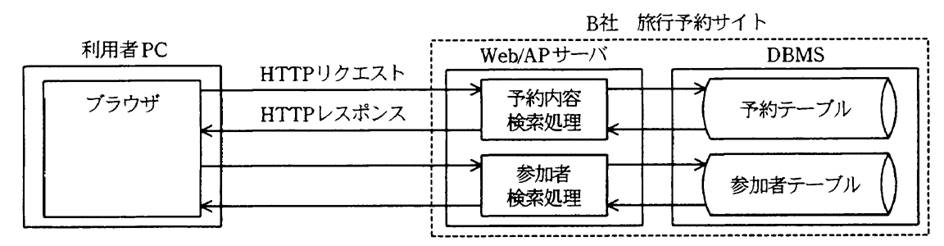

# 第5章　ネットワーク

#### 本章について

　セキュリティとネットワークには強い関連性があり，セキュリティ用語の中にはネットワークの知識が不足していると理解できないものが少なくありません．第１章「セキュリティ」と合わせてトータルな学習を進めてください．なお，ネットワークのみに関する出題は少なく，第１回試験ではルータに関する１問だけでした．

　ITパスポート試験の「中分類22：ネットワーク」に比べて深く広い知識が求められます．基本情報試験の「中分類10：ネットワーク」と同等の難度・範囲です．

## 5.1　ネットワーク方式

### 5.1.1　通信ネットワークの役割

- **通信ネットワークが果たす役割と効果**　通信ネットワークが果たす役割と効果は，ネットワーク障害が発生した場合の社会的影響の大きさによって明らかです．これらに関連する用語としてネットワーク社会，ICTなどがあります．
- **ネットワーク社会**　元の意味は「その構成要素が網の目状につながりあっている社会」のことでピラミッド型社会の対になる概念．現在では通信ネットワークを基盤とする情報社会を指すことが多くなっています．
- **ICT（Information and Communication Technology）**　情報と通信に関する技術の総称．

### 5.1.2　ネットワークの種類と特徴

- **LAN（Local Area Network）**　**構内通信網**．建物や施設の内部のように，利用者による私設が可能な範囲のネットワーク．自由度が高く，一般に高速です．ケーブルを用いる有線LANと用いない無線LANがあります．
- **WAN（Wide Area Network）**　**広域通信網**．電気通信事業者が有償で提供する通信サービス．従うべきルールが多く，一般に低速です．離れたLANとLANの接続にも用います．
- **電気通信事業者**　音声通話やデータ通信などの各種の通信サービスを提供する企業の総称です．電気通信事業者が提供する主なサービスは5.5.5参照．
- **ISP（Internet Services Provider）**　インターネット接続サービス（業者）．通信事業者やその関連会社が提供する場合と，その他の企業や団体，公的機関が提供する場合があります．

### 5.1.3　インターネット技術

- **インターネット技術の特徴**　インターネットは **TCP/IP** プロトコル（5.3.1参照）を核として実現されたネットワークであり，**IPアドレス**（5.3.1参照）を与えられた **ノード**（5.2.2参照）間の通信を基盤として，Webなどのサービスが実現されています．また，**IPパケット**（5.2.1参照）の **ルーティング（5.3.1参照）** がインターネットにおけるデータ伝送の基礎になっています．
- **IETF（Internet Engineering Task Force）**　インターネットに関する技術文書を作成し，標準化のための検討を行う組織です．*⇒SG28春1*
- **ドメイン**　インターネット上の管理主体，権威または監督のための領域．ネットワークの管理単位でありIPアドレスの範囲に名前（**ドメイン名**：5.5.2参照）をつけて用います．
- **DNS（Domain Name System）**　IPアドレスとドメイン名との相互変換を行う仕組み．www.example.jpのようなホスト名（サーバ名＋ドメイン名）から，**ホスト**（5.2.2参照）へのアクセスに必要なIPアドレスを検索する世界的な分散データベースシステムでもあります．
- **RADIUS（Remote Authentication Dial In User Service）**　無線LANや **VPN接続**（1.5.2参照）などで利用される利用者認証システム．接続要求をRADIUSサーバと呼ばれる認証サーバに転送しユーザ認証を行います．

## 5.2　データ通信と制御

### 5.2.1　伝送方式と回線

- **交換回線**　接続相手が固定である専用線に対して，複数の接続で利用する回線のこと．公衆回線（一般電話回線）のようにダイヤル接続を行う回線交換と，パケット交換があります．
- **パケット交換**　データをパケットに分割し複数の送信元・送信先のパケットを回線上に混在させることで，多数が通信できる方式．インターネット等で活用されており，回線を占有しないので利用効率が高いのがメリットです．
- **FTTH（Fiber To The Home）**　光ファイバケーブルによる家庭用超高速ネットワーク接続サービス．光信号用の終端装置である **ONU**（Optical Network Unit：光回線終端装置）を用います．
- **RFID（Radio Frequency Identification）**　極小の集積回路にアンテナを組み合わせたもので電子荷札に利用され，無線自動認識技術によって対象の識別や位置確認などができます．電車の定期券などとして利用される非接触型ICカードに用いられている技術です．汚れに強く，記録された情報を梱包の外から読むことができるのが特徴です．*⇒SG28秋14*

### 5.2.2　ネットワーク接続

- **ネットワーク接続**　ネットワークにおける接続は，主に下表の3種類に分類できます（接続機器については後述）．

| 種類 | 概略 |
|:----|:----|
| **LAN内接続** | LANに機器を追加接続したり延長すること．リピータ，リピータハブ，ブリッジ，レイヤ2（L2）スイッチなどを用いる． **OSI基本参照モデル**（5.3.1参照）の1，2 層（物理層，データリンク層）に該当 |
| **LAN間接続** | 同じプロトコルを用いるLANどうしを接続すること．ルータ，レイヤ3（L3）スイッチなどを用いる． OSI基本参照モデルの1～3 層（ネットワーク層以下）に該当 |
| **LAN-WAN接続** | LANとWANを接続すること．**イントラネット**（5.5.4参照）とインターネットのように通信プロトコルが同一の場合は，LAN間接続と同様にルータなどを用いる． 通信プロトコルが異なる場合は，ゲートウェイなどを用い，この場合はOSI基本参照モデルの全層に該当．|
表5.2.1 ネットワーク接続

- **ネットワーク接続装置**　ネットワーク接続に用いる主な装置と，その特徴は下表のとおりです．

| 種類 | 概略 |
|:----|:----|
| **リピータ** | 同種のセグメント（1本のネットワーク）で信号を増幅・整形することによって伝送距離を延長する装置．OSI基本参照モデルの物理層で接続 *⇒SG28春45* |
| **ハブ（リピータハブ）** | リピータの機能をハードウェアで実装し，多数の接続ポートをもたせた装置．すべてのトラフィックを全ポートに転送する．OSI基本参照モデルの物理層で接続 |
| **ブリッジ** | 二つ以上のLAN を接続し，LAN上のMACアドレス（5.3.1参照）を参照して，その参照結果を基にフレーム（ブリッジにおける通信単位）を他のセグメントに流すかどうかの判断を行う装置．OSI基本参照モデルのデータリンク層までで接続 *⇒SG28春45* |
| **スイッチングハブ** | ブリッジの機能をハードウェアで実装し，多数の接続ポートを持つ装置．受け取ったフレームを適切なポートにのみ転送する．フレームの蓄積機能や速度交換機能もある．OSI基本参照モデルのデータリンク層までで接続 |
| **レイヤ2（L2）スイッチ** | スイッチングハブと同義だが，レイヤ3（L3）スイッチと明確に区別したい場合などに用いる呼称 *⇒SG28春45* |
| **ルータ** | 同じプロトコルの異なるネットワーク（LAN どうしやLANとWAN）を接続する装置．受け取ったパケット（ルータにおける通信単位）のIPアドレスなどにより適切なネットワークに **ルーティング**（:5.3.1参照）する．OSI基本参照モデルのネットワーク層までで接続 *⇒SG28春45* |
| **レイヤ3（L3）スイッチ** | スイッチングハブにルーティング機能を加えてハードウェアで実装し，多数の接続ポートをもたせた装置．OSI基本参照モデルの2層（データリンク層）または3層（ネットワーク層）までで接続 |
| **ゲートウェイ** | プロトコルの異なるLANどうしやLANとWANを接続する装置．受け取ったデータを解釈しプロトコル変換しつつ転送する．OSI基本参照モデルの全層で接続 |

表5.2.2 ネットワーク接続装置

- **ホスト**　他機器に機能を提供するコンピュータのこと．情報ネットワークにおいては，ネットワークに接続されたコンピュータ（PC，サーバ，プリンタ，携帯電話，家電，ゲーム機，産業機器など）の総称です．
- **ノード**　接点．ホストとネットワーク接続装置のことです．あるいはそれらのネットワーク接続口を指します．
- **無線LANアクセスポイント**　無線LANと有線LANの接続装置．**SSID**(1.4.2参照)などによって識別して接続します．
- **プロキシサーバ**　LANからインターネットへの接続を行うときにアクセスを代行する仕組み．セキュリティを確保すると共に，Webコンテンツをキャッシュする（問合せ結果を溜め込んでおいて同一の問合せがあった時に再利用する）ことによって，アクセスを効率化できます．*⇒SG28春46,SG28秋12,SG28秋午後1*

## 5.3　通信プロトコル

### 5.3.1　プロトコルとインタフェース（ネットワーク層，トランスポート層）

- **通信プロトコル**　**通信規約**．ネットワーク接続に関わるハードウェアとソフトウェアの全てのルールの総称です．
- **OSI（Open Systems Interconnection）**　開放型システム間相互接続．**ISO**（2.5.1参照）により制定された，異機種間でデータ通信を実現するためのネットワーク構造の設計方針を定めた国際規格です．
	**OSI基本参照モデル**　ISOが策定した7層からなるネットワークアーキテクチャ．多岐に渡る通信プロトコルを階層（スタック）にしたもので，層ごとの独立性が高く，汎用性に優れています．

| 層 | 層名 | 概略 |
|:---|:---|:---|
| 7 | **アプリケーション層** | 各層のうち，最も利用者に近い部分であり，ファイル転送や電子メールなどの機能が実現されている層 |
| 6 | **プレゼンテーション層** | 利用者に対して，共通の情報表現形式に関する機能を提供する層 |
| 5 | **セッション層** | アプリケーションプロセスでの会話を構成し，同期をとり，データ交換を管理するために必要な手段を提供する層 |
| 4 | **トランスポート層** | 使用するネットワークの伝送品質に応じて適切なエラー検出機能や回復機能を選択することによって，データを授受するホストとホストの間に，信頼性が高いトランスペアレント（後述）なデータ転送を提供する層 |
| 3 | **ネットワーク層** | ネットワークとネットワークの間のデータ伝送を実現するために，ルーティングや中継などを行う層 |
| 2 | **データリンク層** | 隣接するノード（同じネットワークに接続している通信機器）間の伝送制御手順（誤り制御，再送制御など）を提供する層 |
| 1 | **物理層** | 物理的な通信媒体の特性の差を吸収し，上位の層にトランスペアレント（後述）な伝送路を提供する層 |

表5.3.1　OSI参照モデル

- **トランスペアレント**　透過的．ネットワークアキテクチャにおいて層の違いを意識しなくて良いこと．
- **TCP/IP（Transmission Control Protocol/Internet Protocol）** LANやインターネットの通信プロトコルとして広く利用されている，**デファクトスタンダード**（2.5.1参照）です．|
- **TCP/IPプロトコルスタック**　TCP/IP に含まれるプロトコルを階層構造に整理したもの．OSI 基本参照モデルの7階層と対比すると下表のようになります．

| 層 | OSI基本参照モデル | TCP/IPの層名 | 主なプロトコル |
|:---|:---|:---|:---|
| 7  6  5 | アプリケーション層 プレゼンテーション層 セッション層 | **アプリケーション層** |	**HTTP**（5.3.2参照），**SMTP**（5.3.2参照），**POP**（5.3.2参照），**IMAP**（5.3.2参照），**FTP**（5.3.2参照），**DNS**（5.1.3参照），TELNET，DHCP（後述），**NTP**（5.3.2参照） など |
| 4 | トランスポート層 | **トランスポート層** | TCP（後述），UDP（後述） など |
| 3 | ネットワーク層	| **インターネット層** | IP（後述），ICMP など |
| 2  1 | データリンク層 物理層 | **ネットワークインタフェース層** | ARP，PPP，PPPoE など |

表5.3.2　TCP/IPとOSI参照モデル

- **TCP（Transmission Control Protocol）**　信頼性の高いデータ転送を行うプロトコル．Webサービスや電子メールの送受信などを支えるプロトコルです．
- **UDP（User Datagram Protocol）**　TCPと同じトランスポート層に属するプロトコルで，信頼性よりも速度を優先するデータ転送を行います．ストリーミングなどに用いられます．
- **IP（Internet Protocol）**　ネットワークの識別とネットワーク内におけるノードの識別を担うプロトコルです．バージョン4（IPv4）とバージョン6（IPv6）が混用されています（後述）．
- **IPアドレス**　ネットワークとノードを識別するための32ビット（IPv4）の番号．8ビット（オクテット）ずつ4分割して4つの10進数0～255で表記します（0.0.0.0 から 255.255.255.255 まで）．OSI基本参照モデルの3層（ネットワーク層）に該当します．
- **ネットワークアドレス**　IPアドレスの前半のネットワークを示す部分のこと．あるいはホストアドレスを全て0としたアドレス．
- **ホストアドレス**　IPアドレスの後半のノードを示す部分．全てのビットが0の場合，ネットワークそのものを示す番号（ネットワークアドレス）に，全てのビットが1の場合，ブロードキャストアドレス（そのネットワークに所属する全てのノードを意味する特殊なアドレス）になるため，この間の番号を各ノードに割り振ります．
- **アドレスクラス**　IPv4におけるIPアドレスをクラスAからEまでの5つのグループに分割するルール．IPアドレスの先頭1～4ビットでどのクラスに属する識別できます．クラスDとEは特殊用途であり，ホストには設定できません．  
例：192.168.1.2 はクラスC，ネットワークアドレスは 192.168.1.0，ホストアドレスは 2

| クラス | 識別方法 | 範囲 | 構造 | 用途 |
|:----|:----|:----|:----|:----|
| **A** | 先頭1ビットが0 | 0.0.0.0～127.255.255.255 | 第1オクテットがネットワークアドレス | ホスト数の多い大規模ネットワーク用 |
| **B** | 先頭2ビットが10 | 128.0.0.0～191.255.255.255 | 第1，2オクテットがネットワークアドレス | 中規模ネットワーク用 |
| **C** | 先頭3ビットが110 | 192.0.0.0～223.255.255.255 | 第1，2，3オクテットがネットワークアドレス | ホスト数の少ない小規模ネットワーク用 |
| **D** |	先頭4ビットが1110 | 224.0.0.0～239.255.255.255 | 特殊 | マルチキャスト（複数のホストをグループ化して同報通信する手法）用
| **E** | 先頭4ビットが1111 | 240.0.0.0～255.255.255.255 | 特殊 | 実験用 |

表5.3.3　アドレスクラス

- **サブネット** IPv4でアドレスの利用効率を上げるために，アドレスクラスによって決められたホストアドレスの範囲をさらに分割したもの．ホストアドレス用の上位のビットをサブネット用に用いることで分割します．分割した結果のホストアドレスを0にしたものがサブネットアドレスです．  
例：クラスCのネットワークである 192.168.1.0 のホストアドレスは第4オクテットの8ビットなので，その上位2ビットを用いると4つのサブネットに分割できます．

|  | 第4オクテット | アドレスの範囲 | サブネットアドレス |
|:---|:---|:---|
| ① | **00**000000～**00**111111 | 192.168.1.  0～192.168.1. 63 | 192.168.1.0 |
| ② | **01**000000～**01**111111 | 192.168.1. 64～192.168.1.127 | 192.168.1.64 |
| ③ | **10**000000～**10**111111 | 192.168.1.128～192.168.1.191 | 192.168.1.128 |
| ④ | **11**000000～**11**111111 | 192.168.1.192～192.168.1.255 | 192.168.1.192 |

表5.3.4　サブネット分割の例

- **サブネットマスク**　どのビットまでをネットワークアドレスとサブネットに用いたかを1で，残りのホストアドレスを0で示すビット列．IPアドレスと同様にオクテットごとに10進数で表します．上記の例の場合，11111111 11111111 11111111 11000000 なので 255.255.255.192 と表します．*⇒SG28秋47*
- **DHCP（Dynamic Host Confi guration Protocol）**　IPアドレスを与えられた範囲で自動採番し，ネットワーク利用に必要な情報（サブネットマスクやデフォルトゲートウェイアドレス等）と共に返すTCP/IPアプリケーション層のプロトコル．*⇒SG28秋47*
- **MACアドレス**　メディアアクセス制御用（MAC＝Media Access Control）の番号で，イーサネットアドレス，物理アドレスともいいます．LANカードなどに割り振られる48ビットの番号で，前半はベンダID（製造者番号），後半はベンダごとに採番された固有製造番号．通常16進数で表記します（00-00-00-00-00-00 から FF-FF-FF-FF-FF-FF まで）．基本的には重複しないので，ネットワーク内で隣接するノードの識別や選別に用いられますが，偽装が可能であり，盗聴などに悪用されることがあります．OSI基本参照モデルの2層（データリンク層）に該当します．
- **ルーティング**　ルータなどの機器が，受け取ったパケットに指定されているIPアドレスとサブネットマスクによって適切なネットワークに転送すること．直結しているネットワークに該当するものが無い場合は，ルーティングテーブルを用いて経由するネットワークを決定します．
- **デフォルトゲートウェイアドレス**　ルーティングされている外部のネットワークにパケットを送信する場合，そのパケットをルーティングするために「既定の出口」となるノード（主にルータ）のIPアドレス．単にデフォルトゲートウェイともいいます．設定しないと通信相手がLAN内のみに制限されます．*⇒SG28秋47*

図5.3.1 デフォルトゲートウェイ(*⇒IP28春78改*) 　

- **IPv4とIPv6**　これまでインターネットの大半はIPのv4（バージョン4）で運用されてきました．しかし，IPv4 はIPアドレスが32ビット＝42億個程度しかないため，普及に伴って枯渇状態となり，アドレス空間を32ビットから128ビットに拡張するIPv6（バージョン6）への移行が進んでいます．IPv6 ではIPアドレス数が大幅に増えると共に，**IPsec**（1.5.1参照）を標準とするなど，セキュリティ面の強化も行われています．
- **ポート番号**　アプリケーションやサービスの識別番号．IPアドレスと組み合わせることで，１つのホストで実行している複数のアプリケーションやサービスを識別できます．OSI基本参照モデルの3，4層（ネットワーク層とトランスポート層）に該当します．*⇒SG28春14,SG28春29*  
例：192.168.1.2:80 ＝ IPアドレスが 192.168.1.2 であるホストのWebサービス（ポート番号80番）

### 5.3.2　プロトコルとインタフェース（アプリケーション層）

- **HTTP(HyperText Transfer Protocol)**　Webページなどのハイパテキストを転送する，主にWebサーバとWebブラウザ間で用いられるプロトコルです（5.5.2参照）．
- **HTTPS（HTTP over TLS：Transport Layer Security）**　HTTPと **TLS**（トランスポート層のセキュリティを提供するプロトコル）によってWebページの暗号化通信を実現するプロトコルです．*⇒SG28秋16*
- **SMTP（Simple Mail Transfer Protocol）**　電子メールを転送するプロトコル．**メールクライアント**（5.5.1参照）から **メールサーバ**（5.5.1参照）への転送（メール送信）と，メールサーバ間の転送を担います．*⇒SG28秋16,SG28秋19*
- **POP3（Post Office Protocol 3）**　メールサーバからメールクライアントにメールを受信するプロトコル．主に一括受信に用います（5.5.1参照）．*⇒SG28秋16*
- **IMAP（Internet Message Access Protocol）**　メールサーバにあるメールを操作するプロトコル．メールの閲覧，検索やメールのヘッダだけを取り出す機能などを提供します．
- **FTP（File Transfer Protocol）**　ファイル転送用プロトコル．認証機能やFTPサーバ上にあるファイルを操作する機能（5.5.3参照）もあります．*⇒SG28秋19*
- **NTP（Network Time Protocol）**　時刻同期の通信プロトコル．ホストがもつ時計をインターネット上の時刻サーバの正確な時刻に同期させることができます．*⇒SG28秋19*
- **SNMP（Simple Network Management Protocol）**　ネットワークの監視と管理のためのプロトコル．*⇒SG28秋19*

## 5.4　ネットワーク管理

### 5.4.1　ネットワーク運用管理（障害管理）

- **障害管理**　障害の検出，分析，対応を行います．適切な管理を行うためには，平常時における稼働統計の充実が欠かせません．障害管理の流れと要点は下表の通りです．

| 種類 | 概略 |
|:----|:----|
| **情報収集** | 障害の検出を受付け，障害の情報をできるだけ多く収集する |
| **障害の切分け** | 障害を評価して切り分ける．応急措置が可能であれば行い，業務への影響を最小化する |
| **障害原因の特定** | 障害を分析し，原因を特定する |
| **復旧措置** | 障害の原因の根本を解決し，システムを復旧する |
| **記録** | 障害対応の終了を記録する|

表5.4.1　障害管理の手順

## 5.5　ネットワーク応用

### 5.5.1 インターネット（電子メール）

- **電子メールシステム**　メールサーバとメールクライアント（メールソフト）で構成されており，送信したメールはメールサーバからメールサーバへリレー方式で配送される仕組みです．メールの転送（送信）には **SMTP**（5.3.2参照）を，受信には**POP**，**IMAP**（同）をプロトコルとして用います．

図5.5.1　メールサーバ,メールクライアント，SMTP，POP（*⇒FE21春39*） 　

- **メールボックス**　メールサーバ内に用意された利用者（メールアドレス）ごとの保存領域．
- **同報メール**　複数の宛先へのメールを１度に送信すること．全てのアドレスをToで指定するのではなく，Cc，Bccを併用したり，メーリングリストを活用することで，効率やセキュリティを高めることができます．
- **メーリングリスト**　メール配信システム．登録者にメールを同報配信する仕掛けです．
- **Cc（Carbon Copy）**　写し．メールの主たる宛先（Toに指定するアドレス）ではないが，参考として同じ内容のメールを送りたい相手のアドレスを指定します．
- **Bcc（Blind Carbon Copy）**　Ccと同じように，指定したアドレス宛に同じ内容のメールが送信されます．ただし，ToやCcに入力したアドレスは，受信メールに表示されますが，Bccに入力したアドレスは受信メールに表示されないため，他の誰に送信されているか，受信者にはわからない点が特徴です．例えば，複数の顧客宛の案内や，全社員宛てのアンケートを送信する際などに用います．
- **MIME（Multipurpose Internet Mail Extension）**　多目的インターネットメール拡張技術．本来は英文のみを扱う電子メールの機能を拡張し．ヘッダに日本語文字などを用いたり，画像・音声などのバイナリファイルを添付できるようにしたものです．
- **Base64形式**　MIMEで規定されているバイナリデータをテキストデータに置き換える（エンコードする）変換方式．これを用いることでバイナリファイルをメールに添付できます．*⇒SG28秋17*

### 5.5.2 インターネット（Web）

- **WWW（World Wide Web）**　単にWebともいい，主にインターネット上で提供されるハイパテキスト（リンク情報を持つ文書）の配信・閲覧システム．WebサーバとWebブラウザなどのクライアントによって構築されています．情報はマークアップ言語で記述されたWebページによって構成されており，ハイパリンク（ハイパテキストのもつ他のコンテンツに関連付けを行う機能）で簡単に他のWebページを参照できるのが特徴です．通信プロトコルは基本的に **HTTP**（5.3.2参照），**HTTPS**（同）を用いますが，他の多くのプロトコルにも対応しています．
- **マークアップ言語**　開始タグと終了タグを用いて記述する言語．文書の構造や属性に関する情報を記述できます．
- **SGML（Standard Generalized Markup Language）**　標準一般化マークアップ言語．文書処理や電子出版などのためにマークアップ言語として規定された国際標準です．
- **HTML（HyperText Markup Language）**　主にWebページの作成に利用されるマークアップ言語で，SGMLを基に開発されました．Webブラウザが解釈できる既定のタグを用いて記述します．
- **XML（Extensible Markup Language）**　SGMLから開発された拡張マークアップ言語．独自にタグを定義できる機能を備えており，インターネットを介したデータ交換などに利用されています．
- **Webアプリケーションソフトウェア**　Web/APサーバ上で動作するプログラムであり，WebブラウザからのHTTPリクエストによって動作し，HTTPレスポンスを返します．例えば，下図の旅行予約サイトの場合，Web/AP サーバに配置されたプログラムは，PCのブラウザからのHTTPリクエストを基にDBMSに検索を依頼して結果を受け取り，HTML文書として表現した画面の表示内容をHTTPレスポンスとしてブラウザに返しています．

図5.5.2　Web/APサーバ（*⇒SW20春午後I3*） 　

- **cookie**　Webサーバに対するアクセスがどのクライアントからのものであるかを識別するなどの目的のために，Webサーバの指示によってブラウザにユーザ情報などを小さなファイルとして保存する仕組みです． 	
- **URL（Uniform Resource Locator）**　インターネット上やイントラネット上にあるリソース（文書や画像などの情報資源）の存在場所を示す記述方法．一般的な書式は，  
　**プロトコル名://ホスト名またはIPアドレス：ポート番号/ディレクトリ名/…/ファイル名**  
となります（例：https://web.rundog.org:8080/junktest/main.jsp ）．ホスト名はサーバ名（例：web）とドメイン名（例：rundog.org）をドットで連結したものが一般的です．
- **短縮URL**　通常のURLを短縮するWebサービス．特に文字数の制限があるSNSにおいて活用されていますが，見ただけではリンク先がわからないため，悪意のあるサイトへの誘導に悪用される懸念があります．*⇒SG28秋20*
- **Web beacon**　WebページやHTML形式電子メールに１ドット程度の非常に小さなサイズの画像を埋め込む手法，またはその画像のことです．閲覧者や受信者がWebページやメールにアクセスした時の情報を得る為に用いられます．特にHTML形式メールの場合，メールが閲覧された時刻や閲覧時の環境を知ることができますので，受信者にとっては予期せぬ情報が送信者に知られてしまうため，セキュリティ上の問題とされています．*⇒SG28秋14*
- **ブログ**　簡単な操作で日記風のサイトを作成・運用できるサービス．またはそのサービスによって作成されたサイトのこと．
- **トラックバックping**　ブログにおいて双方向のリンクを作成する機能（トラックバック）を利用してリンクを作成したことを相手に通知するためのプロトコル．*⇒SG28秋20*
- **FTPサーバとFTPクライアント**　通信プロトコルとして **FTP**（5.3.2参照）を用いるファイル転送システム．FTP サーバからクライアントへの転送をダウンロード，その反対をアップロードと呼びます．FTP は自前の利用者認証機能や，転送の中断・再開機能などをもつ，ファイル転送に特化したシステムです．
- **オンラインストレージ**　インターネット上のサーバーをファイルの保管庫として利用する，代表的なクラウドサービス．*⇒SG28秋午後1*

### 5.5.4 イントラネット・エクストラネット

- **イントラネット**　インターネットの技術を企業内ネットワークの構築に応用したLAN．インターネットとの親和性が高く，低コストで最新技術を導入できますが，構築と運用には技術力が必要とされ，サポートのコストが高くなりやすいのが欠点です．
- **エクストラネット**　企業のイントラネットを相互接続した，企業をまたがるネットワーク．企業間の **EC（Electronic Commerce：電子商取引）** や，**EDI（Electronic Data Interchange：電子データ交換）** の基盤となります．
- **プライベートIPアドレス**　IPアドレスのうちイントラネット用に予約されているアドレスのこと．**アドレスクラス**（5.3.1参照）ごとに下表の三つのアドレス帯があり，イントラネット内で自由に採番できます．

| クラス | 範囲 |
|:----|:----|
| A | 10.0.0.0～10.255.255.255 |
| B | 172.16.0.0～172.31.255.255 |
| C | 192.168.0.0～192.168.255.255 |

表5.5.1　プライベートIPアドレス

- **グローバルIPアドレス**　IPアドレスのうちインターネット用とされているアドレスのこと．クラスA，B，Cのアドレスのうち，プライベートIPアドレスまたは特殊用途アドレスとして予約されていないアドレス群です．世界中からアクセス可能なWebサーバに割振るアドレスのように，世界で唯一のアドレスである必要があるため，**ICANN** とその下部組織の **NIC（Network Information Center：アドレス管理組織）** によって管理・採番されています（日本では **JPNIC**＝Japan NIC）．これに伴い，グローバルIPアドレスに対応するドメイン名も世界で唯一の名前である必要があるため，ドメイン名管理組織によって管理されています．
- **ICANN（Internet Corporation for Assigned Names and Numbers）** IPアドレスの割当て方針の決定，DNSルートサーバの運用監視，DNS管理に関する調整などを世界規模で行う組織です．*⇒SG28春1*
- **NAT（Network Address Translation）**　プライベートIPアドレスとグローバルIPアドレスの相互付け替えを行うことで，プライべートIPアドレスしかもたない機器からインターネットへのアクセスを可能とするルータなどの仕掛け．アドレスを一対一で変換するのがNATです．
- **NAPT（Network Address Port Translation)**　NATの拡張版で，ポート番号も含めて変換することで，１つのグローバルIPアドレスを複数の変換します．**IPマスカレード** ともいいます．*⇒SG28春46*
- **動的グローバルIPアドレス**　一般に **ISP**（5.1.2参照）の個人ユーザ向けサービスで，ISPが保持しているグローバルIPアドレス群から，その時点で空いているものをユーザに提供するもの．よって，IPアドレスではユーザを特定できません．*⇒SG28春14*

### 5.5.5　通信サービス

- **通信サービス**　代表的な通信サービスの種類と特徴は下表のとおりです．

| 種類 | 概略 |
|:----|:----|
| **専用線サービス** | 専用線（接続相手が固定である回線）によるサービス |
| **回線交換サービス** | 回線交換方式（音声電話通信のように，1本の回線を複数の接続先に切替えて交換することで多数が利用できる方式）による通信サービス |
| **パケット交換網** | **パケット交換**（5.2.1参照）方式によるディジタル通信サービス |
| **インターネットサービス** | **ISP**（5.1.2参照）などによるインターネット接続サービスおよび，インターネット上のリソースを提供するサービスの総称 |
| **IP電話** | インターネット，イントラネットを利用する，**VoIP**（後述）による電話サービス．|
| **モバイル通信** | ノートPCや携帯情報端末，携帯電話などのモバイル機器からの無線データ通信サービス |
| **広域Ethernet** | 離れた拠点間をイーサネットで結ぶサービス．全体を一つのLANとして運用できる |

表5.5.2　主な通信サービス

- **LTE（Long Term Evolution）**　第4世代移動体通信規格の一種．第3世代移動通信規格と比べて通信速度が大幅に向上しています（平均速度は2～12Mbps，理論上最速数値は100Mbps以上）．*⇒SG28秋13*
- **テザリング**　スマートフォンなどの通信端末をモバイルルータのように利用して，PCや携帯端末をインターネットに接続する機能．
- **IP-VPN**　ISPが提供するIPネットワークを利用する **VPN**（1.5.2参照）．インターネットを利用するインターネットVPNに比べてセキュリティや通信品質が高いのが特徴です．
- **VoIP（Voice over Internet Protocol）**　音声をディジタル変換，パケット分割して送受信する仕組み．IP電話を実現する基礎技術です．
- **ベストエフォート**　最善の努力．**QoS（Quality of Service：サービス品質）** を保証できない場合に用いる概念で，通信速度や **MTTR**（3.2.2参照）などが対象になります，最低限度の品質を明示する場合もあります．

