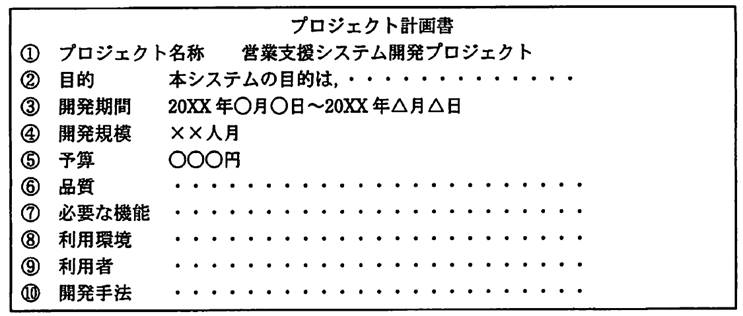
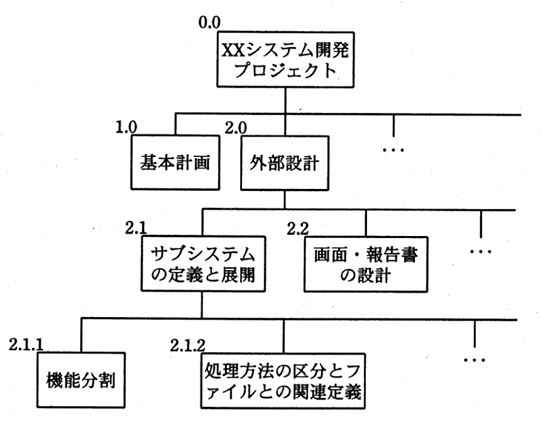
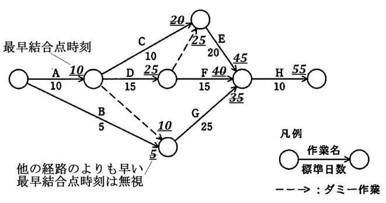

# 第6章　プロジェクトマネジメント

#### 本章について

　プロジェクトマネジメントは．試験シラバスには掲載されていますが．サンプル問題でも第１回試験でもほとんど出題されていないジャンルです．第１回試験ではステークホルダアナリシスが選択肢の一つになった程度で（*⇒SG28春50*），第２回試験でもステークホルダの意味を問う１問（*⇒SG28秋44*）のみでした．

　シラバスでは基本情報試験の「中分類14：プロジェクトマネジメント」と同等の難度・範囲で．ITパスポート試験の「中分類10：プロジェクトマネジメント」よりも深い知識が求められていますが．学習時間を割く必要性は低いと思われます．ただし．PMBOKに準拠しているため．2013年のシラバス改訂前の知識のみお持ちの場合は知識・用語の確認をしておくと良いでしょう．

## 6.1　プロジェクトマネジメント

### 6.1.1　プロジェクトマネジメント

- **プロジェクト**　目標達成のために行う有期の活動．プロジェクトを円滑に推進して目標を達成するために，プロジェクトの環境を分析し，計画（Plan），計画どおりに作業を進める（Do），計画と実績の差異検証（Check），差異の原因に対する処置（Act）の **PDCAマネジメントサイクル**（11.1.1参照）で管理します．
- **PMBOK（Project Management Body of Knowledge）**　プロジェクト管理の知識体系．プロジェクトマネジメントの事実上の標準になっています．
- **プロジェクトマネジメントの五つのプロセスグループ**　プロジェクトマネジメントは下表のようにプロセスグループで構成されています．

| グループ名 | 概略 |
|:----------|:-----|
| **立上げプロセスグループ** | プロジェクトの目的と前提を明確化する |
| **計画プロセスグループ** | プロジェクトの計画と目標を具体化する |
| **実行プロセスグループ** | プロジェクトチームを編成し，管理・運用する |
| **コントロールプロセスグループ** | プロジェクトの実行と進捗を監視する
| **終結プロセスグループ** | プロジェクトの完了に必要な手順を済ませる

表6.1.1 プロジェクトマネジメントの五つのプロセスグループ

- **プロジェクトの体制**　主に下表の3パターンがあります．

| 型 | 概略 |
|:----------|:-----|
| **機能型組織** | メンバは元の業務と兼任する．部門マネージャが権限をもち，プロジェクトリーダは調整役 |
| **マトリックス型組織** | 既存組織と直交するマトリックス組織となる．プロジェクトの有限性が失われる場合がある|
| **プロジェクト型組織** | メンバはプロジェクトに専任する．プロジェクトリーダが権限をもつ．本来のプロジェクトの形式 |

表6.1.2 プロジェクトの体制

- **プロジェクトの自己管理**　プロジェクトおよびその構成メンバには自己管理が求められます．変更管理，問題発見，問題報告，対策立案，文書化などです．また，プロジェクトの体制の中で，メンバが自ら管理すべきこととして，作業計画立案，進捗管理，コミュニケーションがあります．また，常に「報告，連絡，相談」が求められます．

### 6.1.2 プロジェクト統合マネジメント

- **プロジェクト統合マネジメント**　プロジェクトマネジメント活動の各エリアを統合的に管理，調整することが目的です．プロジェクト憲章とプロジェクトスコープ記述書に従って，プロジェクト全体のライフサイクルを構成する各プロセス群の全体を管理します．*⇒SG28秋48*
- **プロジェクト統合マネジメントのプロセス**　以下が含まれます．
 - プロジェクト憲章の作成
 - プロジェクト計画の作成
 - プロジェクト作業の指揮
 - プロジェクト作業のコントロール
 - 変更のコントロール
 - プロジェクトフェーズ又はプロジェクトの終結
 - 学んだ教訓の収集

 

図6.1.1 プロジェクト計画書の例（*⇒AP20春午後10*） 　

- **プロジェクト全体像の把握と管理**　プロジェクトマネジメント計画の作成を行い，プロジェクト作業範囲記述書，変更登録簿，プロジェクト完了報告書，プロジェクトフェーズ又はプロジェクトの終結報告書，学んだ教訓文書，問題点管理表などを管理します．

### 6.1.3 プロジェクトステークホルダマネジメント

- **ステークホルダ**　利害関係者．プロジェクトに関わる全ての人，組織を指します．*⇒SG28秋44*
- **プロジェクトステークホルダマネジメント**　そのプロジェクトのステークホルダを定義してステークホルダ登録簿として文書化し，必要都度，見直しつつ，適切なコミュニケーションを可能にします．
- **プロジェクトステークホルダマネジメントのプロセス**　以下が含まれます．
 - プロジェクトステークホルダの特定
 - プロジェクトステークホルダの特定管理
 - プロジェクト作業の指揮
 - プロジェクト作業のコントロール
- **ステークホルダアナリシス**　特定したステークホルダを利害関係の強さ，関与の度合い，影響度などによって分析すること．*⇒SG28春50*

### 6.1.4 プロジェクトスコープマネジメント

- **スコープ**　プロジェクトの対象範囲．プロジェクトが何をするのか，しないのかの限界を成果物や制約条件と共に明らかにしたものです．
- **プロジェクトスコープマネジメント**　プロジェクトにおいて必要な作業を過不足なく含め，プロジェクトを成功させることが目的．プロジェクトに何を含めるかという範囲を明確にし，プロジェクトを成功させるために必要な事項は何かを定義し，これらを管理可能な状態に分解します．
- **WBS（Work Breakdown Structure）**　作業分解構造．プロジェクト計画に基づき，プロジェクトで作成する成果物や実行する作業を階層的に要素分解し，スコープ全体を定義し表現した構造です．予算，工程，品質などの計画立案や管理に活用されます．

図6.1.2 WBSの例（*⇒SW17春44*） 　

- **ワークパッケージ**　プロジェクトで行う作業を階層的に要素分解したもの．
- **アクティビティ**　最下位のワークパッケージを具体的な作業に分解したもの．
- **ベースライン**　WBSによって定められるスコープ．スコープのコントロールに用います．
- **プロジェクトスコープマネジメントのプロセス**　以下が含まれます．
 - スコープの定義
 - WBSの作成
 - アクティビティの定義
 - スコープのコントロール

### 6.1.5 プロジェクト資源マネジメント

- **プロジェクト資源マネジメント**　プロジェクトに必要な要員，機器，備品，資材，ソフトウェア，ハードウェアなどの範囲を明確にし，効率良く管理します．
- **プロジェクト資源マネジメントにおける要員**　主に，プロジェクトマネージャ，プロジェクトメンバ，プロジェクトマネジメントチームなどのことです．
- **プロジェクトマネジメントチーム**　プロジェクトチームの要員のうち，プロジェクト管理に直接的に関与しているメンバーたちを指します．
- **PMO（ProjectManagement Office）**　プロジェクト管理オフィス．プロジェクト活動を支援する部門です．特に，プロジェクト管理能力の向上や，ノウハウの共有により，プロジェクト資源マネジメントの円滑化に貢献します．また，赤字プロジェクトの発生が頻発した場合などにおいては，その実態把握と対策立案をPMOが行うか支援します．
- **外部人材の管理**　外部資源として人材を受け入れる場合の管理もプロジェクト資源マネジメントの一つです．適切なタイミングで適切な人材を調達できるように，準備と情報収集が必要です．また，**労働者派遣法**（2.3.2参照）などの理解も求められます．
- **プロジェクト資源マネジメントのプロセス**　以下が含まれます．
 - プロジェクトチームの結成
 - 資源の見積り
 - プロジェクト組織の決定
 - プロジェクトチームの育成
 - 資源のコントロール
 - プロジェクトチームの管理

### 6.1.6 プロジェクトタイムマネジメント

- **プロジェクトタイムマネジメント**　プロジェクトを所定の時期に完了させることが目的．プロジェクトの全てのアクティビティの開始時期と終了時期からなるスケジュールを作成し，遂行状況を管理します．また，時間に対して作業を効率的に割振ることによって，プロジェクトの納期を守ります．よって，プロジェクトの構成者個々の進捗管理が欠かせません．
- **アクティビティリスト**　**WBS**（6.1.4参照）で特定したアクティビティの定義集．これを元にアクティビティの順序付け，アクティビティ期間の見積りを行います．
- **PERT (Program Evaluation and Review Technique)**　 ある作業を始めてから完結させるまでに，いくつかの工程に分かれて同時並行で進める場合に，どの工程から取りかかってどの順番で進めれば最も効率的で，作業時間や作業コストが少なくなるかを検討する手法．作業に要する時間と作業順序をアローダイアグラムとして図解し，日程計画を立案・確認・調整します．
- **アローダイアグラム**　作業の各工程を矢印で表して，作業開始を始点とし，作業の順序に従い結合点（○型）で結んでいくもの．以下の記述ルールと特徴があります．
 - 結合点の前後では，先行する作業が完了してから，それに続く作業を開始することができる．
 - 複数の作業の合流する結合点では，その全てが完了しないと続く作業を開始できない．
 - 複数の作業の分岐する結合点では，それらを並行して実行しても良い．
 - 作業の前後関係が複雑な場合や，通常の方法では表せない場合は，**ダミー作業** を用いる（作業の前後関係を示すために表す「時間0の作業」で点線の矢印で示す）
 - その結合点までに少なくとも何日（何時間）かかるかを **最早結合点時刻** という（複数の経路が有る場合は最大値を用い，最大値との差が余裕となる）
 - 終点までの最早結合点時刻を求めた結果が，全工程の所要時間となる．
 - 余裕時間のない作業の並びを **クリティカルパス** という（下図の場合，**Ａ→Ｄ→Ｅ→Ｈ** で全工程の所要時間は55日）
 - クリティカルパスに含まれる作業が進み遅れすると，全工程の所要時間が必ず変化する．
 - この時，クリティカルパスが変わることがある．

 

 
図6.1.3 アローダイヤグラムの例（*⇒AP21春51*） 　

- **プロジェクトタイムマネジメントのプロセス**　以下が含まれます．
 - アクティビティの順序付け
 - アクティビティ期間の見積り
 - スケジュールの作成
 - スケジュールのコントロール

### 6.1.7 プロジェクトコストマネジメント

- **プロジェクトコストマネジメント**　プロジェクトを決められた予算内で完了させることが目的．プロジェクトの全期間でコストを計画し，コストへの影響を監視し，必要な対処を行うことが求められます．プロジェクトには，不確実性が付きものですので，プロジェクトの構成者個々の作業工数の自己管理を含めたコスト管理が重要です．
- **コストベースライン**　プロジェクトの進捗状況を評価するためのコストにおける基準．プロジェクトのコストマネジメント，監視，あるいは報告のために参照される時間軸のコストの基準です．
- **資源単価**　プロジェクトに必要な資源（人員や設備など）の単価．工数や必要数を掛けて積算し，コストマネジメントに用います．
- **プロジェクトコストマネジメントのプロセス**　以下が含まれます．
 - コストの見積り
 - 予算の編成
 - コストのコントロール

### 6.1.8 プロジェクトリスクマネジメント

- **プロジェクトリスクマネジメント**　プロジェクトにマイナスとなる事象の発生確率と影響を低減することが目的です．**リスクの特定と評価**（1.2.2 ～ 1.2.5参照），**リスクへの対応とコントロール**（1.2.5参照）が含まれます．
- **プロジェクトリスクマネジメントのプロセス**　以下が含まれます．
 - リスクの特定
 - リスクの評価
 - リスクへの対応
 - リスクのコントロール

### 6.1.9 プロジェクト品質マネジメント

- **プロジェクト品質マネジメント**　プロジェクトが取り組むニーズを満足させることを目的として品質方針，目標，責任を定め，それらを達成するために，障害報告書の管理を行い，必要なプロセスを実施していくことです．
- **プロジェクト品質マネジメントのプロセス**　以下が含まれます．
 - 品質の計画
 - 品質保証の実施
 - 品質コントロールの実施

### 6.1.10 プロジェクト調達マネジメント

- **プロジェクト調達マネジメント**　作業の実行に必要な資源やサービスを外部(サプライヤ)から購入，取得するために必要な契約やその管理を適切に行うことが目的です．
- **プロジェクト調達マネジメントのプロセス**　以下が含まれます．
 - 調達の計画
 - サプライヤの選定
 - 調達の管理

### 6.1.11 プロジェクトコミュニケーションマネジメント

- **プロジェクトコミュニケーションマネジメント**　プロジェクト情報の生成から配布，廃棄までを適切に行うことで，人と人，人と情報を結びつける役割を果たすことが目的です．
- **プッシュ型コミュニケーション**　特定の相手に情報を必要なときに送り込む方式
- **プル型コミュニケーション**　各々が必要な情報を必要なときに引き出す方式
- **フィードバック型コミュニケーション**　当事者間で双方向に情報を受け渡す方式
- **プロジェクトコミュニケーションマネジメントのプロセス**　以下が含まれます．
 - コミュニケーションの計画
 - 情報の配布
 - コミュニケーションの管理
