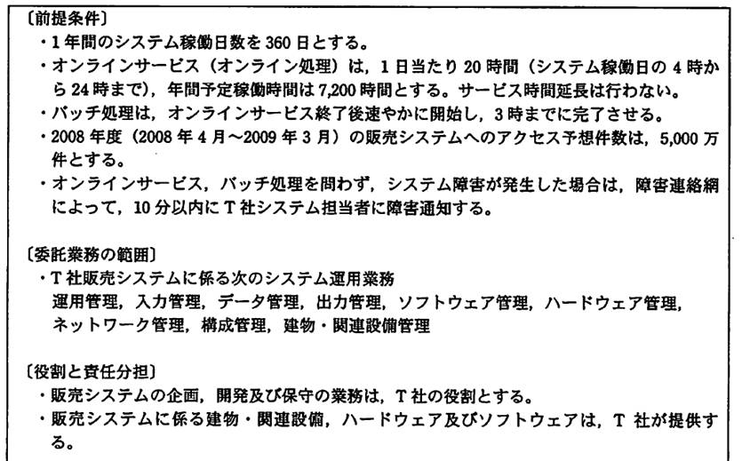
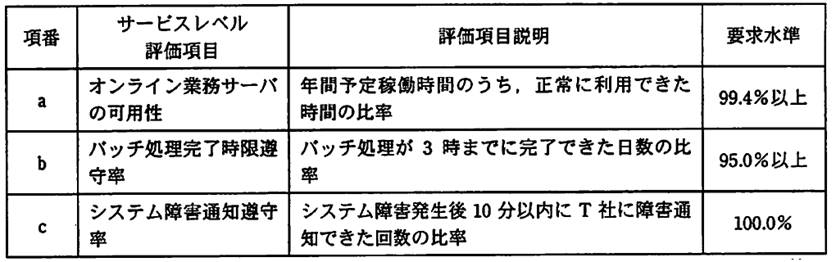

# 第7章　サービスマネジメント

#### 本章について

　サービスマネジメントは、同じマネジメント系でもプロジェクトマネジメントに比べると出題の多いジャンルで、第１回試験ではストラテジ系の事業継続計画に関する問題（*⇒SG28春41*）で「RTO」と「RPO」が、サービスマネジメント単独の問題では「SLA」が出題されています（*⇒SG28春40*）。

　シラバスでは基本情報試験の「中分類15：サービスマネジメント」と同等の難度・範囲で．ITパスポート試験の「中分類11：サービスマネジメント」よりも深い知識が求められています．なお、出題範囲の大半がITILに準拠しているため．2015年のシラバス改訂前の知識のみお持ちの場合は知識・用語の確認をしておくことをお勧めします．

## 7.1　サービスマネジメント

### 7.1.1　サービスマネジメント

- **サービスマネジメント**　サービスの要求事項を満たし，サービスの設計，移行，提供及び改善のために，サービス提供者の活動及び資源を，指揮し，管理する，一連の能力及びプロセスです．
- **ITIL（Information Technology Infrastructure Library）**　サービスマネジメントの **デファクトスタンダード**（2.5.1参照）であるフレームワーク．ITサービスのベストプラクティス（成功事例）の集大成です．
- **ITSMS（IT Service Management System）**　ITサービスマネジメントシステム．ITのサービスマネジメントを実現するためのシステム．ITILに示されている各プロセスを効率的に実現し運用する仕組みです．構築するに当たっては，ベンチマーキングを行い，現行の業務のやり方とベストプラクティスを比較します．

### 7.1.2　SLA

- **SLA（Service Level Agreement）**　発注者とサービス提供者との間で，サービスの品質の内容について合意した文書または契約．ITサービスの範囲と品質を明文化し，顧客とサービス提供者との間の合意に基づく顧客満足度の高いサービスを提供するために締結します．下記はSLAの一例です．*⇒SG28春40*

 

図7.1.1 SLAの例（*⇒AP21春午後11*） 　

- **SLAの記載内容**　顧客とサービス提供者の間で合意されたサービスの目標（サービス時間，応答時間，サービス及びプロセスのパフォーマンスなど）及び責任範囲を記載します．また，提供するサービスの内容，品質，要求水準などに関する保証範囲や（あれば）インセンティブ（褒賞）条項，ペナルティ（罰則）条項についても明記します．下記はサービスレベルの要求水準の一例です．

図7.1.2 サービスレベルの要求水準の例（*⇒AP21春午後11*） 　

## 7.2 サービスの設計・移行

### 7.2.1 サービスの設計・移行

- **サービスの設計の留意点**　事業ニーズを満たす又はサービスの有効性を改善するために新規サービスを提起したり，サービスの変更を行います．この時実施する，サービスの設計においては，達成しなければならないサービスの質に関する要求事項をサービス設計書に具体化することが必要です．サービスレベルの明示などが含まれます．
- **サービスの移行**　新規サービス又はサービス変更を稼働環境に展開すること．手順は以下のとおりです．

 1. 受入れ試験環境などを利用して，稼働環境への展開前に試験（移行テスト，移行リハーサル）を実施する．
 1. サービス受入れ基準に基づいて検証する．
 1. 承認された新規サービス又はサービス変更を稼働環境へ展開する．
 1. 移行活動が完了した後，顧客と利害関係者に，期待される成果に照らして実現された成果を報告する（移行の通知）．また，移行評価を行う．

- **移行テスト**　確実性や効率性の観点で，既存サービスから新サービスへの切替え手順や切替えに伴う問題点を確認します．*⇒SG28秋41*
- **運用サービス基準**　運用サービス提供者が発注者との合意により作成する基準．
- **移行計画**　システムの運用を開始する際に必要な計画であり，システムの利用者への移行計画の通知方法，移行，新旧環境での並行運用の有無，移行の評価方法などを明らかにします．
- **移行判断**　移行作業で問題が発生した場合に旧システムに戻すかどうかの判断．事前に基準を定めておきます．
- **運用引継ぎの留意点**　新規サービス又はサービス変更の運用への引継ぎにおける，必要十分な情報のドキュメント化，引継ぎ記録の作成，引継ぎ作業の承認などが重要です．運用のための資産と，システムの移管を適切に管理すること，運用テストや受入れテストとのすりあわせが必要です．

## 7.3 サービスマネジメントプロセス

### 7.3.1 サービスレベル管理

- **SLM（Service Level Management：サービスレベル管理）**　顧客とサービス提供者の間で **SLA**（7.1.2参照）を締結し，**PDCAマネジメントサイクル**（11.1.1参照）によってサービスの維持，向上を図る一連の活動です．モニタリングの結果に応じてSLA やサービスのプロセスを見直します．サービスレベルが適切か，サービスの報告が適切にされているかなどを，サービス目標と比較するレビューによって確認します．
- **サービス改善計画**　SLMによって，SLAやプロセスを計画的に見直すこと．表面的な見直しで済まさないように適正化することが重要です．
- **サービスカタログ**　サービスの全体像と優先度をまとめたもの．

### 7.3.2 サービスの報告

- **サービスの報告** 十分な情報に基づいた意思決定及び効果的なコミュニケーションを促進するために，顧客との合意に基づいて，適時に信頼できる正確な報告書を作成します．サービス目標に対するパフォーマンス（費用対効果）を明示することが求められます．
- **傾向情報**　トレンド情報ともいい，問合せの発生傾向のような，なんらかの傾向が観られる情報のこと．サービスの報告に加えることで将来的なサービス改善に寄与します．

### 7.3.3 サービス継続及び可用性管理

- **サービス継続及び可用性管理**　平常な状況とサービス中断後の状況の両方の下で，顧客と合意したサービス継続性及び可用性についての要求事項を確実に実施するための活動です．
- **サービス継続計画**　サービスの継続を，あらゆる状況の下で満たすことを確実にするための活動．サービスの復旧対策の策定や評価を行います．
- **RTO（Recovery Time Objective：目標復旧時間）**　復旧までの所要時間の目標値．復旧時間目標ともいいます．
- **RPO（Recovery Point Objective：目標復旧時点）** 障害が発生した後に，どの時点までさかのぼってデータを復旧するかを示す指標．リカバリポイント目標，復旧時点目標ともいいます．*⇒SG28春41*
- **災害復旧**　地震，火災などの完全には予期できない災害からのサービスの復旧で，障害復旧よりも管理が難しくなります．デザスタリカバリともいいます．
- **コールドスタンバイ**　障害発生時の予備サービス（待機系）への切替が遅い方式．待機系を他の用途に用いることでコストを下げます．
- **ホットスタンバイ**　待機系への切替が早い方式．待機系をいつでも切替できる状態にしておきます．*⇒SGサンプル3*
- **サービス継続及び可用性管理の指標**　可用性，信頼性，**保守性**（RAS：1.1.1参照）を用います．
- **保守性**　障害復旧のしやすさ．サービスやシステムのメンテナンスや変更のしやすさの指標でもあります．

### 7.3.4 キャパシティ管理

- **キャパシティ管理**　必要なキャパシティ（能力・容量・など）を把握し，最適な費用で，現在及び将来の安定したサービスを提供するために，サービス提供者が十分なキャパシティをもっていることを確実にする一連の活動です．
- **キャパシティ管理の管理指標**　主な指標として，CPU使用率，メモリ使用率，ファイルの使用量，ネットワークの利用率などがあります．また，それぞれについて，正常とみなす値，またはその範囲である閾値（しきい値）の設定と管理が重要です．

### 7.3.5 供給者管理

- **供給者管理**　サービス提供者が，サービスマネジメントプロセスの導入及び運用のために供給者を用いる場合の管理活動です．供給者のサービスも含めてサービス提供者が顧客にサービスを提供しますので，その管理もサービス提供者が行います．
- **内部グループ**　サービス提供にかかわる同じ組織の他の部門のことです．
- **運用レベル合意書（OLA：Operational Level Agreement）**　**SLA**（7.1.2参照）を実現するために，サービス提供者が同じ組織内の内部グループとの間で取り交わす合意書．

### 7.3.6 インシデント及びサービス要求管理

- **インシデント及びサービス要求管理**　顧客と合意したサービスを可能な限り迅速に回復するためにインシデントの対応を行う，又はサービス要求の対応を行うためのプロセスです．
- **インシデント**　サービスの質を低下させる，または，低下させる可能性がある事象．障害とは限らないのがポイントです．*⇒SGサンプル2,SG28秋42*
- **サービス要求**　事前に対応手順を決めておくことができるインシデントのこと．**FAQ**（7.4.1参照）の作成によって対応工数を省ける場合があります．
- **段階的取扱い**　発生したインシデントの難度が高い場合に，窓口はそのままで，より適切な担当者に引継ぐこと．**エスカレーション** ともいいます．
- **回避策**　インシデント及びサービス要求管理の最大目的は業務再開なので，問題解決よりも回避策の提示が重要です．
- **重大なインシデントへの対応**　重大なインシデントについては，定義を文書化し顧客と合意することが必要です．インシデント及びサービス要求管理では，インシデントを緊急度とシステムに対する影響度（インパクト）を元に分類します．緊急度が低くてもインパクトの大きいものは重大なインシデントとして優先的に取り扱われる必要があります．なお，重大なインシデントの一歩手前の状態を **ヒヤリハット** といいます．

### 7.3.7 問題管理

- **問題管理**　問題の根本原因を突き止め，インシデントの再発防止のための解決策を提示する一連の活動です．
- **問題**　問題管理における問題とはインシデント発生の原因，要因です．
- **既知の誤り**　既に解決策が提示されている問題のことです．「既知のエラー」ともいいます．
- **予防処置と傾向分析**　問題解決の経緯と結果を蓄積し，分析することで，問題の予防につなげることができます．特に問題の発生傾向を分析することは問題管理のみならず，インシデント及びサービス要求管理をも効率化することにつながります．

### 7.3.8 構成管理

- **構成管理**　サービスを構成するハードウェア，ソフトウェア，ドキュメントなどの **CI（Configuration Item：構成品目）** に関する情報を定義し，特定したCIを **CMDB（Configuration Management Data Base：構成管理データベース）** に記録するなど，正確な構成情報を維持する一連の活動です．
- **構成管理と資産管理**　構成情報の変更は固定資産の増減につながることから，資産管理との関連付けに注意が必要です．

### 7.3.9 変更管理

- **変更管理**　全ての変更を評価し，変更要求の受入れ決定，変更スケジュールに従った変更の展開，実施後のレビューを確実に行うこと．リスクの回避，効率的な変更管理プロセス及び手順の実施なども行う一連の活動です．
- **変更管理の留意点**　変更管理では，変更によるサービスへの影響を最小限に抑えることが求められます．よって，変更スケジュールを策定して評価し，変更失敗時に備えて切り戻し（元に戻すこと）の手順を準備します．また，実施後のレビューを行い，変更の効果とコストが妥当だったか，保守への影響の有無などをチェックします．

### 7.3.10 リリース及び展開管理

- **リリース及び展開管理**　変更管理で承認された変更をリリースとして稼働環境に展開するプロセスです．
- **リリース**　変更管理で承認された **RFC（Request For Change：変更要求）** のことです．なお「リリースする」と動詞で用いる場合は，変更をリリースとして稼働環境に展開することを指します．
- **構成管理及び変更管理との連携**　リリース及び展開管理は，新たな版の導入の計画から実際の導入，万一リリース展開に失敗した場合に元に戻す作業である復元などの一連の活動を含みます．よって，構成管理及び変更管理との連携が必要です．

## 7.4 サービスの運用

### 7.4.1 サービスの運用

- **システム運用管理**　日常の運用計画，障害発生時運用を適切に行うための計画，運用負荷低減のための改善計画などに加えて，キャパシティ管理，情報セキュリティ管理，サービス継続及び可用性管理の方針を受けて実施する活動です．
- **運用オペレーション**　システムを安定稼働させるために，定められた手順に沿ってシステムの監視・操作・状況連絡を実施すること．システムの操作に当たっては，作業指示書に従って実施することが求められます．また，操作ログを取得することで，運用オペレーションによる障害の原因を調査し，改良を行います．
- **サービスデスク**　サービスの利用者からの問合せに対して単一の窓口機能を提供し，適切な部署への引継ぎ，対応結果の記録，記録の管理などを行う一連の活動です．ヘルプデスク，コールセンタともいいます．
- **FAQ（Frequently Asked Questions）**　よくある質問とその回答．FAQを作成して公開することで，業務の効率化と利用者の利便性を高めることができます

## 7.5 ファシリティマネジメント

### 7.5.1 ファシリティマネジメント

- **ファシリティマネジメント**　コンピュータシステムやネットワークの施設基盤の設計，構築の管理及び運営のための施設管理，設備管理です．
- **設備管理の目的**　データセンタなどの施設やコンピュータ，ネットワークなどの設備の管理の目的は，コストの削減，快適性，安全性などの確保にあります．電源や回線の冗長化，バックアップ環境の整備，電源，空調設備，建物などのアクセス管理，環境のモニタリングなども検討・実施します．
- **UPS（Uninterruptible Power Supply）**　無停止電源供給装置．停電時に，内蔵している電池からコンピュータにシャットダウンに必要な電力を供給します．瞬間停電時や自家発電装置起動までの「つなぎ電源」としても利用できますが，バッテリーが経年劣化するため，定期的な保守が必要です．
- **セキュリティワイヤ**　盗難防止用の針金．ノートPCなどと机や棚などをつなぐために用います．

