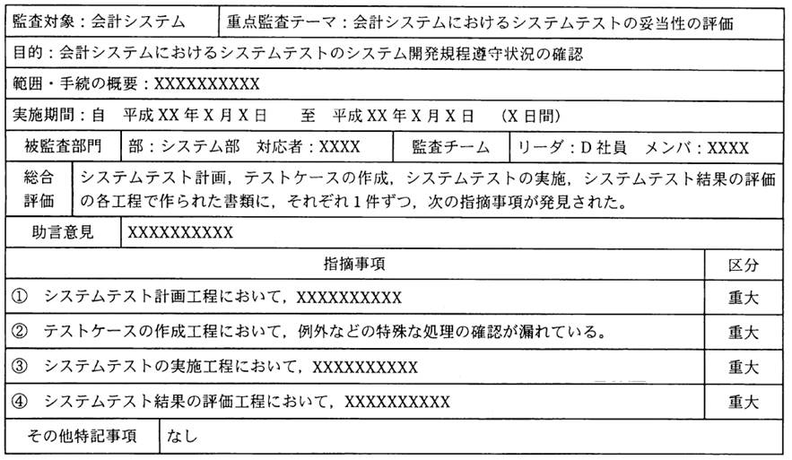

# 第8章　システム監査

#### 本章について

　この試験におけるマネジメント系の中で最も重要な章であり，第１回試験の午前試験では50問中３問が，午後試験では３問中１問が監査に関する問題でした．また，午後問題で出題された **CSA（統制自己評価）**（8.2.2参照）は特に理解しておきたいテーマです．

　ITパスポート試験の「中分類12：システム監査」よりも深い知識が求められており，基本情報試験の「中分類16：システム監査」と同等の範囲ですが，情報セキュリティ監査と実務寄りの出題になっていますので，セキュリティや具体的な事例を想定した理解力が求められます．

## 8.1　システム監査

### 8.1.1　システム監査の目的と手順

- **監査業務**　企業・組織が行う業務が，法令などのルールに従っているかどうかを，第三者が客観的な立場から検証し，是正するべき点があれば指摘することです．実施義務のある法定監査と，実施義務のない任意監査があります．また，監査責任者が社外の監査人である場合を外部監査，社員や役員，監査役などの関係者が行う場合を内部監査といいます．
- **システム監査の目的**　組織体の情報システムに関連するリスクに対するコントロールが **リスクアセスメント**（1.2.4参照）に基づいて適切に整備，運用されているかを，独立かつ専門的な立場のシステム監査人が検証または評価することによって，保証を与え，あるいは助言を行い，もって **ITガバナンス**（8.2.1参照）の実現に寄与することにあります．
- **システム監査の観点**　システム監査の観点は，情報システムの欠陥のようなマイナス面だけではなく，情報システムが組織に貢献しているかにもあります．よって，**信頼性**，**安全性** に加えて，**効率性**，**有効性** に注目します．
- **システム監査の手順**　システム監査は，監査計画に基づき，下記の手順でシステム監査人が行います．
 1. 情報システムの総合的な点検
 1. 評価，経営者への結果説明　
 1. 改善点の勧告および改善状況の確認とその改善指導（**フォローアップ**）  
- **システム監査人**　監査を受ける部門との間に利害関係がなく，専門知識を備えた人であれば，社外の専門家でも社内の監査担当者・監査役でも構いません．システム監査人は，監査報告書に記載した監査意見に対して責任を負いますが，監査報告会で指摘した問題点の改善などの責任は負いません．
- **監査証拠**　システム監査人の監査意見を立証するために必要な事実．システム監査結果の説明において根拠に使える記録のことです．監査報告書は，監査証拠を根拠にしなければなりません．
- **システム監査基準**　システム監査業務の品質を確保し，有効かつ効率的に監査を実施することを目的とした監査人の行為規範です．
- **システムの可監査性**　システム監査を円滑に実施するため，情報システムはあらかじめ，可監査性を意識して構築，整備されなければなりません．例えば，**ログ**（操作記録）や **トレース**（追跡情報）などの監査証跡となる情報を取得するようにしておきます．
- **監査証跡**　システム監査人がシステムの処理内容を調べるために使うアクセスログやテスト結果報告書，聞き取り調査の口述内容などのことです．特に運用に関する証跡を **運用証跡** といいます．
- **システム監査の品質評価**　事実誤認がないか，改善勧告に実現可能性があるか，監査報告書に記載する事項と記載しない事項の判断は正しいか，記載した事項ごとに監査証拠がそろっているか，監査報告がシステムの改善に資する内容や表現になっているか，などを評価します．
- **監査リスク**　監査手続を実施しても監査人が重要な不備を発見できないリスクで，固有リスク，統制リスク，発見リスクがあります．*⇒SG28秋9*
- **固有リスク**　監査対象の業務の性質や本来有する特性から生じるリスク．監査リスクの一つです．*⇒SG28秋9*
- **統制リスク**　監査対象の内部統制のために，不備を発見できないリスク．監査リスクの一つです．*⇒SG28秋9*
- **発見リスク**　監査対象の内部統制のために，発見できなかった不備が，実証手続きを実施してもなお発見されないリスク．監査リスクの一つです．
- **システム監査報告書**　下図のように，総合評論と助言意見，指摘事項などを簡潔に記述したものです．

 

図7.1.1 図8.1.1 システム監査報告書の例（*⇒AP22秋午後12*） 　

### 8.1.2 情報セキュリティ監査

- **情報セキュリティ監査**　情報セキュリティに関するシステム監査．情報セキュリティ監査基準に従って実行します．*⇒SG28春2,SG28春39*
- **情報セキュリティ監査基準**　情報セキュリティ監査業務の品質を確保し，有効かつ効率的に監査を実施することを目的とした監査人の行為規範です．*⇒SG28秋40*
- **情報セキュリティ管理基準**　情報セキュリティの維持を目的として，情報セキュリティ管理の必要な事項を定めたもの．**情報セキュリティマネジメントに関わる国際規格（ISO27001，27002）**（1.2.8参照）に準拠しています．*⇒SG28春38,SG28春39,SG28秋40*

### 8.1.3 コンプライアンス監査

- **コンプライアンス監査**　国，業界，組織などの法令や倫理基準を遵守しているかどうかを，対象組織に対して第三者が監査するものです．組織の行動指針に **コンプライアンス**（2.4.1参照），倫理が含まれているか，透明性があるかを見ます．
- **コンプライアンス監査の指摘事項**　例えば，権利侵害行為への指摘，労働環境における問題点への指摘があります．

## 8.2 内部統制

### 8.2.1 内部統制

- **内部統制**　健全かつ効率的な組織運営のための体制を企業などが自ら構築し運用する仕組みであり，実現には業務プロセスの明確化，職務分掌，実施ルールの設定，チェック体制の確立が必要です．また，ITは内部統制に大きな役割を果たします．*⇒SG28春15*
- **職務分掌**　業務の実行と統制を1人あるいは1部門に任せることによる弊害を防ぐこと．相互牽制（職務の分離）ともいいます．例えば，営業債権管理業務に関する内部統制の場合，売掛金回収条件の設定は，回収を行う営業部門ではなく，審査部門が行うべきです．
- **内部統制の構成要素と基本要素**　内部統制の構成要素としては，全社統制，業務処理統制，IT全般統制が挙げられます．そして，IT機能を活用した業務処理統制のことを，IT業務処理統制と呼びます．内部統制の基本要素は，下表のとおりです．

| 要素 | 概略 |
|:----|:-----|
| **統制環境** | 内部統制の基盤となる経営方針・戦略 |
| **リスクの評価と対応** | リスクへの適切な対応 |
| **統制活動** | 権限と責任，職務分掌 |
| **情報と伝達** | **ステークホルダ**（6.1.3参照）への情報の周知 |
| **モニタリング** | 内部統制の有効性の継続的な評価 |
| **ITへの対応** | IT環境の対応とIT利用および統制 |

表8.2.1 内部統制の基本要素

- **コーポレートガバナンス**　企業経営の透明性を確保するために，企業は誰のために経営を行っているか，トップマネジメントの構造はどうなっているか，組織内部に自浄能力をもっているかなどの視点で，企業活動を監督・監視する仕組みです．*⇒SG28春50*
- **ITガバナンス**　企業などが競争力を高めることを目的として，情報システム戦略を策定し，戦略実行を統制する仕組みを確立するための取組です．なお，システム監査，情報セキュリティ監査，ソフトウェア資産管理などは，ITガバナンスを実現するための取組でもあります．
- **ECM（Enterprise Contents Management）**　企業などが保有するコンテンツ（文書、画像、音声、動画などのデータ）を統合的に管理する仕組みやツール．内部統制における文書管理を支援します．*⇒SG28秋13*

### 8.2.2 法令順守状況の評価・改善

- **法令遵守状況の評価・改善**　情報システムの構築，運用は，当該業務，システムにかかわる法令を遵守して行わなければなりません．そのための適切なタイミングと方法で基準・自社内外の行動規範の順守状況の継続的な評価を行い，改善していく必要があります．内部統制を整備することが法令遵守の体制を確立する上で有効です．
- **CSA（Control Self Assessment：統制自己評価）**　内部監査人ではなく，経営者や業務担当者が自分たちのビジネスプロセスの有効性などを自己評価することです．内部統制の効率を上げる効果があり，評価実施者に対する意識付けや教育として役立ちます．しかし，独立的な立場から公正に評価できる監査とは異なり，関連法規への準拠性が担保できず，現状を追認しやすいという欠点もあります．*⇒SG28春2*
