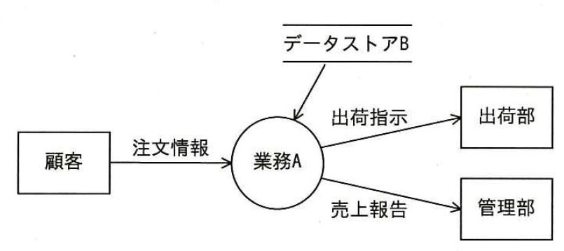

# 第10章　システム企画

#### 本章について

　システム企画には，情報セキュリティに直結するテーマである情報システム導入リスク分析が含まれており，１章で扱っている **情報セキュリティリスク対応**（1.2.5参照）と組み合わせて理解しておくと良いでしょう．また，調達と調達計画のように単独で出題されたテーマもあり（*⇒SG28春48*），RFI、RFPなどの用語も押さえておきましょう．

　なお，システム企画を含むストラテジ系では，この試験のシラバスでは出題対象外となっている「ITパスポート試験のストラテジ系出題ジャンルに含まれる用語」も出題されています．本書ではこれらをこの章の関連部分に掲載しました．

　ITパスポート試験の「中分類7：システム企画」よりも深い知識が求められており，基本情報試験の「中分類18：システム企画」と同等の難度，範囲です．

## 10.1 システム化計画

### 10.1.1 システム化計画の立案における検討項目（情報システム導入リスク分析）

- **システム化計画における検討項目**　主な検討項目として，全体開発スケジュール，要員教育計画，投資の意思決定法，開発投資対効果，情報システム導入リスク分析があります．
- **情報システム導入リスク分析**　システム化計画における分析項目であり，検討項目として，リスク分析の対象，リスクの発生頻度・影響・範囲，リスクの種類（財産損失／責任損失／純収益損失／人的損失）に応じた損害内容と損害額，リスク対策，リスク測定があります．*⇒SG28春5*
- **リスク対策**　リスクのコントロール（損失の防止や軽減）とファイナンス（金銭的対策）であり，リスク回避，損失予防，損失軽減，リスク移転，リスク保有などがあります．
- **リスク回避**　損失の発生を避けること．例えば，保持する必要性の低い情報資産の廃棄が該当します．
- **リスク移転**　発生する損失を他者に移転する損失予防のこと．例えば，保険の加入が該当します．*⇒SG28秋午後3*
- **損失軽減**　情報資産を分離することで，損失の影響を最小化する考え方（リスク分離），損失の発生原因を一まとめにすることで対策を集中化する考え方（リスク集中）などがあります．
- **リスク保有**　発生する損失を負担する考え方．発生可能性が低く予想損失額が小さい場合に特に対策を行わないことです．*⇒SG28春5*
- **共通フレーム**　**ソフトウェアライフサイクルプロセス（SLCP）** ともいい，取得者（発注者）と供給者（受注者）の二者間取引を明確化するための規格です．業務分析，業務設計，ソフトウェアを中心としたシステムの企画，要件定義，開発，運用，保守およびそれらにかかわる諸活動を対象とする国際規格の日本版です．中核を成すテクニカルプロセスでは、各プロセスの対象を下表のように定めています．*⇒SG28秋49*

| プロセス名 | 説明 |
|:-----|:-----|
| **企画プロセス** | 経営・事業の目的，目標を達成するために必要なシステムに 関係する要件の集合とシステム化の方針，及び，システムを実現するための実施計画を得るプロセス |
| **要件定義プロセス** | 取得者の業務要件，ならびに取得者がシステムに求める要件 （機能要件，非機能要件）を明確にするプロセス |
| **システム開発プロセス** | システムの要件定義、方式設計、実装、結合、適格性確認テスト、導入、受入れ支援のプロセス |
| **ソフトウェア実装プロセス** | ソフトウェアの要件定義、方式設計、詳細設計、構築、結合、適格性確認テスト、導入、受入れ支援のプロセス |
| **ハードウェア実装プロセス** | ハードウェア関連の実装プロセス |
| **保守プロセス** | 納入されたシステム及びソフトウェア製品に対して費用対効果が高い支援を提供するプロセス |

表10.1.1	共通フレーム2013のテクニカルプロセス

## 10.2 要件定義

### 10.2.1 要求分析

- **要求分析の手順**　要求分析は下記のような手順で行います．
 1. 要求項目の洗出し．ユーザニーズ調査
 1. 現状分析
 1. システム化ニーズの整理
 1. 前提条件や制約条件の整理
 1. 解決策の検討
 1. 実現可能性の分析
 1. 新しい業務モデルと業務フローの提案（課題定義，要求仕様書作成）

### 10.2.2 要件定義

- **要件定義の目的**　システムや業務全体の枠組み，システム化の範囲と機能を明らかにし，要件定義書を作成することが目的です．
- **要件定義の種類**　下表のように分類できます．

| 要素 | 概略 |
|:-----|:-----|
| **業務要件定義** | 業務上実現すべき要件を業務処理手順を基に定義したもの |
| **機能要件定義** | 業務要件を実現するために必要な情報システムの機能を明らかにしたもの |
| **非機能要件定義** | パフォーマンスや信頼性などの要件で，セキュリティ要件，情報・データ要件などを含む．|

表10.2.1 要件定義の種類

- **E-R図（Entity Relationship Diagram）**　業務で扱う情報を抽象化し，**実体（エンティティ）** と実体間の **関連（リレーションシップ）** を表現する図．いくつかの表記法があり，バックマン線図で描く場合は，実体を四角形で示し，－で1対1の，→で1対Nの，←→でN対Mのカーディナリティ（数的な関連）を示します．**属性（アトリビュート）** を付記する場合もあります．*⇒SG28秋46*
- **DFD（Data Flow Diagram）**　業務プロセスをデータの流れに着目して表現する場合に使用するデータの流れ図．下の図のように，業務を構成するプロセスを円形で，その間で受け渡されるデータフローを矢印で示し，外部要素を四角形，ファイルなどのデータストアを二重線で表します．*⇒SG28秋46*

図10.2.1 DFDの例（*⇒IP27秋8*） 　

## 10.3 調達計画・実施

### 10.3.1 調達と調達計画

- **調達計画**　要件定義を踏まえ，既成の製品またはサービスの購入，組織内部でのシステム開発，外部委託によるシステム開発などから調達方法を選択し，調達の対象，調達の条件，調達の要求事項などを定義して調達計画を策定します．また，調達の適切さを維持するために，システム資産，ソフトウェア資産を管理します．
- **システム資産及びソフトウェア資産の管理**　調達を適切に行う上で，システム資産およびソフトウェア資産を管理することが必要です．ソフトウェア資産管理はライセンス管理，**構成管理**（7.3.8参照）を含みます．
- **ライセンス管理**　ソフトウエアにおけるライセンスは，著作権者がその購入者に対して許諾する「非独占的なソフトウェア利用権」を指します．ソフトウェア開発時に，自社が権利を所有しないソフトウェアを利用する必要が生じた場合はライセンスの許諾を受ける必要があります．そして，獲得したライセンスについて使用実態や使用人数がライセンス契約で託された内容を超えないよう管理する必要があります．
- **外部資源の利用**　外部資源であるシステムインテグレータ，アウトソーシングなどを活用することの妥当性，適切な活用方法を検討し，判断します．
- **システムインテグレータ（SI事業者）**　ハードウェアの選定から情報処理システムの設計構築などを一括して請け負う業者．保守・運用を含むこともあります．
- **アウトソーシング**　業務を外部の業者に委託すること．ある程度まとまった業務を一括で委託する場合の呼び名として用いられます．
- **委託先管理**　外部委託先の情報セキュリティについて，調査の必要性，方法，手順を理解し，情報取扱いルールなど，委託先に求める情報セキュリティ要求事項と委託先における現状とのかい離を，契約担当者と協力しつつ事前確認する必要があります．また，不正防止・機密保護に留意し，必要であれば機密保持契約を締結します．外部委託の終了時は，検収と共に委託先に提示した資料やデータの廃棄（消去）を確認します．

### 10.3.2 調達の実施（調達の方法）

- **調達の実施**　調達の代表的な方法　下表のとおりです．

| 方法・手法 | 概略 |
|:----|:-----|
| **企画競争** | 複数のベンダ企業に対して，提案書の提出や提案プレゼンテーションを求め，あらかじめ定めておいた採点方式で提案内容や技術力の点数の最も高い会社を選定する方法．|
| **一般競争入札** | 公募によって参加資格の条件を満たす入札参加者を集め，提案書と見積書を提出してもらって，見積書の金額が最も安い会社を選定する方法．|
| **総合評価落札方式** | 従来の価格のみによる自動落札方式とは異なり，「価格」と「価格以外の要素」（例えば，初期性能の維持，施工時の安全性や環境への影響）を合わせて評価する方式．入札者が示す価格と技術提案の内容を総合的に評価し，落札者を決定する|

表10.3.1 調達の代表的な方法

- **RFI（Request For Information：情報提供依頼書）**　ベンダ企業に対しシステム化の目的や業務内容を示し情報提供を依頼する文書．**RFP（提案依頼書）**（10.3.3参照）を作成するために，必要な情報の提供を要請するものであり，ユーザ要件を実現するために，現在の状況において利用可能な技術・製品，ベンダにおける導入実績など実現手段に関する情報を求めます．*⇒SG28春48*

### 10.3.3 調達の実施（提案依頼書）

- **RFP（Request For Proposal：提案依頼書）**　ベンダ企業に対し，調達対象システムと対象範囲，提案依頼事項，調達条件などを提示し，提案書の提出を依頼する文書．システムの調達に際して，調達側から技術的要件やシステムモデル，サービス要件，目標スケジュール，契約条件，サービスレベル要件などを提示し，指定した期限内で効果的な実現策の提案を依頼するものです．*⇒SG28春48*
- **RFPと要件定義**　要件定義を機能要件，非機能要件にまとめてRFPに明示します．重要な要求とそうでない要求の区別がつくように重要度を設定すると，より質の高い提案が得られます．
- **RFPとベンダの要件**　RFPにはベンダの経営要件，ベンダのプロジェクト体制要件，ベンダの技術及び実績評価に必要な要件を含めることがあります．
- **RFQ（Request For Quotation：見積依頼書）**　ベンダ企業に対し，見積書の提出を依頼する文書．通常，RFPの一部として作成しますが，RFPによって概算見積りを求め，その後，RFQによって詳しい見積りを求める場合もあります．

### 10.3.4 調達の実施（調達選定）

- **調達選定**　調達先の選定に当たっては，予め選定の手順を確立し，提案評価基準や要求事項適合度の重み付けを決めておきます．そして，ベンダ企業の提案書や見積書から，開発の確実性，信頼性，費用内訳，工程別スケジュール，最終納期などを比較評価して選定します．

### 10.3.5 調達の実施（契約締結）

- **契約締結**　選定したベンダ企業と契約について交渉を行い，受入システム，費用，受入時期，発注元とベンダ企業の役割分担などを確認し，契約を締結します．
- **ソフトウェア開発委託モデル契約**　経済産業省や社団法人情報サービス産業協会（JISA）が公開している開発委託契約の雛型（テンプレート）があります．
- **情報システム・モデル取引・契約書**　経済産業省による情報システムの契約プロセス，契約書（企画，開発，運用・保守の基本契約書）の雛型です．
- **知的財産権利用許諾契約**　ソフトウェアなどの知的財産の利用に関する提供者と利用者との契約．ソフトウェアの場合，ソフトウェアライセンス契約ともいいます．
