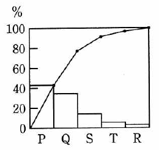

# 第11章　企業活動

#### 本章について

　企業活動には．情報セキュリティに直結するテーマである経営管理（リスクマネジメント）が含まれており，しかも，セキュリティと関連しないテーマがいくつも出題されていますので，ターゲットを絞りづらいセクションです．

　シラバスだけを見ると，ITパスポート試験の「中分類1：企業活動」，基本情報試験の「中分類22：企業活動」と同じ範囲ですが，実際には１～10章のどれにも含まれないテーマが出題されていますので，本書ではそれらをこの章に加えています．具体的には，ITパスポート試験の「大分類2：経営戦略」，基本情報試験の「大分類8：経営戦略」で，この大分類には中分類として，経営戦略マネジメント，技術戦略マネジメント，ビジネスインダストリが含まれています．今後もストラテジ系のテーマとして出題される可能性があります．

## 11.1 経営・組織論

### 11.1.1 経営管理（経営管理・経営組織）

- **経営管理**　企業の目的を達成するために企業活動を円滑に行い，経営資源の最適配分，有効活用の仕組みづくりと運用を行うことです．
- **PDCA（Plan Do Check Act）**　計画，行動，評価，改善のサイクルで，戦略実行の管理を行う考え方のフレームワークです．
- **経営者の職能**　CxOと総称される経営者の主な職能（役職）として下記があります．
 - **CEO**（Chief Executive Officer：最高経営責任者）
 - **COO**（Chief Executive Officer：最高執行責任者）
 - **CFO**（Chief Financial Officer：最高財務責任者）
 - **CIO**（Chief Information Officer：最高情報責任者）
 - **CISO**（Chief Information Security Officer：最高情報セキュリティ責任者）
 - **CPO**（Chief Privacy Officer：最高プライバシー責任者）  
- **3C（Customer，Competitor，Company)**　顧客，競合他社，自社のことで，経営戦略における３大要素．*⇒SG28春9*
- **コアコンピタンス**　企業の「核となる能力」で，他社との差異化の源泉となる経営資源のことです．*⇒SG28春50*
- **コーポレートアンデンティティ**　企業の特長や個性を明示し，顧客が共通したイメージで認識できるように働きかける仕掛け，またはこれに含まれる要素のことです．社名，ブランド名，コーポレートカラーなどが該当します．*⇒SG28春50*
- **代表的な組織構造の種類と特徴**　下表のとおりです．なお，プロジェクトの体制における機能型，マトリックス型，プロジェクト型についてはプロジェクトの体制（6.1.1参照）で説明しています．

表11.1　代表的な組織構造の種類と特徴

| 種類 | 意味・概略 |
|:----|:-----------|
| **階層型組織** | 部・課・係のような階層構造をもつ組織 |
| **職能別組織** | ｢経理全般を担当する経理部｣｢商品の販売を担当する販売部｣ など，担当業務の専門性によって部門を設ける組織 *⇒SG28秋50*|
| **ラインアンドスタッフ組織** | ライン部門（企業の基幹業務を遂行する部門）とスタッフ部門（ライン部門を支援する部門）に分けられる職能別組織
| **プロジェクト組織** | 対象業務ごとの組織．人員および資源がプロジェクトに明確に割り当てられ，プロジェクト・マネージャが業務遂行に必要な決定権をもつ *⇒SG28秋50*|
| **マトリックス組織** | 職能別または事業部制組織とプロジェクト組織の兼用．プロジェクトメンバは，元々所属している組織の上司とプロジェクトリーダの二つの指揮命令系統をもつ *⇒SG28秋50*|
| **事業部制組織** | 主に大規模な企業で，業種別や地域別，顧客別などに事業部 を作り，それぞれに職能別組織を作って独立採算体制としている組織構造 *⇒SG28秋50*|
| **カンパニ制組織** | 事業部の権限を強化し，独立した会社に近づけた組織．それぞれのトップは社長と同等の権限と責任をもつ |

### 11.1.2 経営管理（ヒューマンリソースマネジメント・行動科学）

- **ヒューマンリソースマネジメント（人的資源管理）**　人的資源を管理することであり，採用，昇格，異動，教育，退職などを取り扱います．人事計画，人材開発，人事評価などのサブプロセスで構成されます．
- **人材開発**　職業能力の向上を目的として，社員を教育して身体技能，知識など向上させること．
- **行動科学**　企業組織における人間行動のあり方を対象とする科学で，リーダシップ，コミュニケーション，ネゴシエーションなどのあり方や，テクニカルライティング，プレゼンテーションなどの伝えるためのモチベーション管理，コンフリクト管理などを扱います．
- **ケーススタディ**　教育技法の一つで，特定の事例を取り上げて検討，研究すること．
- **eラーニング**　教育技法の一つで，ネットワークを経由してコンピュータを用いて学習すること．

### 11.1.3 経営管理（リスクマネジメント）

- **リスクマネジメント**　企業の価値を維持，向上させる上で障害となるリスクの分析，および災害などが発生した場合にも必要な事業を継続するための計画を策定することです（1.2.1参照）．
- **BCP（Business Continuity Plan：事業継続計画）**　災害やシステム障害など予期せぬ事態が発生した場合でも，重要な業務の継続を可能とするために事前に策定される行動計画です．*⇒SG28春41,SG28春49,SG28秋39,SG28秋48*
- **BCM（Business Continuity Management：事業継続マネジメント）**　BCPを策定し，実現するための管理．日常的な管理を含みます．
- **ビジネスインパクト分析（BIA：Business Impact Analysis）**　不測の事態によって業務のプロセスが停止したり，中断した場合に，事業全体が受ける業務上および財務上の影響の度合いを分析し，評価すること．**事業影響度分析** ともいいます．

### 11.1.4 コンピュータリテラシ

- **コンピュータリテラシ**　コンピュータを利用する能力．情報リテラシとほぼ同義に用いられますが，主に業務におけるコンピュータ活用能力を指します．
- **アクセシビリティ** 高齢者や障碍のある方を含むあらゆる人に利用可能かどうかの度合い．*⇒SG28秋午後3*

## 11.2 OR・IE

### 11.2.1 検査手法・品質管理手法

- **OR（Operations Research）**　問題解決や意思決定のために用いられる，さまざまな分析技法や図解技法．
- **IE（Industrial Engineering）**　産業工学，経営工学．
- **サンプリング（標本化）**　抜き取り検査ともいい，全データを検査・精査する代わりに適当に選び出したデータや一定間隔ごとのデータを用いることで，処理効率を上げる考え方です．*⇒SG28秋38*
- **ベンチマーキング**　相対評価．*⇒SG28秋38*
- **シミュレーション**　シミュレータ（模擬実験ツール，システム）を用いて，現実の環境では体験や実験が難しいことを模擬環境において可能とすること．
- **QC七つ道具**　主に定量分析に用いられる下記の七つの品質管理ツール・手法です．

| 要素 | 概略 |
|:----|:----|
| **層別管理** | データを層グラフで表すことで項目間の違いを示すもの |
| **ヒストグラム** | 度数分布表を縦棒グラフにしたもの．図11.2.1参照 |
| **パレート図** |	項目別に層別して出現度数の大きさを順に並べるとともに累乗和を示した図であり，主要な原因を識別するために用いる．図11.2.2参照 |
| **散布図** | 2つの要素を縦軸横軸とした点グラフ．分布状態や要素間の相関関係を把握できる．図11.2.3参照 |
| **特性要因図** | 特性または原因と，関連する要因または原因を，魚の骨型に表した図．図11.2.4参照 ※ QC七つ道具ではこれのみが定性的手法 |
| **チェックシート** | データ件数のカウントやチェックのための表 |
| **管理図** | 品質管理用の時系列の折れ線グラフ．折れ線で表されるデータの分布を中心線および上限下限値（管理限界線）と照合して，注意を要するかどうかを判断する．図11.2.5参照 |

表11.2.1 QC七つ道具

 

図11.2.1 ヒストグラム（*⇒FE16春77*） 　

 

図11.2.2　パレート図（*⇒FE27秋午後7*） 　

図11.2.3　散布図（*⇒FE26春77*） 　

図11.2.4　特性要因図（*⇒FE18春75*） 　

図11.2.5　管理図（*⇒ST21秋23*） 　

- **新QC七つ道具**　主に定性分析に用いられる下記の七つの品質管理ツール・手法です．

| 要素 | 概略 |
|:-----|:----|
| **親和図法** | 収集した情報をグループ化し，表札と呼ばれるテーマ名をつけてまとめる手法．**ブレーンストーミング**（11.2.2参照）の後処理においても用いられる |
| **連関図法** | 原因と問題の因果関係を図示するもの |
| **系統図法** | 目的と手段の関係を連続的に図示するもの |
| **マトリックス図法** | 二つの要素を縦軸横軸とした表．要素間の関係やその強弱，傾向を把握できる |
| **マトリックスデータ解析法** | 予測項目間の影響を定量化してマトリックスを使って示し，予測項目間の波及効果をシミュレーションして定量的に示すもの |
| **PDPC法** | Process Decision Program Chart（プロセス決定計画図法）．多様な事態の発生を想定して，それぞれの対処を検討し，整理する手法 |
| **アローダイアグラム法** | プロジェクトタイムマネジメントの **PERT**（6.1.6参照）などに用いられる工程図法 |

表11.2.2 新QC七つ道具

- **グラフ**　多くの図法があり，目的に合わせて使い分けます．例えば，内訳ごとの値と合計値の推移を一つのグラフで表すのが．下図の積上げ棒グラフです．また，２つの項目ごとの占有率を比較したい場合には二重円グラフを，２軸分析を行う場合にはポートフォリオ図を，
- **レーダチャート** ３つ以上の項目におけるバランスを表現する場合に用いるグラフ．*⇒SG28春44*
- **二重円グラフ** ２項目の構成比を表現する場合に用いるグラフ．*⇒SG28春44*
- **ポートフォリオ図** ２軸分析の結果を表す図法．*⇒SG28春44*
- **積上げ棒グラフ** 棒グラフの１本ずつを内側の各項目の構成比で分割したもの．内訳ごとの値と合計値の推移を一つのグラフで表すことができます．*⇒SG28春44*

図11.2.5 積上げ棒グラフの例（IPA JVN iPedia V3.2 より） 　

### 11.2.2 業務分析・業務計画

- **業務分析**　各種の分析技法やレビュー技法を用いて，効率的な分析を行います．
- **データマイニング**　データを蓄積した **データウェアハウス**（4.5.1参照）や，そこから抽出したデータベースである **データマート** を分析して法則性や規則性を導き出すこと．
- **ブレーンストーミング**　問題解決の技法の一つで，参加者のアイディアを批判することなく，またそのアイディアから新たなアイディアを導き出そうとする創造的問題解決に適した技法です．会議の参加者に自由にアイディアを出させ，出されたアイディアに批判や評価を加えないようにすることが重要です．
- **デルファイ法**　専門家にアンケートを何度か繰り返し，その結果をフィードバックして意見を収束させる手法．技術の未来予測などに用います．
- **デシジョンツリー（決定木）**　判断の繰返しを木構造の分岐で表現する図法．決定表と同様に，問題を処理するための条件と処理の関係をわかりやすく表現できます．

図11.2.7　デシジョンツリー（*⇒FE27秋午後7*） 　

## 11.3 会計・財務

### 11.3.1 企業活動と会計

- **固定費**　売上の増減の影響を受けない費用のこと．家賃などが該当します．
- **変動費**　売上に比例して増加する費用のこと．材料費などが該当します．
- **原価**　製品の生産や販売に要した費用を単位当たりに計算した価額．
- **利益**　売上高から費用を差し引いた価額．粗利益（売上総利益），営業利益などの種類があり，用途に応じて計算方法が異なります．
- **粗利益**　売上高から売上原価を引いた金額．売上総利益ともいいます．
- **営業利益**　粗利益から販売費および一般管理費を引いた金額．企業の営業活動によって生まれる利益です．
- **販売費および一般管理費（販管費）**　会社の販売および一般管理業務において発生した全ての費用．営業活動に要する費用の総称です．
- **変動費率**　変動費を売上高で割った値．1に近い場合，費用が売上高にほぼ比例して増加しますので，利益の増加はゆるやかになります．
- **損益分岐点**　売上と費用が等しくなる売上高．売上がこの値を超えると利益(収益)が出ます．

図11.3.1　損益分岐点（*⇒FE24春77*） 　

- **減価償却**　一括計上できない資産を法律で定められた耐用年数に従って分割計上すること．ソフトウェアの場合，元にした金額を耐用年数で割った結果の定額を毎年計上します．
- **リースとレンタル**　リースもレンタルも賃貸借契約ですが，レンタルは業者が所有している汎用的な物品を短期間で貸し出すものであり，返却後の他の顧客への再貸出しが基本です．これに対して，リースは業者が代わりに購入して長期間貸し出すもので，特殊な機器やソフトウェアでも可能です．

### 11.3.2 財務諸表

- **財務諸表**　経営者がステークホルダの為に作成する財務報告書．貸借対照表，損益計算書，キャッシュフロー計算書などからなります．
- **貸借対照表**　一定時点における企業の財政状態を示す一覧表．企業の資産と負債，資本（純資産）を対照させる形式なので **バランスシート（B/S）** ともいいます．

図11.3.2 貸借対照表の例（*⇒AP22春午後1*） 　

- **損益計算書**　一定期間における企業の収益と費用の関係を示す計算表．その期間における各種の利益と損失を示すもので，**プロフィット＆ロス・ステートメント（P/L）** ともいいます．

図11.3.3 損益計算書の例（*⇒AP22春午後1*） 　

- **キャッシュフロー計算書**　企業が有する資金の動きの状況を明らかにするために，一会計期間における状況を活動区分別（営業活動・投資活動・財務活動）に記した財務諸表です．

図11.3.4 キャッシュフロー計算書の例（*⇒AP22春午後1改*） 　

- **資産の種類**　下記のように分類されます．
 1. **純資産**　資産総額から負債総額を引いた金額．株主の出資金と出資金を利用して獲得した利益（内部留保）の合計です．単に資本ともいいます．
 1. **流動資産**　現金，預金，受取手形，売掛金，棚卸資産，短期貸付金，有価証券など．現金または現金化しやすい資産の総称です．
 1. **固定資産**　土地，家屋，償却資産など．企業が長期に渡り自社で継続的に使用する為の資産の総称です．
 1. **繰延資産**　支出された費用の効果が翌年度以降にも及ぶ場合，その費用を単年度の負担とせず，数年度にわたり分割して償却するために，資産として計上するものです．
 1. **有形資産**　形のある経営資産．ハードウェアや印刷済の資料などが該当します．
 1. **無形資産**　形のない経営資産．ソフトウェアやノウハウなどが該当します．
- **負債の種類**　下記のように分類されます．
 1. **流動負債**　支払期限の到来が１年以内である負債．買掛金，短期借入金などです．
 1. **流動資産**　現支払期限の到来が１年以上後となる負債．長期借入金などです．
- **流動比率**　流動資産を流動負債で割った値．企業の短期的な支払い能力を示す指標です．
- **XBRL（eXtensible Business Reporting Language）**　企業の財務諸表などを記述するための **XML**（5.5.2参照） による拡張ビジネスレポーティング言語．財務報告用の情報の作成・流通・利用ができるように標準化した規約であり，適用業務パッケージやプラットフォームに依存せずに財務情報の利用が可能となります．*⇒SG28春47*
