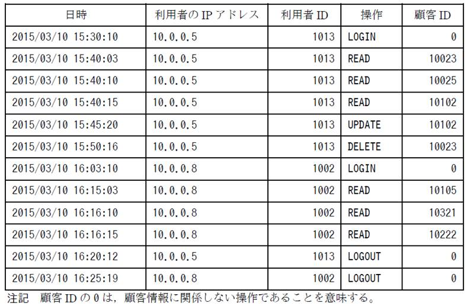

# 第13章　サンプル問題と解説

#### 本章について

　情報処理技術者試験センターは情報セキュリティマネジメント試験の開催に当たってサンプル問題（午前３問，午後１問）を事前公開しました．本章ではその問題とオリジナル解説を掲載します．キーワードには本書第1～11章の該当項目番号を付記してありますので，理解不足の単語があればしっかりチェックすることをお勧めします．

## 13.1 午前試験のサンプル問題と解説

**問１**　情報セキュリティにおいて，業務で利用しているシステムに影響を与える事象ａ～ｄのうち，脅威によって直接的に引き起こされたものだけを全て挙げたものはどれか．

|       |                                                                           |
|-------|----------------------------------------------------------------------------------------------------------------------|
|a.|CD-ROMの劣化によって，保存しておいた顧客リストが利用できなくなる．|
|b.|自然災害による停電や断水によって，システムが利用できなくなる．|
|c.|定期的なメンテナンスによって，メンテナンス期間中はシステムが利用できなくなる．|
|d.|メールサーバの設定ミスによって，メールサーバと連携して動作する自動問合せ業務システムが利用できなくなる．|

ア　a，b　　イ　a，b，d　　ウ　b，c　　エ　c，d

**正解： イ**

脅威は外部からの悪影響要因を指します．よって，外部の要因か，内部の対処のみでは防止できないものを選べば良いでしょう．
ａ，ｂ，ｄが当てはまるのでイが正解です．

ａのCD-ROMの劣化は内部の対処のみでは防止できないので当てはまります．

ｂの自然災害は内部の対処のみでは防止できないので当てはまります．

ｃの定期的なメンテナンスの影響は内部の対処で改善できるので脅威ではありません．

ｄのメールサーバの設定ミスは，これと連動して動作する自動問合せ業務システムにとっては外部の要因なので当てはまります．

**問２**　ディジタルフォレンジックスの活動に含まれるものはどれか．

|       |                                                                           |
|-------|----------------------------------------------------------------------------------------------------------------------|
|ア|インシデントの原因究明に必要となるデータの収集と保全|
|イ|自社システムを攻撃して不正侵入を試みるテストの実施|
|ウ|定期的なウイルスチェック|
|エ|パスワード認証方式からバイオメトリクス認証方式への切替え

**正解：ア**

**ディジタルフォレンジックス**（1.4.2参照）とは証拠保全であり，アの **インシデント**（7.3.6参照）の原因究明に必要なデータの収集と保全が当てはまります．

イは **ペネトレーションテスト**（1.3.1参照）のことであり無関係です．

ウは **ウイルス対策ソフト**（1.4.3参照）の動作であり無関係です．

エの **バイオメトリクス認証**（1.1.13参照）への切替えは認証方式の改善であり無関係です

**問３**　電子的な文書ファイルの機密性を維持するために使用するセキュリティ対策技術として，適切なものはどれか．

ア　アクセス制御　　イ　タイムスタンプ　　ウ　ディジタル署名　　エ　ホットスタンバイ

**正解：ア**

アの **アクセス制御**（1.4.2参照）により，権限のない利用者によるアクセスを制限し，**機密性**（1.1.1参照）を維持できます．よって当てはまります．

イの **タイムスタンプ**（1.4.2参照）は時刻認証を可能にしますが，アクセスを制限するものではないので，機密性の維持とは直接関係しません．

ウの **ディジタル署名**（1.1.11参照）は，改ざんの検出や作成者の否認防止ができますが，機密性とは無関係です．

エの **ホットスタンバイ**（7.3.3参照）は異常発生時のシステムの待機系への切替え時間を短縮できますが，機密性とは無関係です．

## 13.2 午後試験のサンプル問題と解説

**問１**　内部不正防止のためのログのレビューに関する次の記述を読んで，設問1～6に答えよ．

　Ａ社は，高級化粧品を個人に販売しており，従業員は100人である．Ａ社は総務部，情報システム部，購買部，営業部から成り，営業部には60人の従業員が属している．営業部は企画課，営業1課～4課から構成される．営業部のIT環境は次のとおりである．

- 営業部員は全員Ａ社所有のノートPCを使用している．
- 社内ネットワークに接続された，スキャナ用の共用PCが1台設置されている．
- 営業部員は，社外から社内のシステムを使用する際には，ノートPCをインターネット経由でＡ社のVPNサーバに接続して使用している．

　なお，Ａ社では，インターネットの使用を広く認めており，Webメールやファイル共有サービスなどを含め，サービスの使用を制限していない．

　Ａ社では，顧客情報などの機密情報の漏えいを防ぐ目的で，退職後も一定期間有効な損害賠償条項を含む機密保持契約を全従業員と締結している．

　Ａ社では，営業部員が表計算ソフトを使用してノートPCで顧客情報を管理していたが，顧客管理パッケージ(以下，Ｂシステムという)を社内に導入し，そこで集約して管理することを決定した．Ｂシステムに関する方針は次のとおり定めた．

- Ｂシステムの主管部門は営業部である．
- Ｂシステムを使用するのは営業部だけである．
- 見込み客の登録から販売後のフォローアップまでを一貫してＢシステムによって管理する．
- Ｂシステムの導入及び運用はＡ社の情報システム部が行う．
- Ｂシステムは2か月後から使用開始する．
- 表計算ソフトを使用して管理していた顧客情報はＢシステムに移行後，ノートPCから削除する．

　情報システム部は，Ｂシステムに関して，利用者IDの管理，データのバックアップ取得，ログの記録などに関する要件について営業部との間で合意した．Ｂシステムは顧客情報を取り扱うシステムなので，内部不正による顧客情報の漏えいを防止するため，採取するログの保存方法や，レビュー方法(誰がいつ，どのように)についてＣ君が検討を開始した．

〔ログのレビュー方法の検討〕

　業部の企画課に所属するＣ君は，営業部の情報セキュリティリーダを兼ねている．Ｃ君はＢシステムのログの仕様を確認しようと思い，情報システム部担当者のＤ君にログの仕様の調査を依頼した．そこでＤ君は，Ｂシステムのログのサンプルを提示した(表１)．ログイン及びログアウトのログはサーバXで，それ以外のログはサーバYで記録されるが，表１は，情報システム部でツールを用いてそれらのログを同じ形式に整え，表計算ソフトを使用して時系列順に並び替えたもの(以下，加工済みログという)とのことであった．

表１　Ｂシステムの加工済みログ（抜粋）

　Ｄ君は，Ｂシステムでは，次の対策を実施することをＣ君に説明した．

加工済みログの順番が，実際に営業部員がＢシステムに対して実施した操作の順番どおりになるよう， ~~ａ~~ を行う．

ログが故意に消されてしまうことがないように ~~ｂ~~ を行う．

　営業部では，顧客ごとに担当営業を決めているが，担当営業が休みの際のサポートなどが必要なので，Ｂシステムでは，全営業部員が全顧客情報にアクセスできるようにする．

　最近，同業他社で，従業員が，共有ファイルサーバにある全ての顧客情報をUSBメモリにコピーして持ち出し，転職先で使ったという事件が発生した．そこで営業部長は，Ｃ君に図１の要件を伝え，対策の検討を指示した．

- 顧客情報への業務目的外のアクセスをログのレビューによって検出したい．ログのレビュー手順は，まずログの内容を確認し，もし業務目的外と思われる顧客情報へのアクセスログがあった場合は，遅滞なく営業部長に報告の上，そのログが示す操作を行った営業部員がなぜその操作を行ったかを適切な方法で確認する．
- 万が一問題が発生したときに備えて，後からでもどの営業部員がどの顧客情報にアクセスしたか特定できるようにしておきたい．

図１　営業部長が伝えた要件

　営業部長は，<u>①リスクを更に低減させるために，営業部員が退職する際に新たな手続を実施</u>することとした．

　<u>②Ｃ君は，営業部長が伝えた要件を基に，どのような立場の人がどの程度の頻度でレビューをすべきかを検討した</u>．<u>③さらにＣ君は，ログの長期的な保存方法についても検討を行った</u>．Ｃ君が，検討結果を営業部長に説明したところ，営業部長もこれに同意した．

　情報システム部によるＢシステムの導入完了後，各営業部員は，表計算ソフトを使用して管理していた顧客情報をＢシステムに移行し，ノートPCから削除した．移行完了後，営業部ではＢシステムの使用を開始した．

〔ログのレビュー開始〕

　Ｂシステムの使用を開始して１か月が経過し，ログのレビューが開始された．Ｂシステムには約4,000人の顧客情報が保管されている．ログの生成件数を考えると，30日間で100人分以上の顧客情報にアクセスした営業部員のログに限定してレビューを行うべきだということになった．そこで，<u>④Ｃ君は，過去30日間に発生したREADのログからレビュー対象のログを抽出する条件</u>を示してＤ君にログの抽出を依頼した．抽出されたログを見たＣ君は，ある営業部員が1,000人分の顧客情報にアクセスしたことを示すログを発見した．そこで，Ｃ君はすぐに営業部長に報告し，その営業部員の上長の課長に確認した．その結果，その課長の指示でダイレクトメールを送付していたことが分かり，問題はないことが確認できた．

　営業部長とＣ君で相談した結果，レビューを行う人，及び頻度は検討結果のとおりとし，抽出条件に基づいて抽出したログだけをレビュー対象とすることとした．

　営業部長は，ログをレビューするに当たり，次のことを指示した．

- 全ての営業部員に対し，ログをレビューすることを伝えること．ただし，ログのレビューを回避されないように，抽出条件を営業部員には伝えないこと．
- ログがレビューされていることを営業部員に印象付けるために，ログに記録されているアクセスについて定期的に必ず営業部員にアクセスの目的を確認すること．

〔課題の発見とリスクの更なる低減〕

　Ｃ君は，職場内でＢシステムが適切に使用されているかどうかを観察していたところ，いくつかの事象が目に留まり，このままでは，<u>⑤ログのレビューを適切に実施したとしても，図1の要件が実現できない</u>ことに気付いた．そこでＣ君は，営業部長に相談の上，各課長に改善を依頼した．

　Ｂシステムの使用開始から1年間が経過した．ログのレビューによって営業部全体の情報セキュリティ意識が高まり，営業部長のＣ君に対する評価は大きく高まった．

**解説**

組織内部で起こる不正を防止するためのログ管理（1.4.1参照）とレビュー（ここではログのチェック）に関する問題です．**情報セキュリティインシデント**（1.2.1参照）を防止し，その発生を効率良く検知する方法についての知識と理解が問われています．

**問１設問１**

本文中の ~~ａ~~ と ~~ｂ~~ に入れる組合せとして正しい答えを，解答群の中から選べ．

ａ，ｂに関する解答群

|    | ａ                         | ｂ                         |
|----|----------------------------|----------------------------|
| ア | サーバの時刻同期           | ログのWORMメディアヘの記録 |
| イ | サーバの時刻同期           | ログの暗号化               |
| ウ | ログのWORMメディアヘの記録 | サーバの時刻同期           |
| エ | ログのWORMメディアヘの記録 | ログの暗号化               |
| オ | ログの暗号化               | サーバの時刻同期           |

注記　WORM：Write Once Read Many

**正解：ア**

**WORMメディア**（1.4.4参照）は追記式で削除不可な記憶媒体のことです．

空欄ａは「加工済みログの順番が操作の順番になるように」する手段ですので，サーバごとの時刻がずれていると不可能です．よって「サーバの時刻同期」が当てはまります．「ログのWORMメディアへの記録」や「ログの暗号化」はログの順番とは無関係です．

空欄ｂは「消されてしまわないように」する手段ですので，追記式で削除不可な記憶媒体が該当します．よって「ログのWORMメディアへの記録」が当てはまります．「ログの暗号化」はログの盗難対策であって削除対策にはならず，「サーバの時刻同期」は無関係です．

**問１設問２**

本文中の下線①で実施することになった手続はどれか．解答群のうち，最も適切なものを選べ．

解答群

|    |                                                           |
|----|--------------------------------------------------------------------------------|
| ア | 退職する営業部員が担当していた顧客情報を，他の営業部員に引き継ぐ．                                                                       |
| イ | 退職する営業部員が担当していた顧客情報を，Ｂシステムから完全に消去する．                                                                 |
| ウ | 退職する営業部員に，その営業部員と締結した機密保持契約書を見せ，その営業部員がアクセスした顧客情報がログに記録されていることを説明する． |
| エ | 退職する営業部員のPCのハードディスクは再利用せず，完全に物理破壊する．                                                                   |

**正解：ウ**

**退職者対策**（1.4.1参照）に関する問題です．

下線部①は「営業部員が退職する際」に実施する「新たな手続」ですので，ウの機密保持契約書の再確認をしてもらうことと，アクセス情報が記録されていることの説明が当てはまります．

アは業務の引継ぎの説明であり，退職者対策には該当しません．

イは顧客情報を消去する必要はありませんし，業務の引継ぎができなくなってしまいます．

エはPCを内部で再利用する場合は不要な行為です．なお，PCを廃棄したりレンタル・リースの解約のためにハードディスクの内容を完全に消去したい場合は，物理破壊よりも専用ソフトウェアを用いる方が適切です．

**問１設問３**

本文中の下線②における，Ｃ君の検討結果はどれか．解答群のうち，最も適切なものを選べ．

解答群

|    | |
|----|--------------------------------------------------------------------------------|
| ア | 営業部の各課長が，情報システム部担当者の依頼があった都度，ログをレビューする． |
| イ | 営業部の各課長が，毎週，ログをレビューする．                                   |
| ウ | 情報システム部担当者が，営業部長が指定した頻度でログをレビューする．           |
| エ | 情報システム部担当者が，毎週，ログをレビューする．                             |

**正解：イ**

レビュー（ログのチェック）を誰がどういう頻度で行うのが最適かを問う問題です．

「顧客情報への業務目的外のアクセス」かどうかは，情報システム部担当者ではわかりませんので，営業部の各課長が担当すべきです．

そして，「遅滞なく営業部長に報告」するには，定期的な実施が必要ですのでイが正解です．

**問１設問４**

本文中の下線③においてＣ君が検討したログの保存方法はどれか．解答群のうち，最も適切なものを選べ．

解答群

|    | |
|----|----------------------------------------------------------------------------------|
| ア | 情報システム部が全てのログを10年間保存する．                                     |
| イ | 情報システム部が営業部員ごとにログを仕分けして，各営業部員が自分の分を保存する． |
| ウ | レビュー後のログは保存せず，情報システム部担当者が速やかに削除する．             |
| エ | レビューで不審であると判断したログだけを情報システム部が10年間保存する．         |

**正解：ア**

ログの長期的な保存方法に関する問題です．ログは無条件に一括で長期保存が望ましいので，選択肢の中ではアの「全てを10年間」がもっとも適切です．

イの「各営業部員が自分の分を保存」することは情報の散逸につながり改ざんの懸念もあるので不適切です．

ウの「レビュー後のログは保存しない」は後で確認ができなくなるため不適切です．

エの「レビューで不審であると判断したログだけ」保存することは，レビュー時点では不審と判断できなかったログが失われてしまうため不適切です．

**問１設問５**

本文中の下線④でＣ君がＤ君に示した抽出条件を，解答群の中から選べ．

解答群

|    |                                                            |
|----|---------------------------------------------------------|
| ア | アクセスしたユニークな顧客ID数が100以上の営業部員のログ |
| イ | アクセスしたユニークな顧客ID数が100以上の日のログ       |
| ウ | ログ件数が100以上の営業部員のログ                       |
| エ | ログ件数が100以上の日のログ                             |

**正解：ア**

「過去30日間に発生したREADのログからレビュー対象のログを抽出する条件」で，対象は「30日間で100人分以上の顧客情報にアクセスした営業部員」ですので，抽出条件はアの「アクセスしたユニークな顧客ID数が100以上の営業部員」とするのが適切です．

イとエは営業部員ごとではなく，日ごとの抽出なので不適切です．

ウのログ件数だけでの抽出では，同一の顧客情報への複数回のREADをそのままカウントしてしまうので，正常なアクセスまで抽出されてしまい不適切です．

**問１設問６**

Ｃ君が観察した次の(i)～(iv)の事象のうち，本文中の下線⑤の原因となるものを全て挙げた組合せを，解答群の中から選べ．

|       |                                                                           |
|-------|----------------------------------------------------------------------------------------------------------------------|
| (i)   | Ｂシステムで表示した顧客情報をコピーし，表計算ソフトにペーストした上でＡ社の共有ファイルサーバに置いて共有している． |
| (ii)  | Ｂシステムの使用申請をしてから，営業部長が承認するまでに2週間掛かっている．                                          |
| (iii) | ある営業部員が共用PCからＢシステムにログインし，ログインしたままそのPCで他の営業部員がＢシステムを使っている．       |
| (iv)  | ある営業部員が頻繁にＢシステムにログイン，ログアウトを繰り返している．                                               |

解答群

|    |            |    |                 |    |                   |
|----|------------|----|-----------------|----|-------------------|
| ア | (i)，(ii)  | イ | (i)，(ii)，(iv) | ウ | (i)，(iii)        |
| エ | (i)，(iv)  | オ | (ii)，(iii)     | カ | (ii)，(iii)，(iv) |
| キ | (ii)，(iv) | ク | (iii)，(iv)     |    |                   |

**正解：ウ**

ログのレビューを適切に実行しても「業務目的外のアクセスの検出」と「どの営業部員がどの顧客情報にアクセスしたかの特定」の２要件ができないものを選び出します．

(i)では「顧客情報がコピーされ共有されている」ので，利用状況がログに残りません．よって該当します．

(ii)の「営業部長が承認するまでの時間」はこの２要件とは無関係です．

(iii)では他の営業部員のアクセスが，前の営業部員のアクセスとしてログに残ってしまいます．よって該当します．

(iv)の「頻繁なログイン，ログアウトの繰り返し」はこの２要件とは無関係です．

以上のように，(i)と(iii)が該当しますのでウが正解です．
