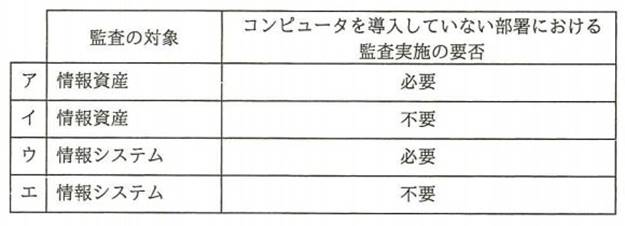
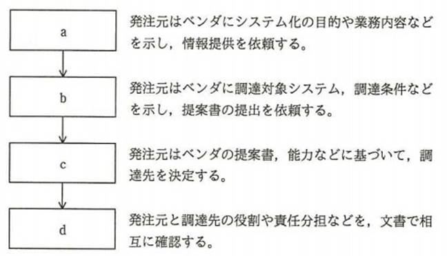

# 第14章　第１回試験（平成28年＝2016年春）午前問題と解説

#### 本章について

2016年春，情報処理技術者試験センターは１回目の情報セキュリティマネジメント試験の開催後，試験問題（午前50問，午後3問）と解答，採点講評を公開しました．本章では午前問題の全問題文とオリジナル解説を掲載します．キーワードには本書第1～11章の該当項目番号を付記してありますので，理解不足の単語があればしっかりチェックすることをお勧めします．

なお，出題割合はストラテジ系が10問，マネジメント系が6問，テクノロジ系が34問でした．テクノロジ系だけでも合格ラインの60点を超えられることがわかりますが，具体的な系統別問題番号は公開されておらず，系統をまたがった問題もありますので，テクノロジ系に偏った対策はお勧めしません．ストラテジ系，マネジメント系を苦手にせぬよう準備してください．なお，他の試験区分のセキュリティ系問題の流用も散見されますので，この50問に加えて、基本情報などのセキュリティ系過去問にも当たっておくと良いでしょう．

## 14.1 午前試験の問題と解説

**問１**　CSIRTの説明として，適切なものはどれか．

|     |                                                                                                                                  |
|:----|:---------------------------------------------------------------------------------------------------------------------------------|
| ア  | IPアドレスの割当て方針の決定，DNSルートサーバの運用監視，DNS管理に関する調整などを世界規模で行う組織である．                     |
| イ  | インターネットに関する技術文書を作成し，標準化のための検討を行う組織である．                                                     |
| ウ  | 企業内・組織内や政府機関に設置され，情報セキュリティインシデントに関する報告を受け取り，調査し，対応活動を行う組織の総称である． |
| エ  | 情報技術を利用し，宗教的又は政治的な目標を達成するという目的をもった人や組織の総称である．                                       |

**正解**：ウ

CSIRT（1.2.9参照）はコンピュータ・セキュリティ・インシデント・レスポンスチームの略で，企業内組織の場合，内閣官房情報セキュリティセンターのような政府内組織，IPAのような独立行政法人，JPCERT/CCのようなNGOの場合があります．よってウが正解です．

アはICANN（5.5.4参照），イはIETF（5.1.3参照），エはハクティビスト（1.1.7参照）

**問２**　情報セキュリティ対策のクリアデスクに該当するものはどれか．

|     |                                                                                                                        |
|:----|:-----------------------------------------------------------------------------------------------------------------------|
| ア  | PCのデスクトップ上のフォルダなどを整理する．                                                                           |
| イ  | PCを使用中に離席した場合，一定時間経過すると，パスワードで画面ロックされたスクリーンセーバに切り替わる設定にしておく． |
| ウ  | 帰宅時，書類やノートPCを机の上に出したままにせず，施錠できる机の引出しなどに保管する．                                 |
| エ  | 机の上に置いたノートPCを，セキュリティワイヤで机に固定する．                                                           |

**正解**：ウ

クリアデスク（1.4.4参照）は，利用者の不在時のインシデント要因となる机上の物をクリア(除去)することを意味する物理的セキュリティ対策です．

アは技術的セキュリティ対策であり，クリアデスクとPCのデスクトップは無関係です．

イも技術的セキュリティ対策です．

エは物理的セキュリティ対策ですが，インシデント要因のクリア(除去)ではなく固定化です．

**問３**　情報セキュリティに係るリスクマネジメントが効果的に実施されるよう，リスクアセスメントに基づいた適切なコントロールの整備，運用状況を検証又は評価し，保証又は助言を与えるものであり，実施者に独立かつ専門的な立場が求められるものはどれか．

|     |                                     |
|:----|:------------------------------------|
| ア  | コントロールセルフアセスメント(CSA) |
| イ  | 情報セキュリティ監査                |
| ウ  | 情報セキュリティ対策ベンチマーク    |
| エ  | ディジタルフォレンジックス          |

**正解**：イ

まず「実施者に独立かつ専門的な立場が求められるもの」とあることから監査だと推定できます．そして，

-   ①情報セキュリティに係るリスクマネジメント(リスクの管理)が効果的に実施されるようにする
-   ②リスクアセスメント(リスクの調査・評価)に基づいた適切なコントロールを整備する
-   ③運用状況を検証又は評価する ④保証又は助言を与える

という説明から情報セキュリティ監査（8.1.2参照）であることがわかります．

アのCSA（8.2.2参照）は主観的に検証・評価することであり監査ではありません．

ウの情報セキュリティ対策ベンチマーク（2.2.6参照）は相対評価であり監査ではありません．

エのディジタルフォレンジックス（1.4.2参照）は監査の証拠保全に役立ちますが，監査そのものではありません．

**問４**　ノートPCやスマートフォンなどのモバイル機器に重要情報を格納して持ち出すとき，機器の紛失による情報漏えい対策として有効なものはどれか．

|     |                                                                |
|:----|:---------------------------------------------------------------|
| ア  | モバイル機器でのSNSの使用を制限する．                          |
| イ  | モバイル機器内の情報をリモートから消去できるツールを導入する． |
| ウ  | モバイル機器に通信を暗号化するツールを導入する．               |
| エ  | モバイル機器にのぞき見防止フィルムを貼付する．                 |

**正解**：イ

「機器の紛失による情報漏えい対策」としては，紛失そのものを防止することが難しいため，紛失後の対策が問われています．選択肢の中ではイの「機器内の情報をリモートから消去できるツール」が当てはまります．

アはSNS（9.2.1参照）による情報発信のリスク（1.2.3参照）である内部情報漏えいや企業イメージへのダメージの防止策です．

ウの通信暗号化は盗聴（1.1.3参照）による情報漏えいの防止策です．

エののぞき見防止フィルムはショルダハッキング（1.1.3参照）による情報漏えいの防止策です．

**問５**　JIS Q 27001において，リスクを受容するプロセスに求められるものはどれか．

|     |                                                          |
|:----|:---------------------------------------------------------|
| ア  | 受容するリスクについては，リスク所有者が承認すること     |
| イ  | 受容するリスクをモニタリングやレビューの対象外とすること |
| ウ  | リスクの受容は，リスク分析前に行うこと                   |
| エ  | リスクを受容するかどうかは，リスク対応後に決定すること   |

**正解**：ア JIS Q 27001（1.2.8参照）はISO/IEC 27001の日本語版で，リスクマネジメントに関する世界標準です．この中で記述されているリスクへの対応策のひとつとして，リスク受容（リスク保有10.1.1参照）があります．リスク受容はリスクの発生確率と被害予想額や対応経費を考えると，対応しない方が良い場合の判断で，この判断にはリスク所有者(リスクの対応責任者)の承認が必要です．

イは，受容するリスクもモニタリング(定点監視)やレビュー(状況確認)の対象にし，必要都度，再検討する必要があります．

ウはリスク分析（10.1.1参照）を行って初めて受容するか判断できるので不適切です．

エはリスク受容とした場合，リスク対応は不要です．

**問６**　JIS Q 27001に基つく情報セキュリティ方針の取扱いとして，適切なものはどれか．

|     |                                                                  |
|:----|:-----------------------------------------------------------------|
| ア  | 機密情報として厳格な管理を行う．                                 |
| イ  | 従業員及び関連する外部関係者に通知する．                         |
| ウ  | 情報セキュリティ担当者各人が作成する．                           |
| エ  | 制定後はレビューできないので，見直しの必要がない内容で作成する． |

**正解**：イ

情報セキュリティ方針（1.2.7参照）は経営者が関係者全員に遵守を求めるものですので，従業員及び関連する外部関係者に通知する必要があります．

アは，情報セキュリティ方針は機密情報ではないので不適切です．

ウは，情報セキュリティ方針を作成するのは経営者直属の専任者なので不適切です．

エは，情報セキュリティ方針は制定後も組織や環境の変化の影響をレビューし，必要なら見直しを行うので不適切です．

**問７**　IPA"組織における内部不正防止ガイドライン"にも記載されている，組織の適切な情報セキュリティ対策はどれか．

|     |                                                                                                                                                                        |
|:----|:-----------------------------------------------------------------------------------------------------------------------------------------------------------------------|
| ア  | インターネット上のWebサイトへのアクセスに関しては，コンテンツフィルタ(URLフィルタ)を導入して，SNS，オンラインストレージ，掲示板などへのアクセスを制限する．            |
| イ  | 業務の電子メールを，システム障害に備えて，私用のメールアドレスに転送するよう設定させる．                                                                               |
| ウ  | 従業員がファイル共有ソフトを利用する際は，ウイルス対策ソフトの誤検知によってファイル共有ソフトの利用が妨げられないよう，ウイルス対策ソフトの機能を一時的に無効にする． |
| エ  | 組織が使用を許可していないソフトウェアに関しては，業務効率が向上するものに限定して，従業員の判断でインストールさせる．                                                 |

**正解**：ア

IPAの組織における内部不正防止ガイドライン（1.4.1参照）は，企業やその他の組織において必要な内部不正対策を効果的に実施可能とすることを目的として作成されたもので，特に，情報漏えいや風評被害の発生，信用失墜などが対象であり，内部から発信可能なWebサイトへのアクセス制限が当てはまります．

イは「業務の電子メールを，システム障害に備えて，組織内のバックアップメールサーバにも転送する」であれば正しいですが，内部不正防止とは無関係です．

ウは「従業員がファイル共有ソフトを（業務上で）利用する」ことは禁止すべきであり，「ウイルス対策ソフトの機能を一時的に無効にする」ことは絶対に認められません．

エは「組織が使用を許可していないソフトウェア」はどういう理由があろうとも，インストールできませんので不適切です．

**問８**　情報システムに対するアクセスのうち，JIS Q 27002でいう特権的アクセス権を利用した行為はどれか．

|     |                                                                                |
|:----|:-------------------------------------------------------------------------------|
| ア  | 許可を受けた営業担当者が，社外から社内の営業システムにアクセスし，業務を行う． |
| イ  | 経営者が，機密性の高い経営情報にアクセスし，経営の意思決定に生かす．           |
| ウ  | システム管理者が業務システムのプログラムのバージョンアップを行う．             |
| エ  | 来訪者が，デモシステムにアクセスし，システム機能の確認を行う．                 |

**正解**：ウ JIS Q 27002（1.2.8参照）で述べられている特権的アクセス権とは「情報セキュリティ管理策の実践のための規範」において「利用者の職務上の役割のための最小限の要求事項に基づいて割り当てる」ものであり，具体的には，ウの「システム管理者の作業に必要なシステムを変更できる権限」が当てはまります．

アは営業担当者に特権的アクセス権を与えることはないので不適切です．

イは経営者に特権的アクセス権を与えることは基本的にないので不適切です．

ウは来訪者に特権的アクセス権を与えることはないので不適切です．

**問９**　"不正のトライアングル"理論において，全てそろったときに不正が発生すると考えられている3要素はどれか．

|     |                              |
|:----|:-----------------------------|
| ア  | 機会，動機，正当化           |
| イ  | 機密性，完全性，可用性       |
| ウ  | 顧客，競合，自社             |
| エ  | 認証，認可，アカウンティング |

**正解**：ア

不正のトライアングル（1.1.6参照）は，不正行為の発生に特徴的な３要素であり，機会，動機に加えて，行為を正当化する理由が得られると，不正行為に走りやすいことを示します．

イは情報セキュリティの三大要件（1.1.1参照）．

ウは3C（11.1.1参照）で経営戦略における３大要素．

エはAAA（1.1.12参照）でアクセス管理，課金やアカウント管理における３要素．

**問10**　利用者アクセスログの取扱いのうち，IPA"組織における内部不正防止ガイドライン"にも記載されており，内部不正の早期発見及び事後対策の観点で適切なものはどれか．

|     |                                        |
|:----|:---------------------------------------|
| ア  | コストにかかわらずログを永久保存する． |
| イ  | 利用者にログの管理権限を付与する．     |
| ウ  | 利用者にログの保存期間を周知する．     |
| エ  | ログを定期的に確認する．               |

**正解**：エ

IPAの組織における内部不正防止ガイドライン（1.4.1参照）には，企業やその他の組織において必要な内部不正対策が多数掲載されていますが，「内部不正の早期発見及び事後対策の観点」において適切であるものを選択肢から選ぶとエが当てはまります．

アは，この観点には当てはまらず，しかも，ログの保存は重要性とコストパフォーマンス等を検討して行う必要があるので不適切です．

イは，管理者以外にログの管理権限を付与してはならないので誤りです．悪意のある利用者にログを消去，改ざんされてしまいます．

ウは，管理者以外にログの保存期間を知らせてはならないので誤りです．悪意をもつ利用者による不正行為を助長してしまう可能性があります．

**問11**　BYODの説明，及びその情報セキュリティリスクに関する記述のうち，適切なものはどれか．

|     |                                                                                                                                                          |
|:----|:---------------------------------------------------------------------------------------------------------------------------------------------------------|
| ア  | 従業員が企業から貸与された情報端末を，客先などへの移動中に業務に利用することであり，ショルダハッキングなどの情報セキュリティリスクが増大する．           |
| イ  | 従業員が企業から貸与された情報端末を，自宅に持ち帰って私的に利用することであり，機密情報の漏えいなどの情報セキュリティリスクが増大する．                 |
| ウ  | 従業員が私的に保有する情報端末を，職場での休憩時間などに私的に利用することであり，セキュリティ意識の低下などに起因する情報セキュリティリスクが増大する． |
| エ  | 従業員が私的に保有する情報端末を業務に利用することであり，セキュリティ設定の不備に起因するウイルス感染などの情報セキュリティリスクが増大する．           |

**正解**：エ

BYOD（9.2.1参照）は私有装置の業務利用のことです．事前及び定期的な設定確認が必要ですが，おろそかになりやすく，各個人が自分自身が利用しやすく設定してしまうことがリスクとなります．

アとイは「企業から貸与された情報端末」，ウは「私的に利用すること」なので当てはまりません．なお，ショルダハッキング（1.1.3参照）は盗み見のことです．

**問12**　IDSの機能はどれか．

|     |                                                                                                                                |
|:----|:-------------------------------------------------------------------------------------------------------------------------------|
| ア  | PCにインストールされているソフトウェア製品が最新のバージョンであるかどうかを確認する．                                         |
| イ  | 検査対象の製品にテストデータを送り，製品の応答や挙動から脆(ぜい)弱性を検出する．                                               |
| ウ  | サーバやネットワークを監視し，セキュリティポリシを侵害するような挙動を検知した場合に管理者へ通知する．                         |
| エ  | 情報システムの運用管理状況などの情報セキュリティ対策状況と企業情報を入力し，組織の情報セキュリティへの取組状況を自己診断する． |

**正解**：エ

IDS（1.4.3参照）は侵入検知システム．検知が目的で，侵入防止は別途行います．

アは検疫ネットワーク（1.4.2参照）の機能の一部．

イはペネトレーションテスト（1.3.1参照）の一種．

エはIPAが提供している情報セキュリティ対策ベンチマーク（2.2.6参照）．

**問13**　クライアントとWebサーバの間において，クライアントがWebサーバに送信されたデータを検査して，SQLインジェクションなどの攻撃を遮断するためのものはどれか．

|     |              |     |                        |
|:----|:-------------|:----|:-----------------------|
| ア  | SSL-VPN機能  | イ  | WAF                    |
| ウ  | クラスタ構成 | エ  | ロードバランシング機能 |

**正解**：イ

SQLインジェクション（1.1.9参照）は，クライアントからWebサーバに送信されたリクエストに不正なSQL文が含まれていないかチェックすることで防止できます．これが可能なのがWAF（Web Application Firewall：1.1.9参照）です．

アのSSL-VPN（1.5.2参照）は暗号化にSSL（1.5.1参照）を用いる仮想私設ネットワーク．

ウのクラスタ構成（3.1.2参照）は多重化による信頼性向上技術でセキュリティ技術ではありません．

エのロードバランシング（3.1.2参照）は負荷分散による処理能力向上技術でセキュリティ技術ではありません．

**問14**　PCで行うマルウェア対策のうち，適切なものはどれか．

|     |                                                                                                                                                |
|:----|:-----------------------------------------------------------------------------------------------------------------------------------------------|
| ア  | PCにおけるウイルスの定期的な手動検査では，ウイルス対策ソフトの定義ファイルを最新化した日時以降に作成したファイルだけを対象にしてスキャンする． |
| イ  | ウイルスがPCの脆(ぜい)弱性を突いて感染しないように，OS及びアプリケーションの修正パッチを適切に適用する．                                       |
| ウ  | 電子メールに添付されたウイルスに感染しないように，使用しないTCPポート宛ての通信を禁止する．                                                    |
| エ  | ワームが侵入しないように，クライアントPCに動的グローバルIPアドレスを付与する．                                                                 |

**正解**：イ

マルウェア（1.1.4参照）の多くはOS及びアプリケーションの脆弱性（1.1.5参照）を悪用するので，修正パッチ（脆弱性修正プログラム：1.4.2参照）の適用が効果的です．

アは「最新化した日時以前に作成した対象にしてスキャンすることで，後日判明したウイルスの対策も行う」が正しい．

ウの「使用しないTCPポート（5.3.1参照）宛ての通信を禁止する」は入口対策（1.4.2参照）としては正しいですが，電子メールに添付されたウイルスの感染防止策にはなりません．

エの「動的グローバルIPアドレス（5.5.4参照）の付与」はIPアドレスではユーザを特定できないというメリットがありますが，これはワーム（1.1.4参照）の侵入防止対策にはなりません．

**問15**　システム管理者による内部不正を防止する対策として，適切なものはどれか．

|     |                                                                                                                |
|:----|:---------------------------------------------------------------------------------------------------------------|
| ア  | システム管理者が複数の場合にも，一つの管理者IDでログインして作業を行わせる．                                   |
| イ  | システム管理者には，特権が付与された管理者IDでログインして，特権を必要としない作業を含む全ての作業を行わせる． |
| ウ  | システム管理者の作業を本人以外の者に監視させる．                                                               |
| エ  | システム管理者の操作ログには，本人にだけアクセス権を与える．                                                   |

**正解**：ウ

内部不正を防止する対策を含むのが内部統制(8.2.1参照)です．内部統制にはウの職務分掌(実施者と承認者を分ける，監視者を置くこと)が含まれています．

アの「管理者IDの共用」は，悪用者が特定できなくなる為，不適切．

イの「特権を必要としない作業」は通常の利用者IDで行うべきであり，特権が付与された管理者IDで行うことは不適切．

エの「操作ログのアクセス権限を本人に与える」ことは，悪用者がログを消去できることになり不適切．

**問16**　ディジタルフォレンジックスでハッシュ値を利用する目的として，適切なものはどれか．

|     |                                                                      |
|:----|:---------------------------------------------------------------------|
| ア  | 一方向性関数によってパスワードを復元できないように変換して保存する． |
| イ  | 改変されたデータを，証拠となり得るように復元する．                   |
| ウ  | 証拠となり得るデータについて，原本と複製の同一性を証明する．         |
| エ  | パスワードの盗聴の有無を検証する．                                   |

**正解**：ウ

ディジタルフォレンジックス（1.4.2参照）は主にセキュリティにおける証拠保存のことです．大量で大きなファイルとなることもあり，元データのあるサーバ等ではなく，外部の保管場所を用いることがあります．ハッシュ値はデータをハッシュ関数（1.1.10参照）に与えて短い文字列(ダイジェスト)を得たもので，元のデータが異なると，ハッシュ値も異なるのが特徴です．よって，保全した証拠データ（複製）のハッシュ値を得て元データ（原本）のあるサーバ等に残しておけば，必要都度，原本のハッシュ値を得て複製のハッシュ値と比較することで同一性(改ざんされていないこと等)が証明できるわけです．

アはパスワードの代わりにハッシュ値を用いた認証の仕組みの一部でディジタルフォレンジックスとは無関係です．

イはハッシュ値から元データは復元できないので不適切．

エの「パスワードの盗聴の有無」はハッシュ値では検証できません．

**問17**　機密ファイルが格納されていて，正常に動作するPCの磁気ディスクを産業廃棄物処理業者に引き渡して廃棄する場合の情報漏えい対策のうち，適切なものはどれか．

|     |                                                                          |
|:----|:-------------------------------------------------------------------------|
| ア  | 異なる圧縮方式で，機密ファイルを複数回圧縮する．                         |
| イ  | 専用の消去ツールで，磁気ディスクのマスタブートレコードを複数回消去する． |
| ウ  | ランダムなビット列で，磁気ディスクの全領域を複数回上書きする．           |
| エ  | ランダムな文字列で，機密ファイルのファイル名を複数回変更する．           |

**正解**：ウ

情報システム廃棄（9.4.2参照）に関する問題です．情報漏えい対策としては，磁気ディスクの全領域のデータが完全に閲覧不能になる必要があります．物理破壊しても磁気顕微鏡などで復元できる危険性があるため，ランダムなビット列による上書きが適切です．なお，OSなどの仕組みにより実際には上書きされない領域が発生する可能性があるので，複数回行うのが基本です．

アの「機密ファイルを複数回圧縮」は暗号化を含まないので，展開して閲覧できてしまうため不適切です．

イのマスタブートレコードは起動情報のある領域であり，消去すると起動できなくなりますが，復旧することで再利用できる可能性があり，情報漏えい対策にはなりません．

エの「ファイル名を複数回変更」は，変更してもファイルの内容は変わらないので，情報漏えい対策にはなりません．

**問18**　2要素認証に該当する組はどれか．

|     |                                                                  |
|:----|:-----------------------------------------------------------------|
| ア  | ICカード認証，指紋認証                                           |
| イ  | ICカード認証，ワンタイムパスワードを生成するハードウェアトークン |
| ウ  | 虹彩認証，静脈認証                                               |
| エ  | パスワード認証，パスワードリマインダ                             |

**正解**：ア

利用者認証（1.1.12参照）には所有物による認証，身体特徴による認証，知識による認証の3要素があり，そのうち2要素以上を用いるのが2要素認証です．

アは所有物（ICカード）による認証と，身体特徴（指紋）による認証の2要素認証．

イはICカード認証もワンタイムパスワードを生成するハードウェアトークン（1.1.12参照）も所有物による認証なので2要素認証ではありません．

ウは虹彩認証（1.1.13参照）も静脈認証（1.1.13参照）も身体特徴による認証なので2要素認証ではありません．

エはパスワード認証もパスワードリマインダ（1.1.12参照）も知識による認証なので2要素認証ではありません．

**問19**　APTの説明はどれか．

|     |                                                                                                                                |
|:----|:-------------------------------------------------------------------------------------------------------------------------------|
| ア  | 攻撃者はDoS攻撃及びDDoS攻撃を繰り返し組み合わせて，長期間にわたり特定組織の業務を妨害する．                                    |
| イ  | 攻撃者は興味本位で場当たり的に，公開されている攻撃ツールや脆弱性検査ツールを悪用した攻撃を繰り返す．                           |
| ウ  | 攻撃者は特定の目的をもち，標的となる組織の防御策に応じて複数の手法を組み合わせて，気付かれないよう執拗(よう)に攻撃を繰り返す． |
| エ  | 攻撃者は不特定多数への感染を目的として，複数の攻撃を組み合わせたマルウェアを継続的にばらまく．                                 |

**正解**：ウ

APT（Advanced Persistent Threats：1.1.9参照）は標的型攻撃の一種で，特定の目的をもつこと，複数の手法を組み合わせた攻撃を繰り返すことが特徴です．

アはDoSとDDoS（1.1.9参照）が同じ攻撃手法なので「複数の手法を組み合わせた攻撃」には当てはまりません．

イは「興味本位で場当たり的」なのでAPTには当てはまりません．

エは「不特定多数への攻撃」なのでAPTには当てはまりません．

**問20**　利用者PCのHDDが暗号化されていないとき，攻撃者が利用者PCからHDDを抜き取り，攻撃者が用意したPCに接続してHDD内の情報を盗む攻撃によって発生する情報漏えいのリスクの低減策のうち，適切なものはどれか．

|     |                                                                                   |
|:----|:----------------------------------------------------------------------------------|
| ア  | HDDにインストールしたOSの利用者アカウントに対して，ログインパスワードを設定する． |
| イ  | HDDに保存したファイルの読取り権限を，ファイルの所有者だけに付与する．             |
| ウ  | 利用者PC上でHDDパスワードを設定する．                                             |
| エ  | 利用者PCにBIOSパスワードを設定する．                                              |

**正解**：ウ

「利用者PCからHDDを抜き取り，攻撃者が用意したPCに接続してHDD内の情報を盗む攻撃」では，PCやOSによるセキュリティ対策は効果をもたず，迂回されてしまいます．

HDDパスワード（1.4.2参照）はHDDそのものに設定できるパスワードであり，他のPCに接続しても有効なので当てはまります．

アのログインパスワードはOSにおけるセキュリティ措置ですので，このような攻撃には効果がありません．

イのアクセス権限設定もOSにおけるセキュリティ措置ですので，このような攻撃には効果がありません．

エのBIOSパスワード（1.4.2参照）は利用者のPCの起動を阻止できますが，攻撃者が用意したPCの起動は阻止できません．

**問21**　クロスサイトスクリプティングに該当するものはどれか．

|     |                                                                                                                                                                                                                                      |
|:----|:-------------------------------------------------------------------------------------------------------------------------------------------------------------------------------------------------------------------------------------|
| ア  | Webアプリケーションのデータ操作言語の呼出し方に不備がある場合に，攻撃者が悪意をもって構成した文字列を入力することによって，データベースのデータの不正な取得，改ざん及び削除を可能とする．                                            |
| イ  | Webサイトに対して，他のサイトを介して大量のパケットを送り付け，そのネットワークトラフィックを異常に高めてサービスを提供不能にする．                                                                                                  |
| ウ  | 確保されているメモリ空間の下限又は上限を超えてデータの書込みと読出しを行うことによって，プログラムを異常終了させたりデータエリアに挿入された不正なコードを実行させたりする．                                                         |
| エ  | 攻撃者が罠(わな)を仕掛けたWebページを利用者が閲覧し，当該ページ内のリンクをクリックしたときに，不正スクリプトを含む文字列が脆弱なWebサーバに送り込まれ，レスポンスに埋め込まれた不正スクリプトの実行によって，情報漏えいをもたらす． |

**正解**：エ

クロスサイトスクリプティング（1.1.9参照）の特徴は「脆弱なWebサーバの悪用」「サイトをまたがった動作」ですので，エが当てはまります．

アはSQLインジェクション（1.1.9参照） イはDoS攻撃，DDoS攻撃（1.1.9参照）

ウはバッファオーバフロー攻撃（1.1.9参照）

**問22**　クリックジャッキング攻撃に該当するものはどれか．

|     |                                                                                                                                                                           |
|:----|:--------------------------------------------------------------------------------------------------------------------------------------------------------------------------|
| ア  | Webアプリケーションの脆弱性を悪用し，Webサーバに不正なリクエストを送ってWebサーバからのレスポンスを二つに分割させることによって，利用者のブラウザのキャッシュを偽造する． |
| イ  | WebサイトAのコンテンツ上に透明化した標的サイトBのコンテンツを配置し，WebサイトA上の操作に見せかけて標的サイトB上で操作させる．                                            |
| ウ  | Webブラウザのタブ表示機能を利用し，Webブラウザの非活性なタブの中身を，利用者が気づかないうちに偽ログインページに書き換えて，それを操作させる．                            |
| エ  | 利用者のWebブラウザの設定を変更することによって，利用者のWebページの閲覧履歴やパスワードなどの機密情報を盗み出す．                                                        |

**正解**：イ

クリックジャッキング攻撃（1.1.9参照）は，利用者のクリックが見かけとは異なるページに対して行われてしまう手口で，利用者に意図せずに個人情報を公開させたり，セキュリティ設定を解除させることなどが目的です．

アはHTTPレスポンス分割攻撃（1.1.9参照） ウはタブナビング（1.1.9参照）

エはスパイウェア（1.1.4参照）の挙動の一例です．

**問23**　送信者Aが文書ファイルと，その文書ファイルのディジタル署名を受信者Bに送信したとき，受信者Bができることはどれか．ここで，受信者Bは送信者Aの署名検証鍵Xを保有しており，受信者Bと第三者は送信者Aの署名生成鍵Yを知らないものとする．

|     |                                                                                                                             |
|:----|:----------------------------------------------------------------------------------------------------------------------------|
| ア  | ディジタル署名，文書ファイル及び署名検証鍵Xを比較することによって，文書ファイルに改ざんがあった場合，その部分を判別できる． |
| イ  | 文書ファイルがウイルスに感染していないことを認証局に問い合わせて確認できる．                                                |
| ウ  | 文書ファイルが改ざんされていないこと，及びディジタル署名が署名生成鍵Yによって生成されたことを確認できる．                   |
| エ  | 文書ファイルとディジタル署名のどちらかが改ざんされた場合，どちらが改ざんされたかを判別できる．                              |

**正解**：ウ

ディジタル署名（1.1.11参照）は公開鍵暗号方式（1.1.10参照）の応用で，署名検証鍵Xは公開鍵，署名生成鍵Yは秘密鍵に当たります．ディジタル署名でわかることは，秘密鍵によって暗号化されていること＝本人であることと，改ざんの有無のみです．

アは改ざんがあった部分を判別できないので誤り．

イのウイルス検知はディジタル署名とは無関係です．また，認証局（CA：1.1.14参照）はウイルス感染についての問合せには応じません．

エは文書ファイルとディジタル署名のどちらが改ざんされたかは判別できないので誤り．

**問24**　公開鍵暗号を利用した電子商取引において，認証局(CA)の役割はどれか．

|     |                                                        |
|:----|:-------------------------------------------------------|
| ア  | 取引当事者間で共有する秘密鍵を管理する．               |
| イ  | 取引当事者の公開鍵に対するディジタル証明書を発行する． |
| ウ  | 取引当事者のディジタル署名を管理する．                 |
| エ  | 取引当事者のパスワードを管理する．                     |

**正解**：イ

認証局（CA：1.1.14参照）の役割は取引当事者の公開鍵に対するディジタル証明書（公開鍵証明書：1.1.14参照）を発行することです．

アは取引当事者間で秘密鍵を共有することはないので誤り．

ウの「ディジタル署名の管理」は認証局の役割ではありません．

エの「パスワードの管理」は認証局の役割ではありません．

**問25**　ドライブバイダウンロード攻撃の説明はどれか．

|     |                                                                                                                                              |
|:----|:---------------------------------------------------------------------------------------------------------------------------------------------|
| ア  | PCにUSBメモリが接続されたとき，USBメモリに保存されているプログラムを自動的に実行する機能を用いてウイルスを実行し，PCをウイルスに感染させる． |
| イ  | PCに格納されているファイルを勝手に暗号化して，戻すためのパスワードを教えることと引換えに金銭を要求する．                                     |
| ウ  | Webサイトを閲覧したとき，利用者が気付かないうちに，利用者の意図にかかわらず，利用者のPCに不正プログラムが転送される．                        |
| エ  | 不正にアクセスする目的で，建物の外部に漏れた無線LANの電波を傍受して，セキュリテイの設定が脆弱な無線LANのアクセスポイントを見つけ出す．       |

**正解**：ウ

ドライブバイダウンロード（1.1.9参照）はWebページを閲覧しただけで，マルウェアがダウンロードされてしまう攻撃です．

アはUSBメモリ感染型ウイルス（1.1.4参照） イはランサムウェア（1.1.4参照）

エはウォードライビング（1.1.9参照）

**問26**　パスワードリスト攻撃の手口に該当するものはどれか．

|     |                                                                                                                                                                  |
|:----|:-----------------------------------------------------------------------------------------------------------------------------------------------------------------|
| ア  | 辞書にある単語をパスワードに設定している利用者がいる状況に着目して，攻撃対象とする利用者IDを定め，英語の辞書にある単語をパスワードとして，ログインを試行する．   |
| イ  | 数字4桁のパスワードだけしか設定できないWebサイトに対して，パスワードを定め，文字を組み合わせた利用者IDを総当たりに，ログインを試行する．                         |
| ウ  | パスワードの総文字数の上限が小さいWebサイトに対して，攻撃対象とする利用者IDを一つ定め，文字を組み合わせたパスワードを総当たりに，ログインを試行する．            |
| エ  | 複数サイトで同ーの利用者IDとパスワードを使っている利用者がいる状況に着目して，不正に取得した他サイトの利用者IDとパスワードの一覧表を用いて，ログインを試行する． |

**正解**：エ

パスワードリスト攻撃（1.1.9参照）は他のサイトから漏えいしたID/パスワードの一覧表を悪用する手法です．複数のWebサイトで同一のIDとパスワードを使っているユーザを狙う攻撃です．

アは辞書攻撃（1.1.9参照）

イとウは総当り攻撃（ブルートフォース：1.1.9参照）

**問27**　バックドアに該当するものはどれか．

|     |                                                              |
|:----|:-------------------------------------------------------------|
| ア  | 攻撃を受けた結果，ロックアウトされた利用者アカウント         |
| イ  | システム内に攻撃者が秘密裏に作成した利用者アカウント         |
| ウ  | 退職などの理由で，システム管理者が無効にした利用者アカウント |
| エ  | パスワードの有効期限が切れた利用者アカウント                 |

**正解**：イ

バックドア（1.1.4参照）は通常のアクセス経路以外で，攻撃者が不正な行為に利用するために設置する侵入ツールで，OSやネットワークサービスの設定の書き換えなどが主な手口ですが，攻撃用の利用者アカウントを秘密裏に作成する行為もバックドアに該当します．

ア・ウ・エはどれも利用不可になっているアカウントで，悪用できないため，バックドアには該当しません．ロックアウトとは利用停止措置のことです．

**問28**　PCとサーバとの間でIPsecによる暗号化通信を行う．ブロック暗号の暗号化アルゴリズムとしてAESを使うとき，用いるべき鍵はどれか．

|     |                              |
|:----|:-----------------------------|
| ア  | PCだけが所有する秘密鍵       |
| イ  | PCとサーバで共有された共通鍵 |
| ウ  | PCの公開健                   |
| エ  | サーバの公開鍵               |

**正解**：イ AES（Advanced Encryption Standard：1.1.10参照）は共通鍵暗号方式（1.1.10参照）ですので，PCとサーバで共有された共通鍵を用います．なお，IPSec（1.5.1参照）はIPパケットを暗号化する規格です．

AESは共通鍵暗号方式ですので，公開鍵暗号方式の秘密鍵や公開鍵は用いません．よって，ア，ウ，エは誤りです．

**問29**　攻撃者がシステムに侵入するときにポートスキャンを行う目的はどれか．

|     |                                                                            |
|:----|:---------------------------------------------------------------------------|
| ア  | 事前調査の段階で，攻撃できそうなサービスがあるかどうかを調査する．         |
| イ  | 権限取得の段階で，権限を奪取できそうなアカウントがあるかどうかを調査する． |
| ウ  | 不正実行の段階で，攻撃者にとって有益な利用者情報があるかどうかを調査する． |
| エ  | 後処理の段階で，システムログに攻撃の痕跡が残っていないかどうかを調査する． |

**正解**：ア

ポートスキャン（1.1.9参照）の目的は，本来閉じられているべきポートが開いていたら，それを攻撃の足掛かりにすることであり，事前調査の段階が該当します．

なお，イの「アカウント」やウの「利用者情報」エの「システムログ」はポート番号からは得られません．

**問30**　ＡさんがＢさんの公開鍵で暗号化した電子メールを，ＢさんとＣさんに送信した結果のうち，適切なものはどれか．ここで，Ａさん，Ｂさん，Ｃさんのそれぞれの公開鍵は3人全員がもち，それぞれの秘密鍵は本人だけがもっているものとする．

|     |                                                                              |
|:----|:-----------------------------------------------------------------------------|
| ア  | 暗号化された電子メールを，Ｂさん，Ｃさんともに，Ｂさんの公開鍵で復号できる． |
| イ  | 暗号化された電子メールを，Ｂさん，Ｃさんともに，自身の秘密鍵で復号できる．   |
| ウ  | 暗号化された電子メールを，Ｂさんだけが，Ａさんの公開鍵で復号できる．         |
| エ  | 暗号化された電子メールを，Ｂさんだけが，自身の秘密鍵で復号できる．           |

**正解**：エ

公開鍵暗号方式（1.1.10参照）では，公開鍵で暗号化した暗号文は，その鍵と対になっている秘密鍵でのみ復号できます．よって，Ｂさんの公開鍵で暗号化した電子メールを復号できるのは，Ｂさんが秘匿している秘密鍵のみです．

アとウは，公開鍵で暗号化した暗号文は，公開鍵では復号できないので不適切．

イは，Ｃさんの秘密鍵では復号できないので不適切．

**問31**　"OECDプライバシーガイドライン"には８原則が定められている．その中の四つの原則についての説明のうち，適切なものはどれか．

**正解**：エ

OECDプライバシーガイドライン（2.2.3参照）における8原則は収集制限の原則，データ内容の原則，目的明確化の原則，利用制限の原則，安全保護の原則，公開の原則，個人参加の原則，責任の原則で，データ内容の原則は「個人データの内容は，利用の目的に沿ったものであり，かつ正確，完全，最新であるべきである」となっている．

アは「収集制限の原則」 イは「公開の原則」 ウは「目的明確化の原則」

**問32**　個人情報に関する記述のうち，個人情報保護法に照らして適切なものはどれか．

|     |                                                                                                |
|:----|:-----------------------------------------------------------------------------------------------|
| ア  | 構成する文字列やドメイン名によって特定の個人を識別できるメールアドレスは，個人情報である．     |
| イ  | 個人に対する業績評価は，特定の個人を識別できる情報が含まれていても，個人情報ではない．         |
| ウ  | 新聞やインターネットなどで既に公表されている個人の氏名，性別及び生年月日は，個人情報ではない． |
| エ  | 法人の本店所在地，支店名，支店所在地，従業員数及び代表電話番号は，個人情報である．             |

**正解**：ア

メールアドレスは共有の場合もありますが「構成する文字列やドメイン名によって特定の個人を識別できる」のであれば，個人情報（2.2.3参照）となります．

イは「個人に対する業績評価は，特定の個人を識別できる情報が含まれていれば，個人情報である」が適切です．

ウは「新聞やインターネットなどで既に公表されている個人の氏名，性別及び生年月日は，個人情報である」が適切です．なお，公表されているかどうかと，個人情報であるかどうかとは無関係です．

エの法人の情報は個人情報ではありません．

**問33**　刑法における"電子計算機損壊等業務妨害"に該当する行為はどれか．

|     |                                                                |
|:----|:---------------------------------------------------------------|
| ア  | 企業が運営するWebサイトに接続し，Webページを改ざんした．       |
| イ  | 他社の商標に酷似したドメイン名を使用し，不正に利益を得た．     |
| ウ  | 他人のWebサイトを無断で複製して，全く同じWebサイトを公開した． |
| エ  | 他人のキャッシュカードでATMを操作し，自分の口座に振り込んだ．  |

**正解**：ア

電子計算機損壊等業務妨害罪（2.2.4参照）は，電子計算機や電磁的記録を破壊して，電子計算機上で行われる業務を妨害する行為が対象．よって，企業Webページの改ざんが該当します．

イは不正競争防止法（2.1.2参照）および，商標法（2.1.1参照）が該当します．

ウは著作権法（2.1.1参照）が該当します．

エは刑法の電子計算機使用詐欺罪（2.2.4参照）が該当します．

**問34**　特定電子メール送信適正化法で規制される，いわゆる迷惑メール(スパムメール)はどれか．

|     |                                                                            |
|:----|:---------------------------------------------------------------------------|
| ア  | ウイルスに感染していることを知らずに，職場全員に送信した業務連絡メール     |
| イ  | 書籍に掲載された著者のメールアドレスへ，匿名で送信した批判メール           |
| ウ  | 接客マナーへの不満から，その企業のお客様窓口に繰返し送信したクレームメール |
| エ  | 送信することの承諾を得ていない不特定多数の人に送った広告メール             |

**正解**：エ

「承諾を得ていないこと」「不特定多数宛てであること」「広告メール」であることがSPAM（迷惑メール：1.1.3参照）の要件です．

アも「迷惑なメール」ですが，特定電子メール送信適正化法（特定電子メール法：2.2.5参照）の規制対象ではありません．イとウは規制されるべきメールでありません．

**問35**　不正競争防止法によって保護される対象として規定されているものはどれか．

|     |                                                                                                        |
|:----|:-------------------------------------------------------------------------------------------------------|
| ア  | 自然法則を利用した技術的思想の創作のうち高度なものであって，プログラム等を含む物と物を生産する方法     |
| イ  | 著作物を翻訳し，編曲し，若しくは変形し，又は脚色し，映画化し，その他翻案することによって創作した著作物 |
| ウ  | 秘密として管理されている事業活動に有用な技術上又は営業上の情報であって，公然と知られていないもの       |
| エ  | 法人等の発意に基づきその法人等の業務に従事する者が職務上作成するプログラム著作物                       |

**正解**：ウ

不正競争防止法（2.2.1参照）の保護対象は主に営業秘密（2.2.1参照）であり，秘密管理性，有用性，非公然性，合法性がある場合に限り該当します．

アは特許法（2.1.1参照）で保護される対象．

イは翻案部分が著作権法（2.1.1参照）で保護される対象です．

エは著作権法（2.1.1参照）で保護される対象．

**問36**　請負契約の下で，自己の雇用する労働者を契約先の事業所などで働かせる場合，適切なものはどれか．

|     |                                                                                |
|:----|:-------------------------------------------------------------------------------|
| ア  | 勤務時間，出退勤時刻などの労働条件は，契約先が定めて管理する．                 |
| イ  | 雇用主が自らの指揮命令の下に当該労働者を業務に従事させる．                     |
| ウ  | 当該労働者は，契約先で働く期間は，契約先との間にも雇用関係が生じる．           |
| エ  | 当該労働者は，契約先の指揮命令によって業務に従事するが，雇用関係の変更はない． |

**正解**：イ

請負契約（2.3.3参照）では業務完成責任が発生しますが，指揮命令関係や雇用関係の変更は起こらず，雇用主が自らの指揮命令の下に当該労働者を業務に従事させます．

アは正しくは「雇用主が定めて管理する」．

ウは正しくは「契約先との雇用関係は生じない」．

エは正しくは「雇用主の指揮命令によって業務に従事するが，雇用関係の変更はない」．

**問37**　スプレッドシートの利用に係るコントロールの監査において把握した，利用者による行為のうち，指摘事項に該当するものはどれか．

|     |                                                                                                  |
|:----|:-------------------------------------------------------------------------------------------------|
| ア  | スプレッドシートに組み込まれたロジックの正確性を，検算によって確認していた．                     |
| イ  | スプレッドシートに組み込まれたロジックを，業務上の必要に応じて，随時，変更し上書き保存していた． |
| ウ  | スプレッドシートにパスワードを付した上で，アクセスコントロールが施されたサーバに保管していた．   |
| エ  | スプレッドシートを所定のルールに従ってバックアップしていた．                                     |

**正解**：イ

スプレッドシートは表計算ソフトのデータファイルで，合計や判断などのロジックを含むことが特徴です．利用者による行為の中で，コントロールの監査における指摘事項に該当するのは，その行為の正当性が確認されていなかったり，他の利用者への影響が懸念されるものです．よって，選択肢の中では，ロジックの変更と上書き保存が該当します．

ア，ウ，エは他の利用者への影響がなく，正当性を確認する必要のない行為ですので，コントロールの監査における指摘事項にはあたりません．

**問38**　従業員の守秘義務について，"情報セキュリティ管理基準"に基づいて監査を行った．指摘事項に該当するものはどれか．

|     |                                                                                                |
|:----|:-----------------------------------------------------------------------------------------------|
| ア  | 雇用の終了をもって守秘義務が解消されることが，雇用契約に定められている．                       |
| イ  | 定められた勤務時間以外においても守秘義務を負うことが，雇用契約に定められている．               |
| ウ  | 定められた守秘義務を果たさなかった場合，相応の措置がとられることが，雇用契約に定められている． |
| エ  | 定められた内容の守秘義務契約書に署名することが，雇用契約に定められている．                     |

**正解**：ア

情報セキュリティ管理基準（8.1.2参照）には「秘密保持契約又は守秘義務契約には，秘密を無期限に保持する場合も含めた，契約の有効期間を含める」「契約終了時に要求する処置を含める」とありますので，「雇用の終了をもって守秘義務が解消されることを，雇用契約に定める」ことは，監査の指摘事項に該当します．

イ，ウ，エは正当な内容であり，指摘事項には該当しません．

**問39**　"情報セキュリティ監査基準"に基づいて情報セキュリティ監査を実施する場合，監査の対象，及びコンピュータを導入していない部署における監査実施の要否の組合せのうち，最も適切なものはどれか．

**正解**：ア

情報セキュリティ管理基準（8.1.2参照）に基づく情報セキュリティ監査（8.1.2参照）は，情報システムを対象とするシステム監査（8.1参照）とは異なり，監査の対象は情報資産となります．

また，システム監査ではコンピュータを導入していない部署は監査実施の必要がありませんが，情報セキュリティ監査では必要があります．

**問40**　SLAに記載する内容として，適切なものはどれか．

|     |                                                                          |
|:----|:-------------------------------------------------------------------------|
| ア  | サービス及びサービス目標を特定した，サービス提供者と顧客との間の合意事項 |
| イ  | サービス提供者が提供する全てのサービスの特徴，構成要素，料金             |
| ウ  | サービスデスクなどの内部グループとサービス提供者との間の合意事項         |
| エ  | 利用者から出されたITサービスに対する業務要件                             |

**正解**：ア

SLA（7.1.2参照）はサービス・レベル・アグリメント(合意書)であり，サービス提供者と顧客（サービスを受ける側）との契約です．

イはサービス目標の特定がされていないサービスメニューなので不適切．

ウは「サービスデスクなどの内部グループとサービスを受ける側との間」であれば該当しますが，提供側どうしになっているので不適切です．

エは合意書ではなくサービスの要求書（要件定義書：10.2.2参照）です．

**問41**　事業継続計画で用いられる用語であり，インシデントの発生後，次のいずれかの事項までに要する時間を表すものはどれか．

|                                                                             |
|:----------------------------------------------------------------------------|
| ①製品又はサービスが再開される．|
| ②事業活動が再開される．|
| ③資源が復旧される． |

　ア　MTBF　　イ　MTTR　　ウ　RPO　　エ　RTO

**正解**：エ

事業継続計画（11.1.3参照）では復旧までの目標を示す指標として，RPOとRTO（7.3.3参照）が用いられるます．復旧までに要する時間なので，RTO（復旧目標時間）が該当します．

アのMTBF（3.2.2参照）は平均故障間隔，イのMTTR（3.2.2参照）は平均修復時間で，どちらも信頼性の指標です．

ウのRPOは復旧目標時点で，どの時点までの復旧を目標とするかを示す指標です．

**問42**　過去５年間のシステム障害について，年ごとの種類別件数と総件数の推移を一つの図で表すのに最も適したものはどれか．

|     |                  |     |                |
|:----|:-----------------|:----|:---------------|
| ア  | 積上げ棒グラフ   | イ  | 二重円グラフ   |
| ウ  | ポートフォリオ図 | エ  | レーダチャート |

**正解**：ア

積上げ棒グラフ（11.2.1参照）は内訳ごとの値と合計値の推移を一つのグラフで表すことに適しており，問題文の説明に該当します．

二重円グラフ，ポートフォリオ図，レーダチャート（11.2.1参照）はそれぞれ，２項目の構成比，２軸分析の結果，３要素以上のバランスを表すもので，不適切です．

**問43**　コンピュータシステムに対して問合せの終わり又は要求の終わりを指示してから，利用者端末に最初の処理結果のメッセージが出始めるまでの経過時間を何というか．

|     |                        |     |                  |
|:----|:-----------------------|:----|:-----------------|
| ア  | アクセスタイム         | イ  | サイクルタイム   |
| ウ  | ターンアラウンドタイム | エ  | レスポンスタイム |

**正解**：エ

レスポンスタイム（3.2.1参照）はシステムの性能指標で，入力の完了から出力の開始までの時間であり，問題文の説明に該当します．主にオンライン処理に用います．

アのアクセスタイムは媒体アクセスの所要時間で，主にHDDなどの速度の評価指標に用います．

イのサイクルタイムは一連の処理の所要時間です．　　

ウのターンアラウンドタイム（3.2.1参照）もシステムの性能指標ですが，入力（準備）の開始から出力の完了までの時間であり，主にバッチ処理に用います．

**問44**　企業の様々な活動を介して得られた大量のデータを整理・統合して蓄積しておき，意思決定支援などに利用するものはどれか．

|     |                              |
|:----|:-----------------------------|
| ア  | データアドミニストレーション |
| イ  | データウェアハウス           |
| ウ  | データディクショナリ         |
| エ  | データマッピング             |

**正解**：イ

データウェアハウス（4.5.1参照）は蓄積用のデータベースシステムであり，問題文の説明に該当します．

アのデータアドミニストレーションはデータ管理作業であり，主に，データベース管理者が担当します．

ウのデータディクショナリ（4.2.1参照）はデータの辞書です．

エのデータマッピング（4.5.1参照）はデータの付け合わせのことです．

**問45**　ルータの機能に関する記述として，適切なものはどれか．

|     |                                                                                                                                   |
|:----|:----------------------------------------------------------------------------------------------------------------------------------|
| ア  | LAN同士やLANとWANを接続して，ネットワーク層での中継処理を行う．                                                                   |
| イ  | データ伝送媒体上の信号を物理層で増幅して中継する．                                                                                |
| ウ  | データリンク層でのネットワーク同士を接続する．                                                                                    |
| エ  | 二つ以上のLANを接続し，LAN上のMACアドレスを参照して，その参照結果を基にデータフレームを他のセグメントに流すかどうかの判断を行う． |

**正解**：ア

ルータ（5.2.2参照）はOSI参照モデルのネットワーク層で動作するネットワーク間中継装置です．

イはリピータ（5.2.2参照），ウとエはブリッジ（5.2.2参照）やレイヤ2（L2）スイッチ（スイッチングハブ：5.2.2参照）の説明です．

**問46**　社内ネットワークからインターネットへのアクセスを中継し，Webコンテンツをキャッシュすることによってアクセスを高速にする仕組みで，セキュリティの確保にも利用されるものはどれか．

|     |                  |     |                      |
|:----|:-----------------|:----|:---------------------|
| ア  | DMZ              | イ  | IPマスカレード(NAPT) |
| ウ  | ファイアウォール | エ  | プロキシ             |

**正解**：エ

プロキシはプロキシサーバ（5.2.2参照）の略で，LANからインターネットへの接続を行うときにアクセスを代行する仕組みです．アクセスを高速にし，セキュリティを確保する効果もありますので問題文の説明に該当します．

アのDMZ（1.4.2参照）は非武装地帯の略で，セキュリティを確保する仕組みですが，アクセスを高速にする効果はありません．

イのIPマスカレード（NAPT：5.5.4参照）はプライベートIPアドレスとグローバルIPアドレスをポート番号を含めて変換する仕組みで，セキュリティを確保する効果はありますが，アクセスを高速にする効果はありません．

ウのファイアウォール（1.4.3参照）はネットワークの「防火壁」であり，セキュリティを確保する効果はありますが，アクセスを高速にする効果はありません．

**問47**　利用者が，インターネットを経由してサービスプロバイダのシステムに接続し，サービスプロバイダが提供するアプリケーションの必要な機能だけを必要なときにオンラインで利用するものはどれか．

　ア　ERP　　イ　SaaS　　ウ　SCM　　エ　XBRL  

**正解**：イ SaaS（9.3.1参照）はSoftware as a Serviceの略であり問題文の説明に該当します．

アのERP（9.1.1参照）は経営資源計画（Enterprise Resource Planning）の略です． ウのSCM（9.1.1参照）は供給連鎖管理（Supply Chain Management）の略です．

エのXBRL（11.3.2参照）は拡張ビジネスレポーティング言語（eXtensible Business Reporting Language）の略です．

**問48**　図に示す手順で情報システムを調達する場合，<u>|￣￣ｂ￣￣|</u>に入るものはどれか．

　ア　RFI　　イ　RFP　　ウ　供給者の選定　　エ　契約の締結  

**正解**：イ

空欄には順に，ａ＝RFI（ア），ｂ＝RFP（イ），ｃ＝供給者の選定（ウ），ｄ＝契約の締結（エ）が当てはまります．

アのRFI（10.3.2参照）は情報提供依頼書（Request For Information）の略です． イのRFP（10.3.3参照）は提案依頼書（Request For Proposal）の略です．

**問49**　事業継続計画の策定に際し，リスクへの対応として適切なものはどれか．

|     |                                                                      |
|:----|:---------------------------------------------------------------------|
| ア  | 全リスクを網羅的に洗い出し，リスクがゼロとなるように策定する．       |
| イ  | 想定するリスクのうち，許容できる損失を超えるものを優先的に対処する． |
| ウ  | 想定するリスクの全てについて，発生時の対応策をとることを目的とする． |
| エ  | 想定するリスクの優先度に差をつけずに検討する．                       |

**正解**：イ

事業継続計画（BCP＝Business Continuity Plan：11.1.3参照）の策定においては，全てのリスクを対象とするのではなく，優先度を決めて対応します．

全てのリスクを対象とするのではないのでア・ウは誤りです．

優先度を決めて対応するのでエは誤りです．

**問50**　企業経営の透明性を確保するために，企業は誰のために経営を行っているか，トップマネジメントの構造はどうなっているか，組織内部に自浄能力をもっているかなどの視点で，企業活動を監督・監視する仕組みはどれか．

|     |                              |
|:----|:-----------------------------|
| ア  | コアコンピタンス             |
| イ  | コーポレートアンデンティティ |
| ウ  | コーポレートガバナンス       |
| エ  | ステークホルダアナリシス     |

**正解**：ウ

コーポレートガバナンス（8.2.1参照）は企業活動を監督・監視する仕組みであり問題文の説明に該当します．

コアコンピタンス（11.1.1参照）は企業の「核となる能力」です．

コーポレートアンデンティティ（11.1.1参照）は企業を顧客が共通したイメージで認識できるように働きかける仕掛けです．

ステークホルダアナリシス（6.1.3参照）はステークホルダ（利害関係者）を分析することです．
